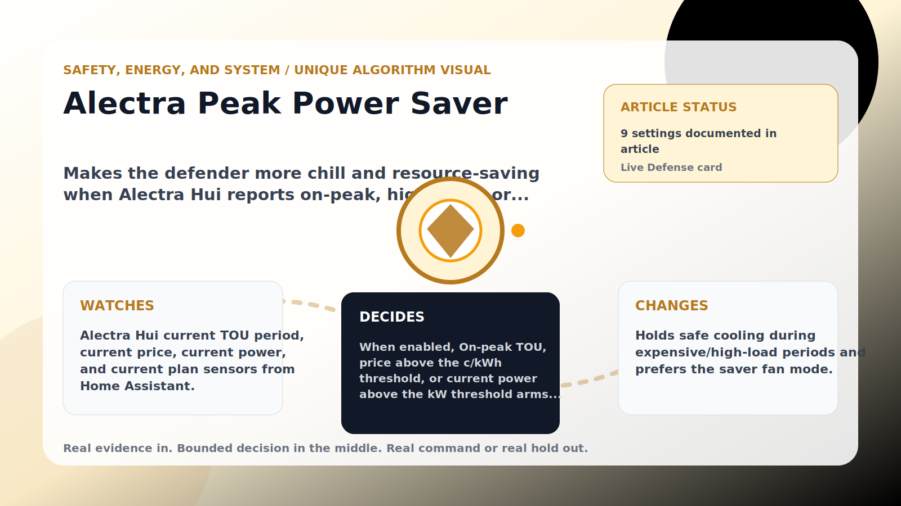

Safety, Energy, and System algorithm

# Alectra Peak Power Saver

  

    
Makes the defender more chill and resource-saving when Alectra Hui reports on-peak, high price, or high power use.

    
These algorithms keep the product honest: real Home Assistant commands, real errors, real weather or usage data, and safety-first fallbacks whenever comfort or equipment protection matters.

    
<a class="mini-link" href="Algorithms.html">Back to all algorithms</a> <a class="mini-link" href="Defender-Logic.html#alectra-peak-power-saver">See it on the logic page</a>

  

  

  

  

  
1<strong>Watch</strong>

  
2<strong>Decide</strong>

  
3<strong>Act</strong>

  
<i></i>

## The short version

Makes the defender more chill and resource-saving when Alectra Hui reports on-peak, high price, or high power use.

## What it watches

Alectra Hui current TOU period, current price, current power, and current plan sensors from Home Assistant.

## How it decides

When enabled, On-peak TOU, price above the c/kWh threshold, or current power above the kW threshold arms a short saver window. During that window it holds only safe cooling commands that would demand more cooling, and it can set the configured fan saver mode if the room is still inside the safety band. If the room or upstairs gets too hot, or the command would save energy by warming the setpoint, it steps aside.

## What it changes

Holds safe cooling during expensive/high-load periods and prefers the saver fan mode.

## Safety boundaries

- Uses the real inputs listed above. It does not invent thermostat, weather, usage, or sensor state.
- Changes only the output listed above. Thermostat-affecting work goes through Home Assistant or returns a real error.
- The global AC Defender rules still apply: the website target remains the floor for cooling commands, the worker keeps refreshing real Home Assistant state 24/7, and comfort/safety rules are not bypassed by decorative timing.

## Settings

<ul class="settings-list"><li><code>PeakPowerSaverEnabled</code></li><li><code>PeakPowerSaverOnPeakEnabled</code></li><li><code>PeakPowerSaverHighPowerEnabled</code></li><li><code>PeakPowerSaverPowerThresholdKilowatts</code></li><li><code>PeakPowerSaverPriceThresholdCentsPerKwh</code></li><li><code>PeakPowerSaverHoldMinutes</code></li><li><code>PeakPowerSaverSafetyBandCelsius</code></li><li><code>PeakPowerSaverFanSaverEnabled</code></li><li><code>PeakPowerSaverFanMode</code></li></ul>

## Where to see it

- **Defense page:** live card with state, verdict, evidence, and metrics.
- **Guide page:** generated from the same guard catalog entry.
- **Source:** `Guards/GuardCatalog.cs` describes this page; the implementation is coordinated by `Services/DefenderStateStore.cs` and `Services/AcDefenderService.cs`.
