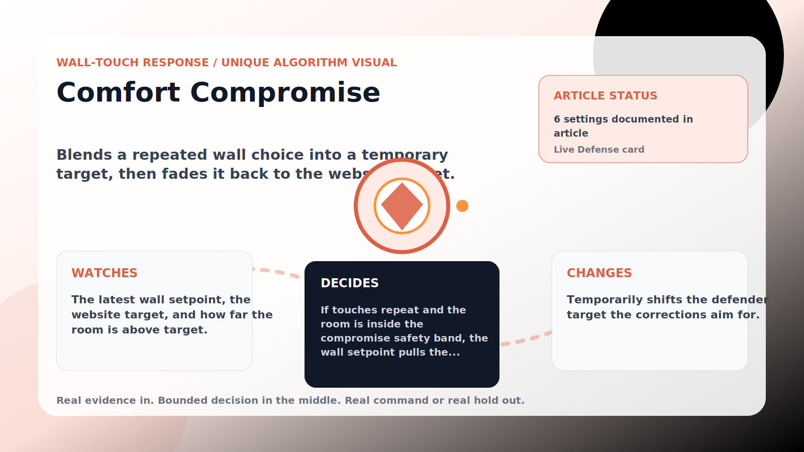

Wall-Touch Response algorithm

# Comfort Compromise

  

    
Blends a repeated wall choice into a temporary target, then fades it back to the website target.

    
These algorithms exist for the exact household fight AC Defender is built for: someone keeps raising the thermostat, but the room still needs to come back to your temperature without starting a visible duel.

    
<a class="mini-link" href="Algorithms.html">Back to all algorithms</a> <a class="mini-link" href="Defender-Logic.html#comfort-compromise">See it on the logic page</a>

  

  

  

  

  
1<strong>Watch</strong>

  
2<strong>Decide</strong>

  
3<strong>Act</strong>

  
<i></i>

## The short version

Blends a repeated wall choice into a temporary target, then fades it back to the website target.

## What it watches

The latest wall setpoint, the website target, and how far the room is above target.

## How it decides

If touches repeat and the room is inside the compromise safety band, the wall setpoint pulls the effective target up to the max offset for the hold minutes, then eases back over the decay minutes. A too-warm room clears it immediately.

## What it changes

Temporarily shifts the defender target the corrections aim for.

## Safety boundaries

- Uses the real inputs listed above. It does not invent thermostat, weather, usage, or sensor state.
- Changes only the output listed above. Thermostat-affecting work goes through Home Assistant or returns a real error.
- The global AC Defender rules still apply: the website target remains the floor for cooling commands, the worker keeps refreshing real Home Assistant state 24/7, and comfort/safety rules are not bypassed by decorative timing.

## Settings

<ul class="settings-list"><li><code>ComfortCompromiseEnabled</code></li><li><code>ComfortCompromiseTriggerTouches</code></li><li><code>ComfortCompromiseHoldMinutes</code></li><li><code>ComfortCompromiseDecayMinutes</code></li><li><code>ComfortCompromiseMaxOffsetCelsius</code></li><li><code>ComfortCompromiseSafetyBandCelsius</code></li></ul>

## Where to see it

- **Defense page:** live card with state, verdict, evidence, and metrics.
- **Guide page:** generated from the same guard catalog entry.
- **Source:** `Guards/GuardCatalog.cs` describes this page; the implementation is coordinated by `Services/DefenderStateStore.cs` and `Services/AcDefenderService.cs`.
