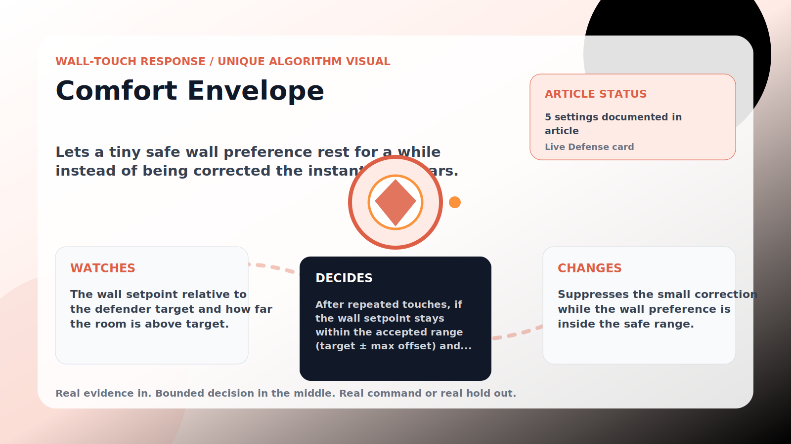

Wall-Touch Response algorithm

# Comfort Envelope

  

    
Lets a tiny safe wall preference rest for a while instead of being corrected the instant it appears.

    
These algorithms exist for the exact household fight AC Defender is built for: someone keeps raising the thermostat, but the room still needs to come back to your temperature without starting a visible duel.

    
<a class="mini-link" href="Algorithms.html">Back to all algorithms</a> <a class="mini-link" href="Defender-Logic.html#comfort-envelope">See it on the logic page</a>

  

  

  

  

  
1<strong>Watch</strong>

  
2<strong>Decide</strong>

  
3<strong>Act</strong>

  
<i></i>

## The short version

Lets a tiny safe wall preference rest for a while instead of being corrected the instant it appears.

## What it watches

The wall setpoint relative to the defender target and how far the room is above target.

## How it decides

After repeated touches, if the wall setpoint stays within the accepted range (target ± max offset) and the room is under the safety band, it simply observes for the hold minutes. A setpoint outside the range, a too-warm room, or a direct-cooling need clears it.

## What it changes

Suppresses the small correction while the wall preference is inside the safe range.

## Safety boundaries

- Uses the real inputs listed above. It does not invent thermostat, weather, usage, or sensor state.
- Changes only the output listed above. Thermostat-affecting work goes through Home Assistant or returns a real error.
- The global AC Defender rules still apply: the website target remains the floor for cooling commands, the worker keeps refreshing real Home Assistant state 24/7, and comfort/safety rules are not bypassed by decorative timing.

## Settings

<ul class="settings-list"><li><code>ComfortEnvelopeEnabled</code></li><li><code>ComfortEnvelopeTriggerTouches</code></li><li><code>ComfortEnvelopeHoldMinutes</code></li><li><code>ComfortEnvelopeMaxOffsetCelsius</code></li><li><code>ComfortEnvelopeSafetyBandCelsius</code></li></ul>

## Where to see it

- **Defense page:** live card with state, verdict, evidence, and metrics.
- **Guide page:** generated from the same guard catalog entry.
- **Source:** `Guards/GuardCatalog.cs` describes this page; the implementation is coordinated by `Services/DefenderStateStore.cs` and `Services/AcDefenderService.cs`.
