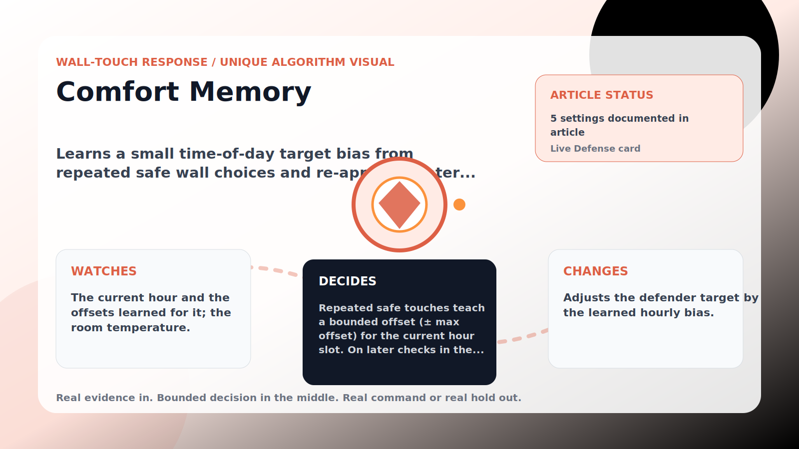

Wall-Touch Response algorithm

# Comfort Memory

  

    
Learns a small time-of-day target bias from repeated safe wall choices and re-applies it later that hour.

    
These algorithms exist for the exact household fight AC Defender is built for: someone keeps raising the thermostat, but the room still needs to come back to your temperature without starting a visible duel.

    
<a class="mini-link" href="Algorithms.html">Back to all algorithms</a> <a class="mini-link" href="Defender-Logic.html#comfort-memory">See it on the logic page</a>

  

  

  

  

  
1<strong>Watch</strong>

  
2<strong>Decide</strong>

  
3<strong>Act</strong>

  
<i></i>

## The short version

Learns a small time-of-day target bias from repeated safe wall choices and re-applies it later that hour.

## What it watches

The current hour and the offsets learned for it; the room temperature.

## How it decides

Repeated safe touches teach a bounded offset (± max offset) for the current hour slot. On later checks in the same window it nudges the target by that learned offset. Learned memory expires after the retention hours and is skipped when the room is warm or upstairs needs cooling.

## What it changes

Adjusts the defender target by the learned hourly bias.

## Safety boundaries

- Uses the real inputs listed above. It does not invent thermostat, weather, usage, or sensor state.
- Changes only the output listed above. Thermostat-affecting work goes through Home Assistant or returns a real error.
- The global AC Defender rules still apply: the website target remains the floor for cooling commands, the worker keeps refreshing real Home Assistant state 24/7, and comfort/safety rules are not bypassed by decorative timing.

## Settings

<ul class="settings-list"><li><code>ComfortMemoryEnabled</code></li><li><code>ComfortMemoryLearningTouches</code></li><li><code>ComfortMemoryRetentionHours</code></li><li><code>ComfortMemoryMaxOffsetCelsius</code></li><li><code>ComfortMemorySafetyBandCelsius</code></li></ul>

## Where to see it

- **Defense page:** live card with state, verdict, evidence, and metrics.
- **Guide page:** generated from the same guard catalog entry.
- **Source:** `Guards/GuardCatalog.cs` describes this page; the implementation is coordinated by `Services/DefenderStateStore.cs` and `Services/AcDefenderService.cs`.
