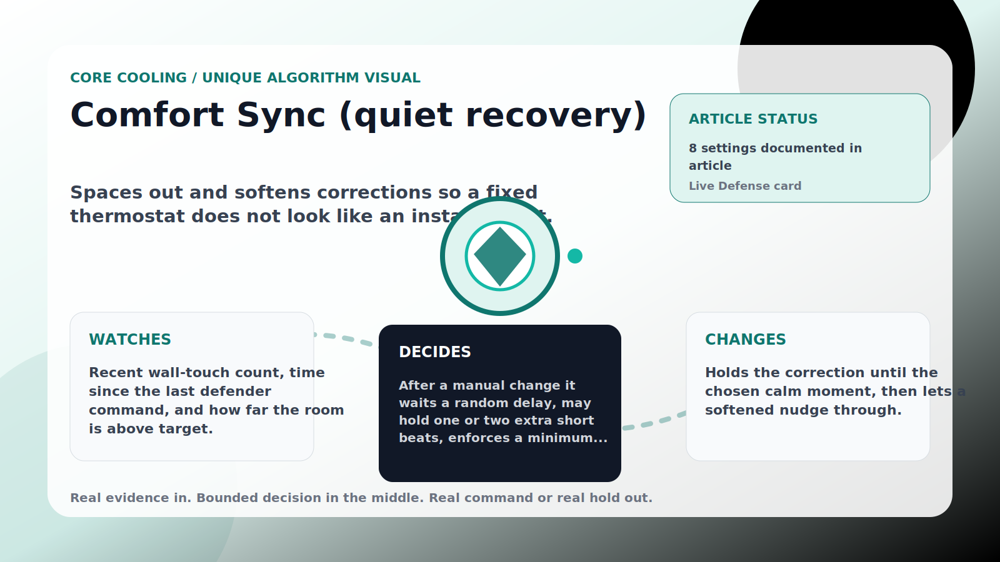

Core Cooling algorithm

# Comfort Sync (quiet recovery)

  

    
Spaces out and softens corrections so a fixed thermostat does not look like an instant robot.

    
These algorithms keep the main promise: when the room is hot because the wall setpoint drifted upward, AC Defender reads the real climate entity and walks cooling back toward the target without theatrical jumps.

    
<a class="mini-link" href="Algorithms.html">Back to all algorithms</a> <a class="mini-link" href="Defender-Logic.html#comfort-sync-quiet-recovery">See it on the logic page</a>

  

  

  

  

  
1<strong>Watch</strong>

  
2<strong>Decide</strong>

  
3<strong>Act</strong>

  
<i></i>

## The short version

Spaces out and softens corrections so a fixed thermostat does not look like an instant robot.

## What it watches

Recent wall-touch count, time since the last defender command, and how far the room is above target.

## How it decides

After a manual change it waits a random delay, may hold one or two extra short beats, enforces a minimum gap between commands, and shrinks the nudge size. Repeated touches raise the quiet level (Calm → Light → Quiet → Extra quiet → Softest), lengthening waits and shrinking steps. A warm room (over the safety override) skips all of it.

## What it changes

Holds the correction until the chosen calm moment, then lets a softened nudge through.

## Safety boundaries

- Uses the real inputs listed above. It does not invent thermostat, weather, usage, or sensor state.
- Changes only the output listed above. Thermostat-affecting work goes through Home Assistant or returns a real error.
- The global AC Defender rules still apply: the website target remains the floor for cooling commands, the worker keeps refreshing real Home Assistant state 24/7, and comfort/safety rules are not bypassed by decorative timing.

## Settings

<ul class="settings-list"><li><code>NaturalRecoveryEnabled</code></li><li><code>AdaptiveQuietnessEnabled</code></li><li><code>MinimumNaturalDelaySeconds</code></li><li><code>MaximumNaturalDelaySeconds</code></li><li><code>NaturalStepCelsius</code></li><li><code>NaturalHoldChancePercent</code></li><li><code>MinimumCommandGapSeconds</code></li><li><code>NaturalSafetyOverrideCelsius</code></li></ul>

## Where to see it

- **Defense page:** live card with state, verdict, evidence, and metrics.
- **Guide page:** generated from the same guard catalog entry.
- **Source:** `Guards/GuardCatalog.cs` describes this page; the implementation is coordinated by `Services/DefenderStateStore.cs` and `Services/AcDefenderService.cs`.
