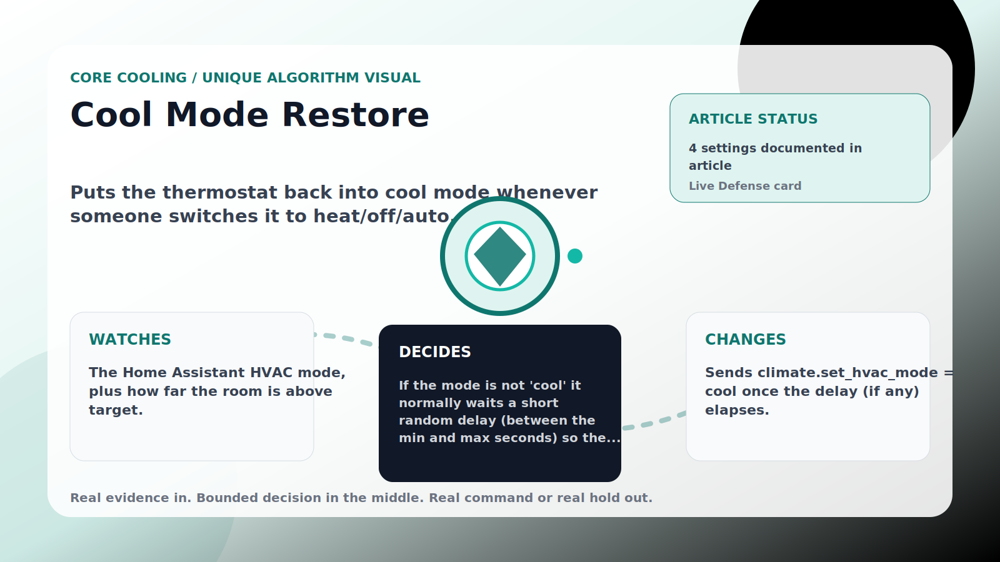

Core Cooling algorithm

# Cool Mode Restore

  

    
Puts the thermostat back into cool mode whenever someone switches it to heat/off/auto.

    
These algorithms keep the main promise: when the room is hot because the wall setpoint drifted upward, AC Defender reads the real climate entity and walks cooling back toward the target without theatrical jumps.

    
<a class="mini-link" href="Algorithms.html">Back to all algorithms</a> <a class="mini-link" href="Defender-Logic.html#cool-mode-restore">See it on the logic page</a>

  

  

  

  

  
1<strong>Watch</strong>

  
2<strong>Decide</strong>

  
3<strong>Act</strong>

  
<i></i>

## The short version

Puts the thermostat back into cool mode whenever someone switches it to heat/off/auto.

## What it watches

The Home Assistant HVAC mode, plus how far the room is above target.

## How it decides

If the mode is not &#x27;cool&#x27; it normally waits a short random delay (between the min and max seconds) so the change is not jarring — but only while the room stays within the comfort band. If the room is warmer than target + band, upstairs is severely hot, or the safety override is crossed, it restores cool immediately.

## What it changes

Sends climate.set_hvac_mode = cool once the delay (if any) elapses.

## Safety boundaries

- Uses the real inputs listed above. It does not invent thermostat, weather, usage, or sensor state.
- Changes only the output listed above. Thermostat-affecting work goes through Home Assistant or returns a real error.
- The global AC Defender rules still apply: the website target remains the floor for cooling commands, the worker keeps refreshing real Home Assistant state 24/7, and comfort/safety rules are not bypassed by decorative timing.

## Settings

<ul class="settings-list"><li><code>CoolModeRestoreDelayEnabled</code></li><li><code>CoolModeRestoreMinimumDelaySeconds</code></li><li><code>CoolModeRestoreMaximumDelaySeconds</code></li><li><code>CoolModeRestoreComfortBandCelsius</code></li></ul>

## Where to see it

- **Defense page:** live card with state, verdict, evidence, and metrics.
- **Guide page:** generated from the same guard catalog entry.
- **Source:** `Guards/GuardCatalog.cs` describes this page; the implementation is coordinated by `Services/DefenderStateStore.cs` and `Services/AcDefenderService.cs`.
