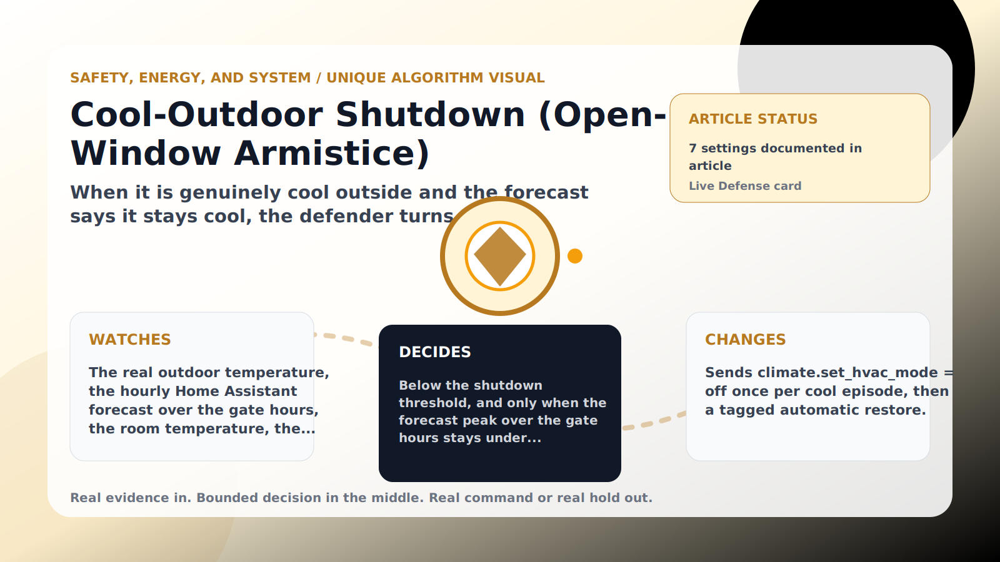

Safety, Energy, and System algorithm

# Cool-Outdoor Shutdown (Open-Window Armistice)

  

    
When it is genuinely cool outside and the forecast says it stays cool, the defender turns the AC fully off — and turns it back on by itself when the weather or the room demands it.

    
These algorithms keep the product honest: real Home Assistant commands, real errors, real weather or usage data, and safety-first fallbacks whenever comfort or equipment protection matters.

    
<a class="mini-link" href="Algorithms.html">Back to all algorithms</a> <a class="mini-link" href="Defender-Logic.html#cool-outdoor-shutdown-open-window-armistice">See it on the logic page</a>

  

  

  

  

  
1<strong>Watch</strong>

  
2<strong>Decide</strong>

  
3<strong>Act</strong>

  
<i></i>

## The short version

When it is genuinely cool outside and the forecast says it stays cool, the defender turns the AC fully off — and turns it back on by itself when the weather or the room demands it.

## What it watches

The real outdoor temperature, the hourly Home Assistant forecast over the gate hours, the room temperature, the thermostat mode, and the minimum-off dwell clock.

## How it decides

Below the shutdown threshold, and only when the forecast peak over the gate hours stays under threshold+margin (no off/on flapping before a hot afternoon), it sends ONE off command per cool episode and stands guard. It restores cool mode on its own once outdoor warms past threshold+margin (after the minimum off dwell) — or immediately, dwell ignored, if the room crosses the safety band. Someone turning the AC back on mid-episode wins for the rest of that episode; an AC already off by hand is adopted without a command. Unknown outdoor or a missing forecast means it does nothing new; safety bands always win. While it holds the AC off, the quiet minutes bank food rations.

## What it changes

Sends climate.set_hvac_mode = off once per cool episode, then a tagged automatic restore.

## Safety boundaries

- Uses the real inputs listed above. It does not invent thermostat, weather, usage, or sensor state.
- Changes only the output listed above. Thermostat-affecting work goes through Home Assistant or returns a real error.
- The global AC Defender rules still apply: the website target remains the floor for cooling commands, the worker keeps refreshing real Home Assistant state 24/7, and comfort/safety rules are not bypassed by decorative timing.

## Settings

<ul class="settings-list"><li><code>CoolOutdoorShutdownEnabled</code></li><li><code>CoolOutdoorShutdownBelowCelsius</code></li><li><code>CoolOutdoorRestoreMarginCelsius</code></li><li><code>CoolOutdoorMinimumOffMinutes</code></li><li><code>CoolOutdoorForecastGateEnabled</code></li><li><code>CoolOutdoorForecastGateHours</code></li><li><code>ForecastRefreshMinutes</code></li></ul>

## Where to see it

- **Defense page:** live card with state, verdict, evidence, and metrics.
- **Guide page:** generated from the same guard catalog entry.
- **Source:** `Guards/GuardCatalog.cs` describes this page; the implementation is coordinated by `Services/DefenderStateStore.cs` and `Services/AcDefenderService.cs`.
