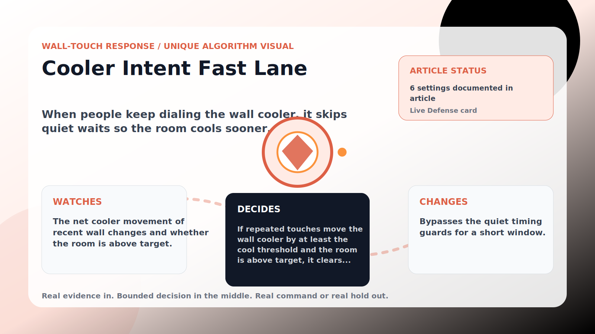

Wall-Touch Response algorithm

# Cooler Intent Fast Lane

  

    
When people keep dialing the wall cooler, it skips quiet waits so the room cools sooner.

    
These algorithms exist for the exact household fight AC Defender is built for: someone keeps raising the thermostat, but the room still needs to come back to your temperature without starting a visible duel.

    
<a class="mini-link" href="Algorithms.html">Back to all algorithms</a> <a class="mini-link" href="Defender-Logic.html#cooler-intent-fast-lane">See it on the logic page</a>

  

  

  

  

  
1<strong>Watch</strong>

  
2<strong>Decide</strong>

  
3<strong>Act</strong>

  
<i></i>

## The short version

When people keep dialing the wall cooler, it skips quiet waits so the room cools sooner.

## What it watches

The net cooler movement of recent wall changes and whether the room is above target.

## How it decides

If repeated touches move the wall cooler by at least the cool threshold and the room is above target, it clears quiet waits (cooldown, grace, conflict quiet, cadence, repeat quiet, sensor rhythm, runway, and more) for the hold minutes. It never lowers the website target — cooling still starts at room minus 1 °C and stops at target. A room over the safety band hands control back to normal safety rules.

## What it changes

Bypasses the quiet timing guards for a short window.

## Safety boundaries

- Uses the real inputs listed above. It does not invent thermostat, weather, usage, or sensor state.
- Changes only the output listed above. Thermostat-affecting work goes through Home Assistant or returns a real error.
- The global AC Defender rules still apply: the website target remains the floor for cooling commands, the worker keeps refreshing real Home Assistant state 24/7, and comfort/safety rules are not bypassed by decorative timing.

## Settings

<ul class="settings-list"><li><code>CoolerIntentFastLaneEnabled</code></li><li><code>CoolerIntentMinimumTouches</code></li><li><code>CoolerIntentWindowMinutes</code></li><li><code>CoolerIntentHoldMinutes</code></li><li><code>CoolerIntentNetCoolThresholdCelsius</code></li><li><code>CoolerIntentSafetyBandCelsius</code></li></ul>

## Where to see it

- **Defense page:** live card with state, verdict, evidence, and metrics.
- **Guide page:** generated from the same guard catalog entry.
- **Source:** `Guards/GuardCatalog.cs` describes this page; the implementation is coordinated by `Services/DefenderStateStore.cs` and `Services/AcDefenderService.cs`.
