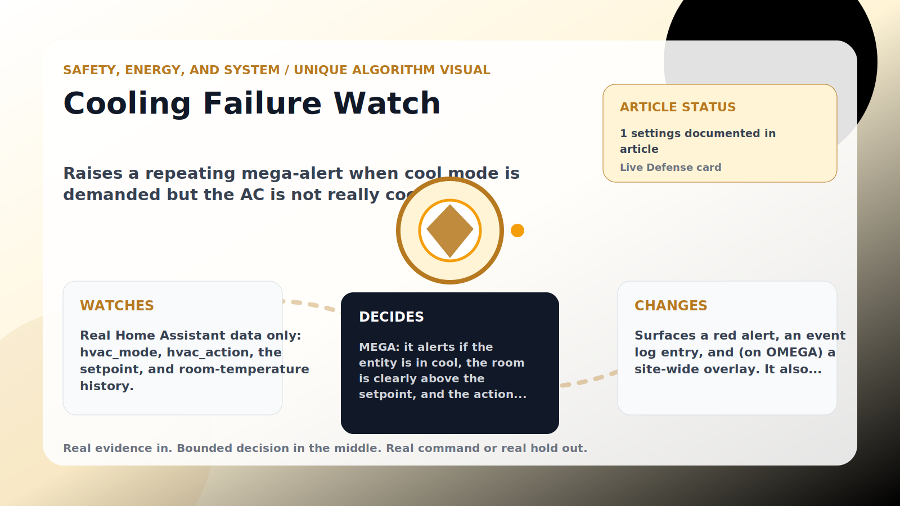

Safety, Energy, and System algorithm

# Cooling Failure Watch

  

    
Raises a repeating mega-alert when cool mode is demanded but the AC is not really cooling, escalates to a full-site OMEGA alert when a rising room confirms it, then turns the AC off until the room warms 0.5 C.

    
These algorithms keep the product honest: real Home Assistant commands, real errors, real weather or usage data, and safety-first fallbacks whenever comfort or equipment protection matters.

    
<a class="mini-link" href="Algorithms.html">Back to all algorithms</a> <a class="mini-link" href="Defender-Logic.html#cooling-failure-watch">See it on the logic page</a>

  

  

  

  

  
1<strong>Watch</strong>

  
2<strong>Decide</strong>

  
3<strong>Act</strong>

  
<i></i>

## The short version

Raises a repeating mega-alert when cool mode is demanded but the AC is not really cooling, escalates to a full-site OMEGA alert when a rising room confirms it, then turns the AC off until the room warms 0.5 C.

## What it watches

Real Home Assistant data only: hvac_mode, hvac_action, the setpoint, and room-temperature history.

## How it decides

MEGA: it alerts if the entity is in cool, the room is clearly above the setpoint, and the action stays idle for about 30 minutes (possible breaker/equipment), or if the action says cooling but the room does not drop over the retained window (possible compressor/airflow). OMEGA: while the idle/breaker mega alert is up, if the room has also risen at least 0.4 C over the last 5 minutes — what a dead breaker looks like — it escalates to a full-site OMEGA alert. Requiring a real, sustained rise (and only on the idle branch) keeps false positives down. Alerts repeat about once a minute.

## What it changes

Surfaces a red alert, an event log entry, and (on OMEGA) a site-wide overlay. It also turns the AC fully off (a failing unit is only wasting power) and holds it off until the real room temperature rises 0.5 C above the reading captured at shutdown, then restores cool. A human turning the AC back on is always respected.

## Safety boundaries

- Uses the real inputs listed above. It does not invent thermostat, weather, usage, or sensor state.
- Changes only the output listed above. Thermostat-affecting work goes through Home Assistant or returns a real error.
- The global AC Defender rules still apply: the website target remains the floor for cooling commands, the worker keeps refreshing real Home Assistant state 24/7, and comfort/safety rules are not bypassed by decorative timing.

## Settings

<ul class="settings-list"><li><code>CoolingFailureWatchEnabled</code></li></ul>

## Where to see it

- **Defense page:** live card with state, verdict, evidence, and metrics.
- **Guide page:** generated from the same guard catalog entry.
- **Source:** `Guards/GuardCatalog.cs` describes this page; the implementation is coordinated by `Services/DefenderStateStore.cs` and `Services/AcDefenderService.cs`.
