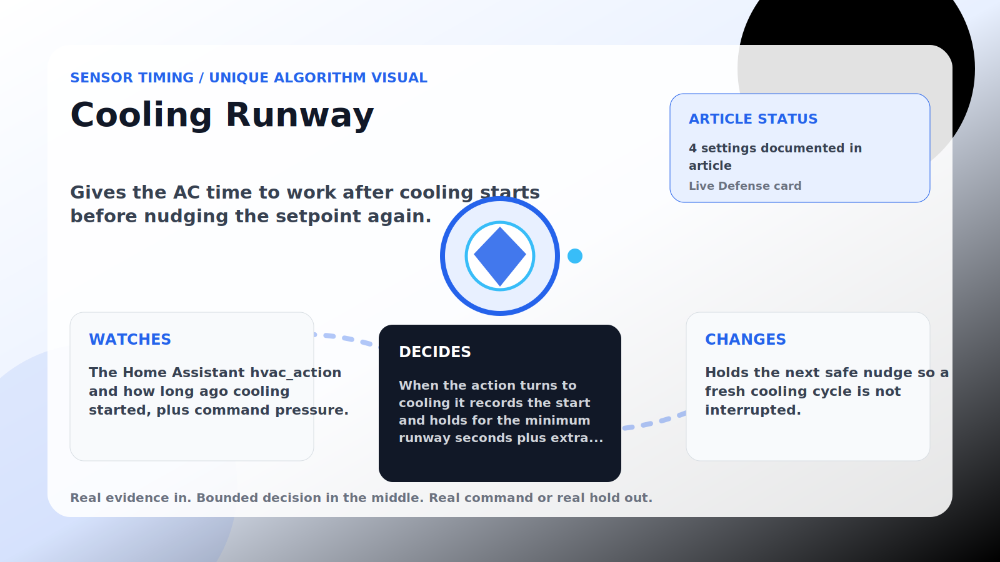

Sensor Timing algorithm

# Cooling Runway

  

    
Gives the AC time to work after cooling starts before nudging the setpoint again.

    
These algorithms make corrections land near real house signals instead of on a robotic beat, while still stepping aside when room comfort needs direct cooling.

    
<a class="mini-link" href="Algorithms.html">Back to all algorithms</a> <a class="mini-link" href="Defender-Logic.html#cooling-runway">See it on the logic page</a>

  

  

  

  

  
1<strong>Watch</strong>

  
2<strong>Decide</strong>

  
3<strong>Act</strong>

  
<i></i>

## The short version

Gives the AC time to work after cooling starts before nudging the setpoint again.

## What it watches

The Home Assistant hvac_action and how long ago cooling started, plus command pressure.

## How it decides

When the action turns to cooling it records the start and holds for the minimum runway seconds plus extra pressure seconds. If cooling stops or the room gets too warm, it clears immediately.

## What it changes

Holds the next safe nudge so a fresh cooling cycle is not interrupted.

## Safety boundaries

- Uses the real inputs listed above. It does not invent thermostat, weather, usage, or sensor state.
- Changes only the output listed above. Thermostat-affecting work goes through Home Assistant or returns a real error.
- The global AC Defender rules still apply: the website target remains the floor for cooling commands, the worker keeps refreshing real Home Assistant state 24/7, and comfort/safety rules are not bypassed by decorative timing.

## Settings

<ul class="settings-list"><li><code>CoolingRunwayGuardEnabled</code></li><li><code>CoolingRunwayMinimumSeconds</code></li><li><code>CoolingRunwayPressureExtraSeconds</code></li><li><code>CoolingRunwaySafetyBandCelsius</code></li></ul>

## Where to see it

- **Defense page:** live card with state, verdict, evidence, and metrics.
- **Guide page:** generated from the same guard catalog entry.
- **Source:** `Guards/GuardCatalog.cs` describes this page; the implementation is coordinated by `Services/DefenderStateStore.cs` and `Services/AcDefenderService.cs`.
