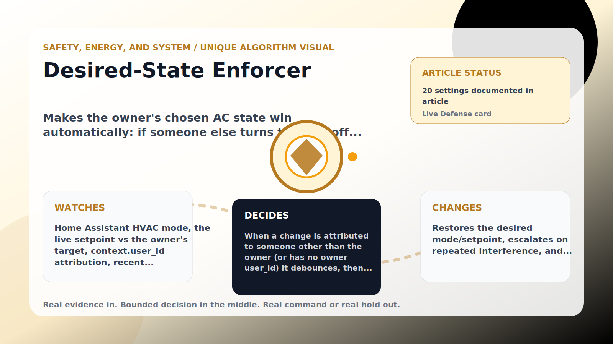

Safety, Energy, and System algorithm

# Desired-State Enforcer

  

    
Makes the owner&#x27;s chosen AC state win automatically: if someone else turns the unit off or moves the setpoint, it restores the exact desired state and keeps it there.

    
These algorithms keep the product honest: real Home Assistant commands, real errors, real weather or usage data, and safety-first fallbacks whenever comfort or equipment protection matters.

    
<a class="mini-link" href="Algorithms.html">Back to all algorithms</a> <a class="mini-link" href="Defender-Logic.html#desired-state-enforcer">See it on the logic page</a>

  

  

  

  

  
1<strong>Watch</strong>

  
2<strong>Decide</strong>

  
3<strong>Act</strong>

  
<i></i>

## The short version

Makes the owner&#x27;s chosen AC state win automatically: if someone else turns the unit off or moves the setpoint, it restores the exact desired state and keeps it there.

## What it watches

Home Assistant HVAC mode, the live setpoint vs the owner&#x27;s target, context.user_id attribution, recent override/assert counts, and the learned interference probability.

## How it decides

When a change is attributed to someone other than the owner (or has no owner user_id) it debounces, then either lets the human-like stealth pipeline ease the setpoint back (smart-stealth mode) or snaps to the exact target (hard mode). Cooldown, device-reject backoff, and a rate limit stop it thrashing; repeated overrides escalate it to firm mode and an optional notification. Owner changes are respected. It clamps to the device min/max and never acts while Home Assistant is unreachable.

## What it changes

Restores the desired mode/setpoint, escalates on repeated interference, and notifies — using the trained interference/cadence models to pace itself.

## Safety boundaries

- Uses the real inputs listed above. It does not invent thermostat, weather, usage, or sensor state.
- Changes only the output listed above. Thermostat-affecting work goes through Home Assistant or returns a real error.
- The global AC Defender rules still apply: the website target remains the floor for cooling commands, the worker keeps refreshing real Home Assistant state 24/7, and comfort/safety rules are not bypassed by decorative timing.

## Settings

<ul class="settings-list"><li><code>EnforcerModeEnabled</code></li><li><code>EnforcerTargetTemperatureCelsius</code></li><li><code>EnforcerEnforceMode</code></li><li><code>EnforcerEnforceSetpoint</code></li><li><code>EnforcerStealthShaping</code></li><li><code>EnforcerRespectOwner</code></li><li><code>EnforcerOwnerUserIds</code></li><li><code>EnforcerDebounceSeconds</code></li><li><code>EnforcerCooldownSeconds</code></li><li><code>EnforcerRateWindowMinutes</code></li><li><code>EnforcerMaxAssertsPerWindow</code></li><li><code>EnforcerEscalateAfterOverrides</code></li><li><code>EnforcerBackoffBaseSeconds</code></li><li><code>EnforcerBackoffMaxSeconds</code></li><li><code>EnforcerScheduleEnabled</code></li><li><code>EnforcerStartTime</code></li><li><code>EnforcerEndTime</code></li><li><code>EnforcerRequirePresence</code></li><li><code>EnforcerNotifyEnabled</code></li><li><code>EnforcerUseLearning</code></li></ul>

## Where to see it

- **Defense page:** live card with state, verdict, evidence, and metrics.
- **Guide page:** generated from the same guard catalog entry.
- **Source:** `Guards/GuardCatalog.cs` describes this page; the implementation is coordinated by `Services/DefenderStateStore.cs` and `Services/AcDefenderService.cs`.
