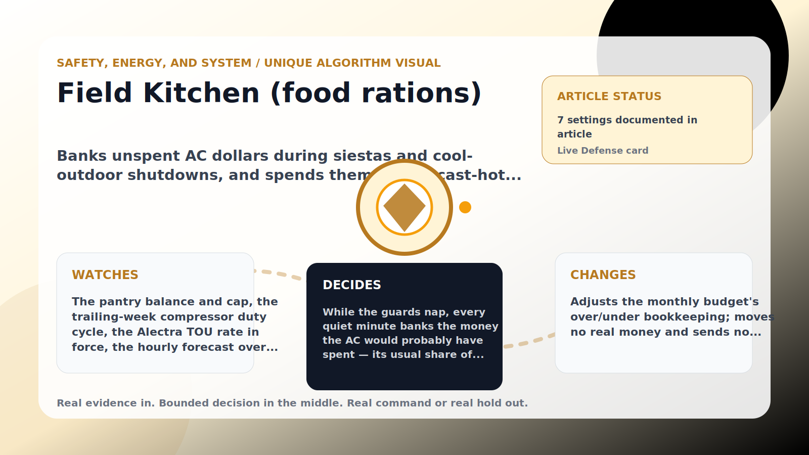

Safety, Energy, and System algorithm

# Field Kitchen (food rations)

  

    
Banks unspent AC dollars during siestas and cool-outdoor shutdowns, and spends them on forecast-hot days so the monthly budget eases exactly when cooling matters most.

    
These algorithms keep the product honest: real Home Assistant commands, real errors, real weather or usage data, and safety-first fallbacks whenever comfort or equipment protection matters.

    
<a class="mini-link" href="Algorithms.html">Back to all algorithms</a> <a class="mini-link" href="Defender-Logic.html#field-kitchen-food-rations">See it on the logic page</a>

  

  

  

  

  
1<strong>Watch</strong>

  
2<strong>Decide</strong>

  
3<strong>Act</strong>

  
<i></i>

## The short version

Banks unspent AC dollars during siestas and cool-outdoor shutdowns, and spends them on forecast-hot days so the monthly budget eases exactly when cooling matters most.

## What it watches

The pantry balance and cap, the trailing-week compressor duty cycle, the Alectra TOU rate in force, the hourly forecast over the release lookahead, and the AC&#x27;s real per-slice estimated cost.

## How it decides

While the guards nap, every quiet minute banks the money the AC would probably have spent — its usual share of run-time from the last week × its assumed power draw × the Alectra rate right now. On a forecast-hot day the pantry pays the AC&#x27;s bill: every dollar the AC actually spends during the hot window comes out of the food balance instead of counting against the monthly budget (up to the per-day cap, only while over pace). A slice where the compressor actually cools earns nothing, and no usage history means no accrual — the pantry never invents savings. Rations can also summon the WinForge reactor&#x27;s AI operator — one ration per hour.

## What it changes

Adjusts the monthly budget&#x27;s over/under bookkeeping; moves no real money and sends no thermostat commands.

## Safety boundaries

- Uses the real inputs listed above. It does not invent thermostat, weather, usage, or sensor state.
- Changes only the output listed above. Thermostat-affecting work goes through Home Assistant or returns a real error.
- The global AC Defender rules still apply: the website target remains the floor for cooling commands, the worker keeps refreshing real Home Assistant state 24/7, and comfort/safety rules are not bypassed by decorative timing.

## Settings

<ul class="settings-list"><li><code>FoodRationsEnabled</code></li><li><code>FoodBalanceMaxCad</code></li><li><code>FoodReleaseHotThresholdCelsius</code></li><li><code>FoodReleaseLookaheadHours</code></li><li><code>FoodReleaseMaxPerDayCad</code></li><li><code>ReactorPowerEnabled</code></li><li><code>FoodRationSizeCad</code></li></ul>

## Where to see it

- **Defense page:** live card with state, verdict, evidence, and metrics.
- **Guide page:** generated from the same guard catalog entry.
- **Source:** `Guards/GuardCatalog.cs` describes this page; the implementation is coordinated by `Services/DefenderStateStore.cs` and `Services/AcDefenderService.cs`.
