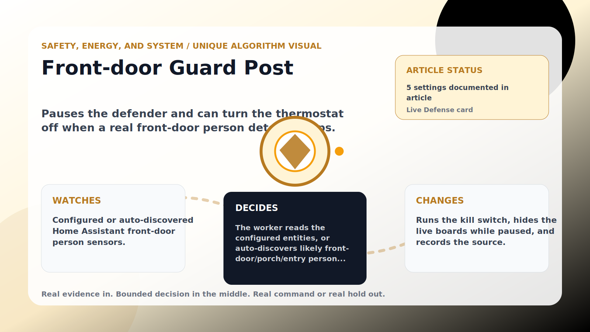

Safety, Energy, and System algorithm

# Front-door Guard Post

  

    
Pauses the defender and can turn the thermostat off when a real front-door person detector trips.

    
These algorithms keep the product honest: real Home Assistant commands, real errors, real weather or usage data, and safety-first fallbacks whenever comfort or equipment protection matters.

    
<a class="mini-link" href="Algorithms.html">Back to all algorithms</a> <a class="mini-link" href="Defender-Logic.html#front-door-guard-post">See it on the logic page</a>

  

  

  

  

  
1<strong>Watch</strong>

  
2<strong>Decide</strong>

  
3<strong>Act</strong>

  
<i></i>

## The short version

Pauses the defender and can turn the thermostat off when a real front-door person detector trips.

## What it watches

Configured or auto-discovered Home Assistant front-door person sensors.

## How it decides

The worker reads the configured entities, or auto-discovers likely front-door/porch/entry person sensors. If any detector reports a person, the defender pauses immediately, holds the guard window, and sends thermostat OFF if that setting is enabled. The source is recorded as the front-door guard post so it does not look like a wall touch.

## What it changes

Runs the kill switch, hides the live boards while paused, and records the source.

## Safety boundaries

- Uses the real inputs listed above. It does not invent thermostat, weather, usage, or sensor state.
- Changes only the output listed above. Thermostat-affecting work goes through Home Assistant or returns a real error.
- The global AC Defender rules still apply: the website target remains the floor for cooling commands, the worker keeps refreshing real Home Assistant state 24/7, and comfort/safety rules are not bypassed by decorative timing.

## Settings

<ul class="settings-list"><li><code>FrontDoorKillSwitchEnabled</code></li><li><code>FrontDoorPersonEntityIds</code></li><li><code>FrontDoorKillSwitchHoldMinutes</code></li><li><code>FrontDoorKillSwitchRefreshSeconds</code></li><li><code>FrontDoorKillSwitchTurnsThermostatOff</code></li></ul>

## Where to see it

- **Defense page:** live card with state, verdict, evidence, and metrics.
- **Guide page:** generated from the same guard catalog entry.
- **Source:** `Guards/GuardCatalog.cs` describes this page; the implementation is coordinated by `Services/DefenderStateStore.cs` and `Services/AcDefenderService.cs`.
