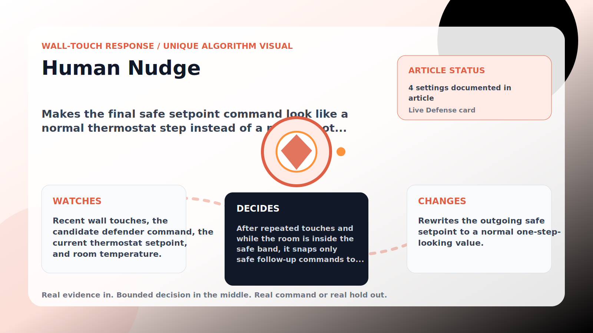

Wall-Touch Response algorithm

# Human Nudge

  

    
Makes the final safe setpoint command look like a normal thermostat step instead of a precise bot number.

    
These algorithms exist for the exact household fight AC Defender is built for: someone keeps raising the thermostat, but the room still needs to come back to your temperature without starting a visible duel.

    
<a class="mini-link" href="Algorithms.html">Back to all algorithms</a> <a class="mini-link" href="Defender-Logic.html#human-nudge">See it on the logic page</a>

  

  

  

  

  
1<strong>Watch</strong>

  
2<strong>Decide</strong>

  
3<strong>Act</strong>

  
<i></i>

## The short version

Makes the final safe setpoint command look like a normal thermostat step instead of a precise bot number.

## What it watches

Recent wall touches, the candidate defender command, the current thermostat setpoint, and room temperature.

## How it decides

After repeated touches and while the room is inside the safe band, it snaps only safe follow-up commands to the configured human step size. Direct warm-room cooling, upstairs heat, or quiet-timing bypasses skip this shaper.

## What it changes

Rewrites the outgoing safe setpoint to a normal one-step-looking value.

## Safety boundaries

- Uses the real inputs listed above. It does not invent thermostat, weather, usage, or sensor state.
- Changes only the output listed above. Thermostat-affecting work goes through Home Assistant or returns a real error.
- The global AC Defender rules still apply: the website target remains the floor for cooling commands, the worker keeps refreshing real Home Assistant state 24/7, and comfort/safety rules are not bypassed by decorative timing.

## Settings

<ul class="settings-list"><li><code>HumanNudgeEnabled</code></li><li><code>HumanNudgeTriggerTouches</code></li><li><code>HumanNudgeStepCelsius</code></li><li><code>HumanNudgeSafetyBandCelsius</code></li></ul>

## Where to see it

- **Defense page:** live card with state, verdict, evidence, and metrics.
- **Guide page:** generated from the same guard catalog entry.
- **Source:** `Guards/GuardCatalog.cs` describes this page; the implementation is coordinated by `Services/DefenderStateStore.cs` and `Services/AcDefenderService.cs`.
