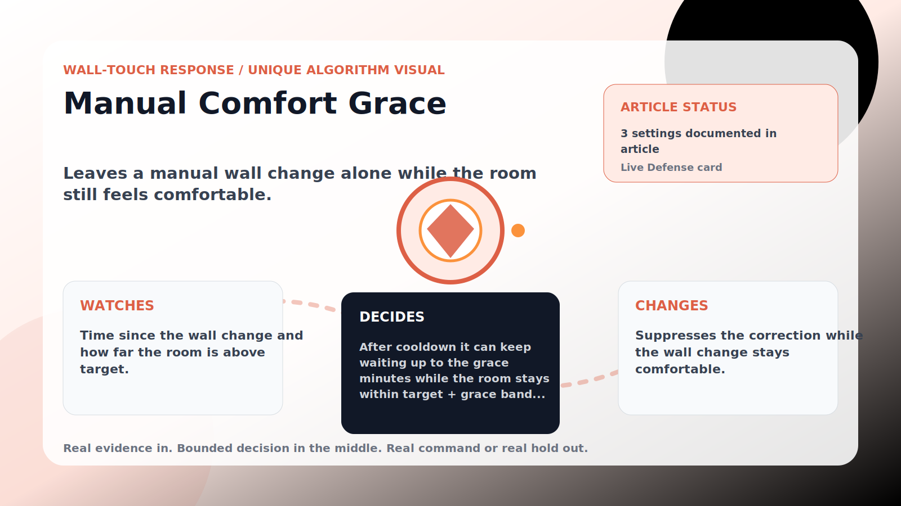

Wall-Touch Response algorithm

# Manual Comfort Grace

  

    
Leaves a manual wall change alone while the room still feels comfortable.

    
These algorithms exist for the exact household fight AC Defender is built for: someone keeps raising the thermostat, but the room still needs to come back to your temperature without starting a visible duel.

    
<a class="mini-link" href="Algorithms.html">Back to all algorithms</a> <a class="mini-link" href="Defender-Logic.html#manual-comfort-grace">See it on the logic page</a>

  

  

  

  

  
1<strong>Watch</strong>

  
2<strong>Decide</strong>

  
3<strong>Act</strong>

  
<i></i>

## The short version

Leaves a manual wall change alone while the room still feels comfortable.

## What it watches

Time since the wall change and how far the room is above target.

## How it decides

After cooldown it can keep waiting up to the grace minutes while the room stays within target + grace band. If the room rises above the band, the mode leaves cool, or upstairs becomes severely hot, grace ends. Touch Intent can extend the grace when recent changes are clearly warmer.

## What it changes

Suppresses the correction while the wall change stays comfortable.

## Safety boundaries

- Uses the real inputs listed above. It does not invent thermostat, weather, usage, or sensor state.
- Changes only the output listed above. Thermostat-affecting work goes through Home Assistant or returns a real error.
- The global AC Defender rules still apply: the website target remains the floor for cooling commands, the worker keeps refreshing real Home Assistant state 24/7, and comfort/safety rules are not bypassed by decorative timing.

## Settings

<ul class="settings-list"><li><code>ManualComfortGraceEnabled</code></li><li><code>ManualComfortGraceMinutes</code></li><li><code>ManualComfortGraceBandCelsius</code></li></ul>

## Where to see it

- **Defense page:** live card with state, verdict, evidence, and metrics.
- **Guide page:** generated from the same guard catalog entry.
- **Source:** `Guards/GuardCatalog.cs` describes this page; the implementation is coordinated by `Services/DefenderStateStore.cs` and `Services/AcDefenderService.cs`.
