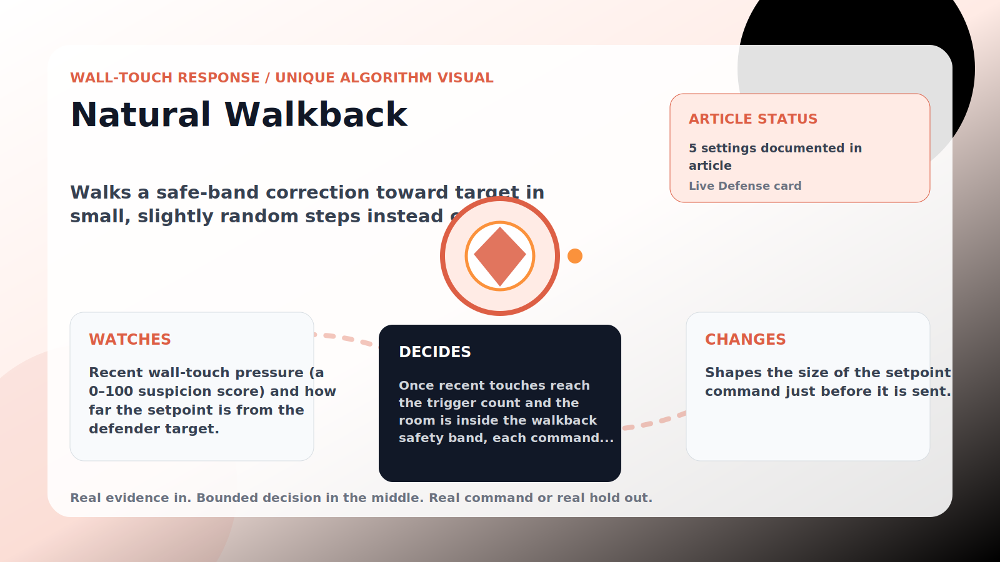

Wall-Touch Response algorithm

# Natural Walkback

  

    
Walks a safe-band correction toward target in small, slightly random steps instead of one obvious jump.

    
These algorithms exist for the exact household fight AC Defender is built for: someone keeps raising the thermostat, but the room still needs to come back to your temperature without starting a visible duel.

    
<a class="mini-link" href="Algorithms.html">Back to all algorithms</a> <a class="mini-link" href="Defender-Logic.html#natural-walkback">See it on the logic page</a>

  

  

  

  

  
1<strong>Watch</strong>

  
2<strong>Decide</strong>

  
3<strong>Act</strong>

  
<i></i>

## The short version

Walks a safe-band correction toward target in small, slightly random steps instead of one obvious jump.

## What it watches

Recent wall-touch pressure (a 0–100 suspicion score) and how far the setpoint is from the defender target.

## How it decides

Once recent touches reach the trigger count and the room is inside the walkback safety band, each command moves only about the walkback step (plus a tiny jitter) toward target. A warm room that needs direct cooling skips walkback and still commands the configured warm-room approach below the current room temperature (0.5 C by default).

## What it changes

Shapes the size of the setpoint command just before it is sent.

## Safety boundaries

- Uses the real inputs listed above. It does not invent thermostat, weather, usage, or sensor state.
- Changes only the output listed above. Thermostat-affecting work goes through Home Assistant or returns a real error.
- The global AC Defender rules still apply: the website target remains the floor for cooling commands, the worker keeps refreshing real Home Assistant state 24/7, and comfort/safety rules are not bypassed by decorative timing.

## Settings

<ul class="settings-list"><li><code>NaturalWalkbackEnabled</code></li><li><code>NaturalWalkbackTriggerTouches</code></li><li><code>NaturalWalkbackStepCelsius</code></li><li><code>NaturalWalkbackJitterCelsius</code></li><li><code>NaturalWalkbackSafetyBandCelsius</code></li></ul>

## Where to see it

- **Defense page:** live card with state, verdict, evidence, and metrics.
- **Guide page:** generated from the same guard catalog entry.
- **Source:** `Guards/GuardCatalog.cs` describes this page; the implementation is coordinated by `Services/DefenderStateStore.cs` and `Services/AcDefenderService.cs`.
