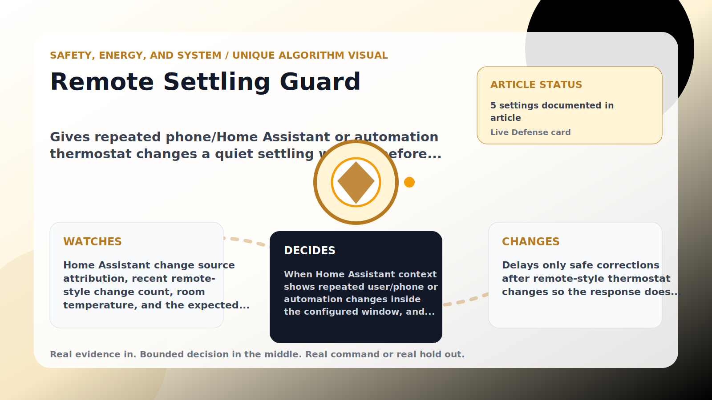

Safety, Energy, and System algorithm

# Remote Settling Guard

  

    
Gives repeated phone/Home Assistant or automation thermostat changes a quiet settling window before a safe answer-back.

    
These algorithms keep the product honest: real Home Assistant commands, real errors, real weather or usage data, and safety-first fallbacks whenever comfort or equipment protection matters.

    
<a class="mini-link" href="Algorithms.html">Back to all algorithms</a> <a class="mini-link" href="Defender-Logic.html#remote-settling-guard">See it on the logic page</a>

  

  

  

  

  
1<strong>Watch</strong>

  
2<strong>Decide</strong>

  
3<strong>Act</strong>

  
<i></i>

## The short version

Gives repeated phone/Home Assistant or automation thermostat changes a quiet settling window before a safe answer-back.

## What it watches

Home Assistant change source attribution, recent remote-style change count, room temperature, and the expected setpoint.

## How it decides

When Home Assistant context shows repeated user/phone or automation changes inside the configured window, and the room is still inside the safety band, it holds only safe corrections for the quiet hold minutes. A too-warm room, cooler intent, matching setpoint, disabled setting, or expired hold releases it immediately.

## What it changes

Delays only safe corrections after remote-style thermostat changes so the response does not look instant.

## Safety boundaries

- Uses the real inputs listed above. It does not invent thermostat, weather, usage, or sensor state.
- Changes only the output listed above. Thermostat-affecting work goes through Home Assistant or returns a real error.
- The global AC Defender rules still apply: the website target remains the floor for cooling commands, the worker keeps refreshing real Home Assistant state 24/7, and comfort/safety rules are not bypassed by decorative timing.

## Settings

<ul class="settings-list"><li><code>RemoteSettlingGuardEnabled</code></li><li><code>RemoteSettlingTriggerChanges</code></li><li><code>RemoteSettlingWindowMinutes</code></li><li><code>RemoteSettlingHoldMinutes</code></li><li><code>RemoteSettlingSafetyBandCelsius</code></li></ul>

## Where to see it

- **Defense page:** live card with state, verdict, evidence, and metrics.
- **Guide page:** generated from the same guard catalog entry.
- **Source:** `Guards/GuardCatalog.cs` describes this page; the implementation is coordinated by `Services/DefenderStateStore.cs` and `Services/AcDefenderService.cs`.
