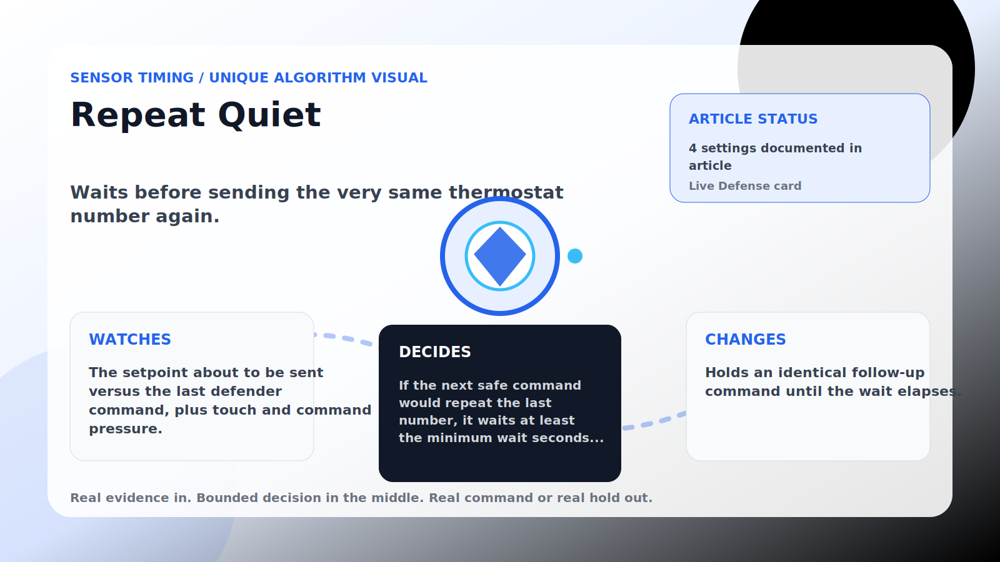

Sensor Timing algorithm

# Repeat Quiet

  

    
Waits before sending the very same thermostat number again.

    
These algorithms make corrections land near real house signals instead of on a robotic beat, while still stepping aside when room comfort needs direct cooling.

    
<a class="mini-link" href="Algorithms.html">Back to all algorithms</a> <a class="mini-link" href="Defender-Logic.html#repeat-quiet">See it on the logic page</a>

  

  

  

  

  
1<strong>Watch</strong>

  
2<strong>Decide</strong>

  
3<strong>Act</strong>

  
<i></i>

## The short version

Waits before sending the very same thermostat number again.

## What it watches

The setpoint about to be sent versus the last defender command, plus touch and command pressure.

## How it decides

If the next safe command would repeat the last number, it waits at least the minimum wait seconds plus extra pressure seconds (scaling with recent touches and commands). Different one-degree step-downs pass straight through; a too-warm room steps it aside.

## What it changes

Holds an identical follow-up command until the wait elapses.

## Safety boundaries

- Uses the real inputs listed above. It does not invent thermostat, weather, usage, or sensor state.
- Changes only the output listed above. Thermostat-affecting work goes through Home Assistant or returns a real error.
- The global AC Defender rules still apply: the website target remains the floor for cooling commands, the worker keeps refreshing real Home Assistant state 24/7, and comfort/safety rules are not bypassed by decorative timing.

## Settings

<ul class="settings-list"><li><code>RepeatCommandGuardEnabled</code></li><li><code>RepeatCommandMinimumWaitSeconds</code></li><li><code>RepeatCommandPressureExtraSeconds</code></li><li><code>RepeatCommandSafetyBandCelsius</code></li></ul>

## Where to see it

- **Defense page:** live card with state, verdict, evidence, and metrics.
- **Guide page:** generated from the same guard catalog entry.
- **Source:** `Guards/GuardCatalog.cs` describes this page; the implementation is coordinated by `Services/DefenderStateStore.cs` and `Services/AcDefenderService.cs`.
