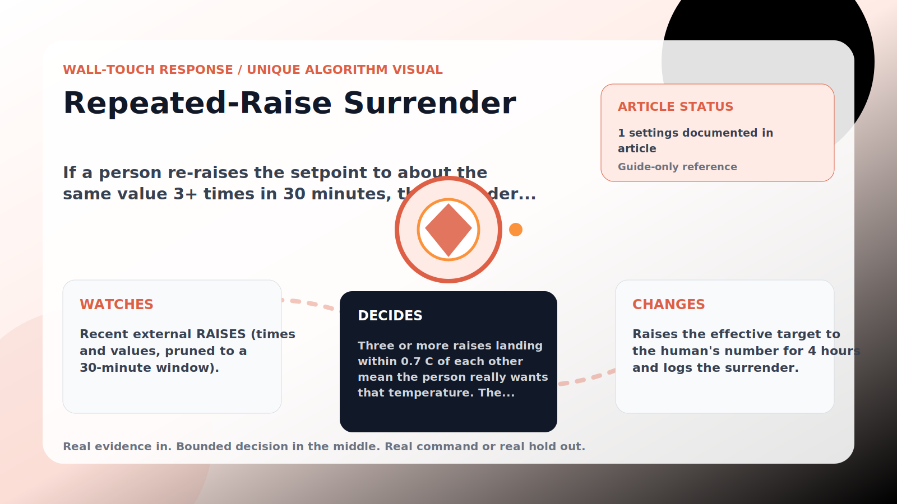

Wall-Touch Response algorithm

# Repeated-Raise Surrender

  

    
If a person re-raises the setpoint to about the same value 3+ times in 30 minutes, the defender adopts their number for 4 hours — the human wins the argument.

    
These algorithms exist for the exact household fight AC Defender is built for: someone keeps raising the thermostat, but the room still needs to come back to your temperature without starting a visible duel.

    
<a class="mini-link" href="Algorithms.html">Back to all algorithms</a> <a class="mini-link" href="Defender-Logic.html#repeated-raise-surrender">See it on the logic page</a>

  

  

  

  

  
1<strong>Watch</strong>

  
2<strong>Decide</strong>

  
3<strong>Act</strong>

  
<i></i>

## The short version

If a person re-raises the setpoint to about the same value 3+ times in 30 minutes, the defender adopts their number for 4 hours — the human wins the argument.

## What it watches

Recent external RAISES (times and values, pruned to a 30-minute window).

## How it decides

Three or more raises landing within 0.7 C of each other mean the person really wants that temperature. The defender adopts it (capped at 27 C) as the effective target for 4 hours — deliberately with NO &#x27;unless the room is too warm&#x27; escape, because that escape hatch is what turned dawn disagreements into a detached thermostat. My temp stays the hard floor, emergencies still win, and a deliberate website target clears the surrender.

## What it changes

Raises the effective target to the human&#x27;s number for 4 hours and logs the surrender.

## Safety boundaries

- Uses the real inputs listed above. It does not invent thermostat, weather, usage, or sensor state.
- Changes only the output listed above. Thermostat-affecting work goes through Home Assistant or returns a real error.
- The global AC Defender rules still apply: the website target remains the floor for cooling commands, the worker keeps refreshing real Home Assistant state 24/7, and comfort/safety rules are not bypassed by decorative timing.

## Settings

<ul class="settings-list"><li><code>(always on — fixed: 3 raises / 30 min window / 4 h hold / 27 C cap)</code></li></ul>

## Where to see it

- **Defense page:** guide-only reference entry.
- **Guide page:** generated from the same guard catalog entry.
- **Source:** `Guards/GuardCatalog.cs` describes this page; the implementation is coordinated by `Services/DefenderStateStore.cs` and `Services/AcDefenderService.cs`.
