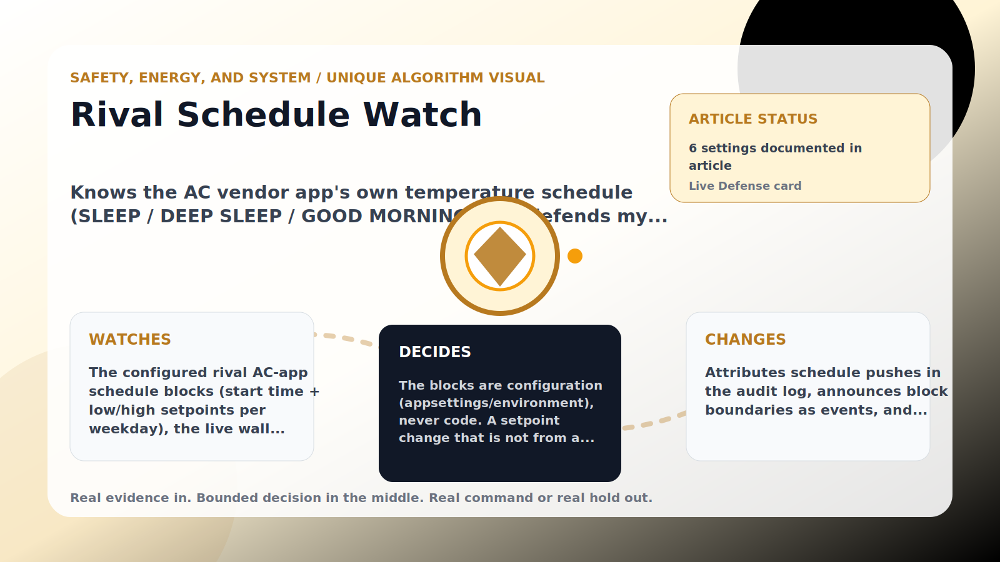

Safety, Energy, and System algorithm

# Rival Schedule Watch

  

    
Knows the AC vendor app&#x27;s own temperature schedule (SLEEP / DEEP SLEEP / GOOD MORNING) and defends my temp when a scheduled block pushes the wall warmer while everyone sleeps.

    
These algorithms keep the product honest: real Home Assistant commands, real errors, real weather or usage data, and safety-first fallbacks whenever comfort or equipment protection matters.

    
<a class="mini-link" href="Algorithms.html">Back to all algorithms</a> <a class="mini-link" href="Defender-Logic.html#rival-schedule-watch">See it on the logic page</a>

  

  

  

  

  
1<strong>Watch</strong>

  
2<strong>Decide</strong>

  
3<strong>Act</strong>

  
<i></i>

## The short version

Knows the AC vendor app&#x27;s own temperature schedule (SLEEP / DEEP SLEEP / GOOD MORNING) and defends my temp when a scheduled block pushes the wall warmer while everyone sleeps.

## What it watches

The configured rival AC-app schedule blocks (start time + low/high setpoints per weekday), the live wall setpoint, Home Assistant change context, and the local clock.

## How it decides

The blocks are configuration (appsettings/environment), never code. A setpoint change that is not from a Home Assistant user and lands on the active block&#x27;s low/high number is attributed to the AC app schedule instead of a human wall touch — so it starts no cooldown, no comfort grace, no touch counters, no peace offering, and teaches nothing to comfort memory/compromise (otherwise the schedule would train the defender to like the rival&#x27;s warm blocks). While the wall sits at a scheduled setpoint above my temp and the room is warm, quiet waits are bypassed: a schedule is a machine running while the household sleeps, so nobody is watching the correction. My temp is never changed by the rival schedule, and extreme heat still defers to normal comfort safety. The vendor app&#x27;s Fan schedule tab is reserved in configuration but not enforced yet.

## What it changes

Attributes schedule pushes in the audit log, announces block boundaries as events, and answers a scheduled warm push back toward my temp without human-style delays.

## Safety boundaries

- Uses the real inputs listed above. It does not invent thermostat, weather, usage, or sensor state.
- Changes only the output listed above. Thermostat-affecting work goes through Home Assistant or returns a real error.
- The global AC Defender rules still apply: the website target remains the floor for cooling commands, the worker keeps refreshing real Home Assistant state 24/7, and comfort/safety rules are not bypassed by decorative timing.

## Settings

<ul class="settings-list"><li><code>RivalScheduleWatchEnabled</code></li><li><code>RivalScheduleSetpointToleranceCelsius</code></li><li><code>RivalScheduleBypassQuietTiming</code></li><li><code>RivalScheduleSafetyBandCelsius</code></li><li><code>RivalScheduleBlocks</code></li><li><code>RivalFanScheduleBlocks</code></li></ul>

## Where to see it

- **Defense page:** live card with state, verdict, evidence, and metrics.
- **Guide page:** generated from the same guard catalog entry.
- **Source:** `Guards/GuardCatalog.cs` describes this page; the implementation is coordinated by `Services/DefenderStateStore.cs` and `Services/AcDefenderService.cs`.
