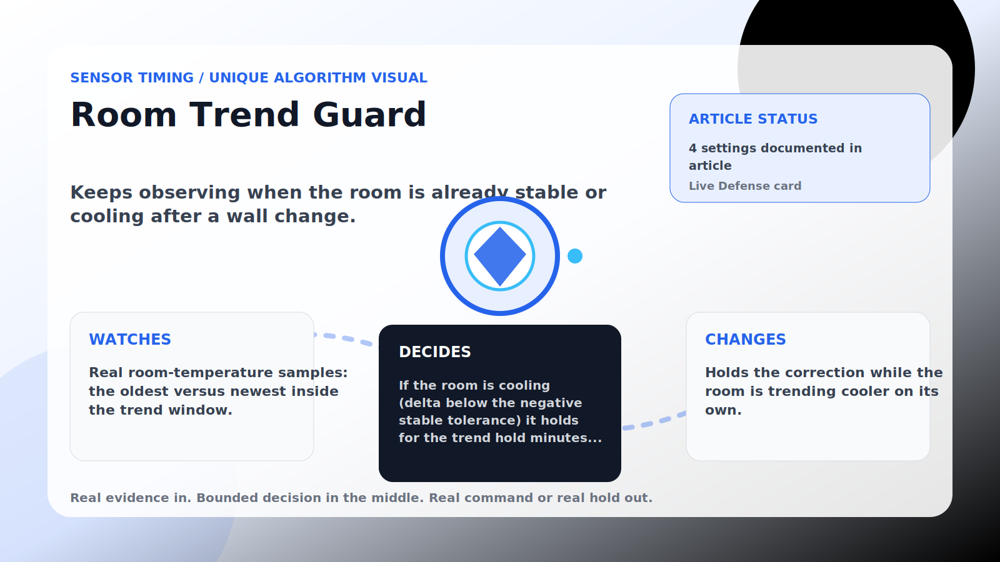

Sensor Timing algorithm

# Room Trend Guard

  

    
Keeps observing when the room is already stable or cooling after a wall change.

    
These algorithms make corrections land near real house signals instead of on a robotic beat, while still stepping aside when room comfort needs direct cooling.

    
<a class="mini-link" href="Algorithms.html">Back to all algorithms</a> <a class="mini-link" href="Defender-Logic.html#room-trend-guard">See it on the logic page</a>

  

  

  

  

  
1<strong>Watch</strong>

  
2<strong>Decide</strong>

  
3<strong>Act</strong>

  
<i></i>

## The short version

Keeps observing when the room is already stable or cooling after a wall change.

## What it watches

Real room-temperature samples: the oldest versus newest inside the trend window.

## How it decides

If the room is cooling (delta below the negative stable tolerance) it holds for the trend hold minutes so cooling can continue. Stable or warming rooms let the correction proceed; rooms above the grace band or safety override always proceed.

## What it changes

Holds the correction while the room is trending cooler on its own.

## Safety boundaries

- Uses the real inputs listed above. It does not invent thermostat, weather, usage, or sensor state.
- Changes only the output listed above. Thermostat-affecting work goes through Home Assistant or returns a real error.
- The global AC Defender rules still apply: the website target remains the floor for cooling commands, the worker keeps refreshing real Home Assistant state 24/7, and comfort/safety rules are not bypassed by decorative timing.

## Settings

<ul class="settings-list"><li><code>RoomTrendGuardEnabled</code></li><li><code>RoomTrendWindowMinutes</code></li><li><code>RoomTrendStableToleranceCelsius</code></li><li><code>RoomTrendHoldMinutes</code></li></ul>

## Where to see it

- **Defense page:** live card with state, verdict, evidence, and metrics.
- **Guide page:** generated from the same guard catalog entry.
- **Source:** `Guards/GuardCatalog.cs` describes this page; the implementation is coordinated by `Services/DefenderStateStore.cs` and `Services/AcDefenderService.cs`.
