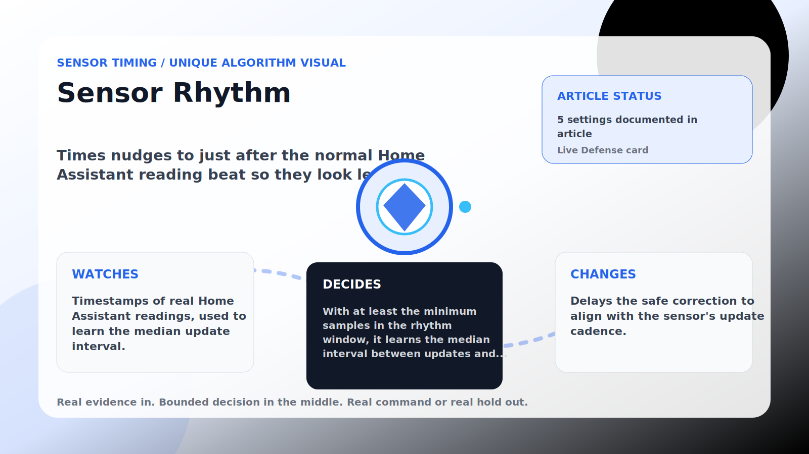

Sensor Timing algorithm

# Sensor Rhythm

  

    
Times nudges to just after the normal Home Assistant reading beat so they look less mechanical.

    
These algorithms make corrections land near real house signals instead of on a robotic beat, while still stepping aside when room comfort needs direct cooling.

    
<a class="mini-link" href="Algorithms.html">Back to all algorithms</a> <a class="mini-link" href="Defender-Logic.html#sensor-rhythm">See it on the logic page</a>

  

  

  

  

  
1<strong>Watch</strong>

  
2<strong>Decide</strong>

  
3<strong>Act</strong>

  
<i></i>

## The short version

Times nudges to just after the normal Home Assistant reading beat so they look less mechanical.

## What it watches

Timestamps of real Home Assistant readings, used to learn the median update interval.

## How it decides

With at least the minimum samples in the rhythm window, it learns the median interval between updates and waits until just after the next beat plus a small jitter. A too-warm room or upstairs heat clears it.

## What it changes

Delays the safe correction to align with the sensor&#x27;s update cadence.

## Safety boundaries

- Uses the real inputs listed above. It does not invent thermostat, weather, usage, or sensor state.
- Changes only the output listed above. Thermostat-affecting work goes through Home Assistant or returns a real error.
- The global AC Defender rules still apply: the website target remains the floor for cooling commands, the worker keeps refreshing real Home Assistant state 24/7, and comfort/safety rules are not bypassed by decorative timing.

## Settings

<ul class="settings-list"><li><code>SensorRhythmGuardEnabled</code></li><li><code>SensorRhythmMinimumSamples</code></li><li><code>SensorRhythmWindowMinutes</code></li><li><code>SensorRhythmJitterSeconds</code></li><li><code>SensorRhythmSafetyBandCelsius</code></li></ul>

## Where to see it

- **Defense page:** live card with state, verdict, evidence, and metrics.
- **Guide page:** generated from the same guard catalog entry.
- **Source:** `Guards/GuardCatalog.cs` describes this page; the implementation is coordinated by `Services/DefenderStateStore.cs` and `Services/AcDefenderService.cs`.
