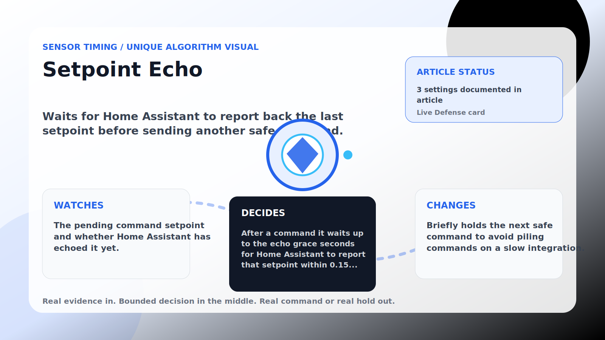

Sensor Timing algorithm

# Setpoint Echo

  

    
Waits for Home Assistant to report back the last setpoint before sending another safe command.

    
These algorithms make corrections land near real house signals instead of on a robotic beat, while still stepping aside when room comfort needs direct cooling.

    
<a class="mini-link" href="Algorithms.html">Back to all algorithms</a> <a class="mini-link" href="Defender-Logic.html#setpoint-echo">See it on the logic page</a>

  

  

  

  

  
1<strong>Watch</strong>

  
2<strong>Decide</strong>

  
3<strong>Act</strong>

  
<i></i>

## The short version

Waits for Home Assistant to report back the last setpoint before sending another safe command.

## What it watches

The pending command setpoint and whether Home Assistant has echoed it yet.

## How it decides

After a command it waits up to the echo grace seconds for Home Assistant to report that setpoint within 0.15 °C. Once echoed, or after the grace expires, the next command is allowed. A too-warm room steps it aside.

## What it changes

Briefly holds the next safe command to avoid piling commands on a slow integration.

## Safety boundaries

- Uses the real inputs listed above. It does not invent thermostat, weather, usage, or sensor state.
- Changes only the output listed above. Thermostat-affecting work goes through Home Assistant or returns a real error.
- The global AC Defender rules still apply: the website target remains the floor for cooling commands, the worker keeps refreshing real Home Assistant state 24/7, and comfort/safety rules are not bypassed by decorative timing.

## Settings

<ul class="settings-list"><li><code>SetpointEchoGuardEnabled</code></li><li><code>SetpointEchoGraceSeconds</code></li><li><code>SetpointEchoSafetyBandCelsius</code></li></ul>

## Where to see it

- **Defense page:** live card with state, verdict, evidence, and metrics.
- **Guide page:** generated from the same guard catalog entry.
- **Source:** `Guards/GuardCatalog.cs` describes this page; the implementation is coordinated by `Services/DefenderStateStore.cs` and `Services/AcDefenderService.cs`.
