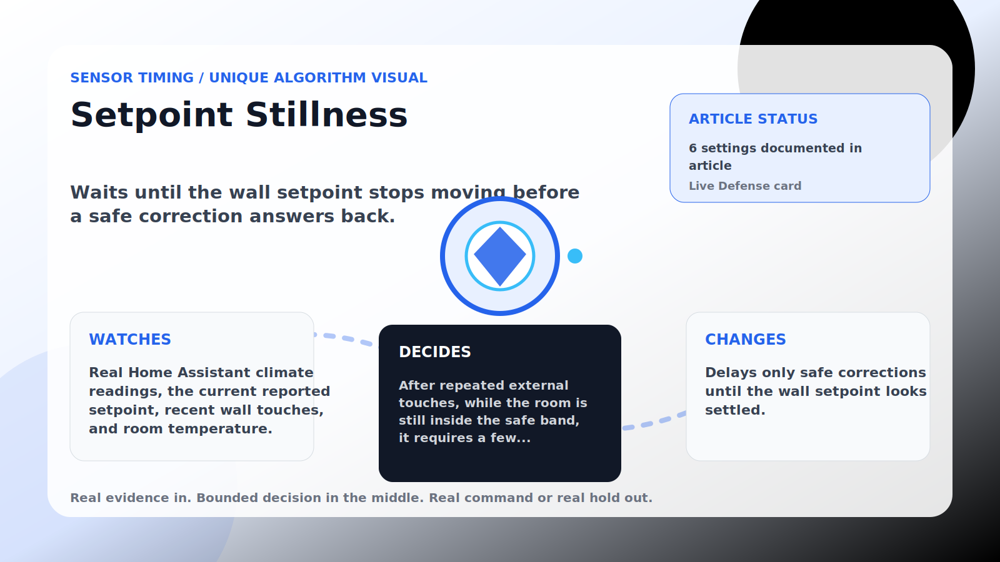

Sensor Timing algorithm

# Setpoint Stillness

  

    
Waits until the wall setpoint stops moving before a safe correction answers back.

    
These algorithms make corrections land near real house signals instead of on a robotic beat, while still stepping aside when room comfort needs direct cooling.

    
<a class="mini-link" href="Algorithms.html">Back to all algorithms</a> <a class="mini-link" href="Defender-Logic.html#setpoint-stillness">See it on the logic page</a>

  

  

  

  

  
1<strong>Watch</strong>

  
2<strong>Decide</strong>

  
3<strong>Act</strong>

  
<i></i>

## The short version

Waits until the wall setpoint stops moving before a safe correction answers back.

## What it watches

Real Home Assistant climate readings, the current reported setpoint, recent wall touches, and room temperature.

## How it decides

After repeated external touches, while the room is still inside the safe band, it requires a few consecutive real Home Assistant readings at the same wall setpoint before allowing a safe correction. If the room gets too warm, a cooler-intent fast lane is active, the expected setpoint is already reached, or the max hold expires, it steps aside.

## What it changes

Delays only safe corrections until the wall setpoint looks settled.

## Safety boundaries

- Uses the real inputs listed above. It does not invent thermostat, weather, usage, or sensor state.
- Changes only the output listed above. Thermostat-affecting work goes through Home Assistant or returns a real error.
- The global AC Defender rules still apply: the website target remains the floor for cooling commands, the worker keeps refreshing real Home Assistant state 24/7, and comfort/safety rules are not bypassed by decorative timing.

## Settings

<ul class="settings-list"><li><code>SetpointStillnessGuardEnabled</code></li><li><code>SetpointStillnessTriggerTouches</code></li><li><code>SetpointStillnessRequiredSamples</code></li><li><code>SetpointStillnessMaxHoldSeconds</code></li><li><code>SetpointStillnessToleranceCelsius</code></li><li><code>SetpointStillnessSafetyBandCelsius</code></li></ul>

## Where to see it

- **Defense page:** live card with state, verdict, evidence, and metrics.
- **Guide page:** generated from the same guard catalog entry.
- **Source:** `Guards/GuardCatalog.cs` describes this page; the implementation is coordinated by `Services/DefenderStateStore.cs` and `Services/AcDefenderService.cs`.
