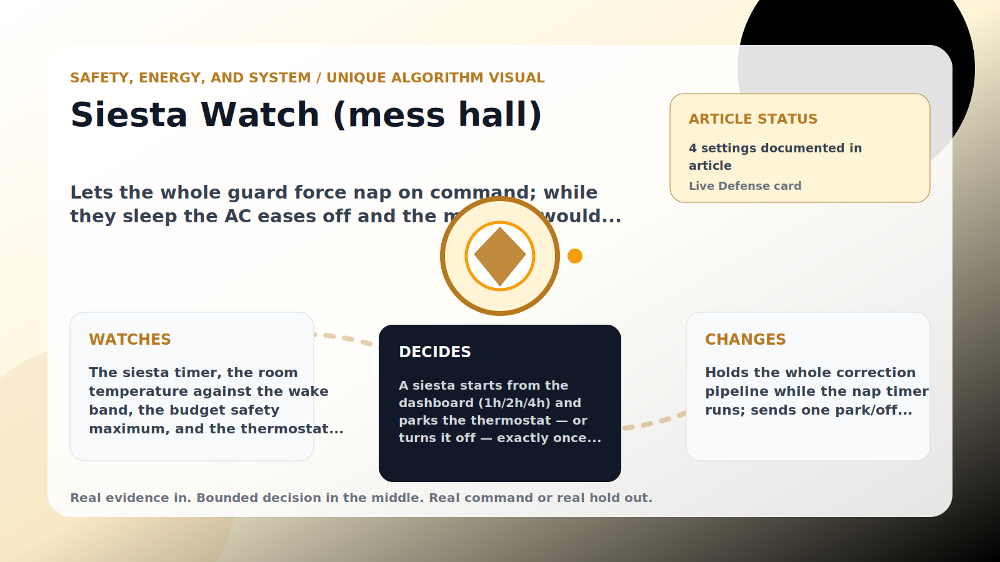

Safety, Energy, and System algorithm

# Siesta Watch (mess hall)

  

    
Lets the whole guard force nap on command; while they sleep the AC eases off and the money it would have spent is banked as food rations.

    
These algorithms keep the product honest: real Home Assistant commands, real errors, real weather or usage data, and safety-first fallbacks whenever comfort or equipment protection matters.

    
<a class="mini-link" href="Algorithms.html">Back to all algorithms</a> <a class="mini-link" href="Defender-Logic.html#siesta-watch-mess-hall">See it on the logic page</a>

  

  

  

  

  
1<strong>Watch</strong>

  
2<strong>Decide</strong>

  
3<strong>Act</strong>

  
<i></i>

## The short version

Lets the whole guard force nap on command; while they sleep the AC eases off and the money it would have spent is banked as food rations.

## What it watches

The siesta timer, the room temperature against the wake band, the budget safety maximum, and the thermostat mode.

## How it decides

A siesta starts from the dashboard (1h/2h/4h) and parks the thermostat — or turns it off — exactly once; a human changing it back mid-nap is respected, the accrual just pauses while the unit cools. The guards wake on the timer, immediately when the room passes target + wake band or the budget safety maximum, on cancel, or when an emergency fires or the master switch pauses the defender. Rations already earned are always kept.

## What it changes

Holds the whole correction pipeline while the nap timer runs; sends one park/off command at the start.

## Safety boundaries

- Uses the real inputs listed above. It does not invent thermostat, weather, usage, or sensor state.
- Changes only the output listed above. Thermostat-affecting work goes through Home Assistant or returns a real error.
- The global AC Defender rules still apply: the website target remains the floor for cooling commands, the worker keeps refreshing real Home Assistant state 24/7, and comfort/safety rules are not bypassed by decorative timing.

## Settings

<ul class="settings-list"><li><code>SiestaEnabled</code></li><li><code>SiestaThermostatAction</code></li><li><code>SiestaWakeBandCelsius</code></li><li><code>SiestaMaxMinutes</code></li></ul>

## Where to see it

- **Defense page:** live card with state, verdict, evidence, and metrics.
- **Guide page:** generated from the same guard catalog entry.
- **Source:** `Guards/GuardCatalog.cs` describes this page; the implementation is coordinated by `Services/DefenderStateStore.cs` and `Services/AcDefenderService.cs`.
