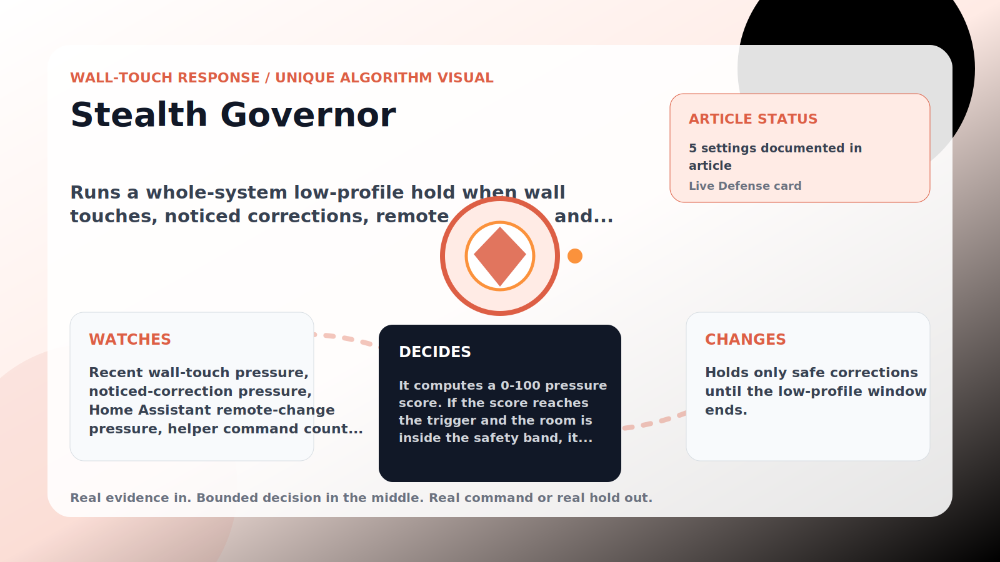

Wall-Touch Response algorithm

# Stealth Governor

  

    
Runs a whole-system low-profile hold when wall touches, noticed corrections, remote changes, and helper commands make the defender look too busy.

    
These algorithms exist for the exact household fight AC Defender is built for: someone keeps raising the thermostat, but the room still needs to come back to your temperature without starting a visible duel.

    
<a class="mini-link" href="Algorithms.html">Back to all algorithms</a> <a class="mini-link" href="Defender-Logic.html#stealth-governor">See it on the logic page</a>

  

  

  

  

  
1<strong>Watch</strong>

  
2<strong>Decide</strong>

  
3<strong>Act</strong>

  
<i></i>

## The short version

Runs a whole-system low-profile hold when wall touches, noticed corrections, remote changes, and helper commands make the defender look too busy.

## What it watches

Recent wall-touch pressure, noticed-correction pressure, Home Assistant remote-change pressure, helper command count, and room temperature.

## How it decides

It computes a 0-100 pressure score. If the score reaches the trigger and the room is inside the safety band, it holds the next safe correction for a min-to-max low-profile window scaled by the score. Direct comfort needs, upstairs heat, or a quiet-timing bypass clear it.

## What it changes

Holds only safe corrections until the low-profile window ends.

## Safety boundaries

- Uses the real inputs listed above. It does not invent thermostat, weather, usage, or sensor state.
- Changes only the output listed above. Thermostat-affecting work goes through Home Assistant or returns a real error.
- The global AC Defender rules still apply: the website target remains the floor for cooling commands, the worker keeps refreshing real Home Assistant state 24/7, and comfort/safety rules are not bypassed by decorative timing.

## Settings

<ul class="settings-list"><li><code>StealthGovernorEnabled</code></li><li><code>StealthGovernorTriggerScore</code></li><li><code>StealthGovernorMinimumHoldMinutes</code></li><li><code>StealthGovernorMaximumHoldMinutes</code></li><li><code>StealthGovernorSafetyBandCelsius</code></li></ul>

## Where to see it

- **Defense page:** live card with state, verdict, evidence, and metrics.
- **Guide page:** generated from the same guard catalog entry.
- **Source:** `Guards/GuardCatalog.cs` describes this page; the implementation is coordinated by `Services/DefenderStateStore.cs` and `Services/AcDefenderService.cs`.
