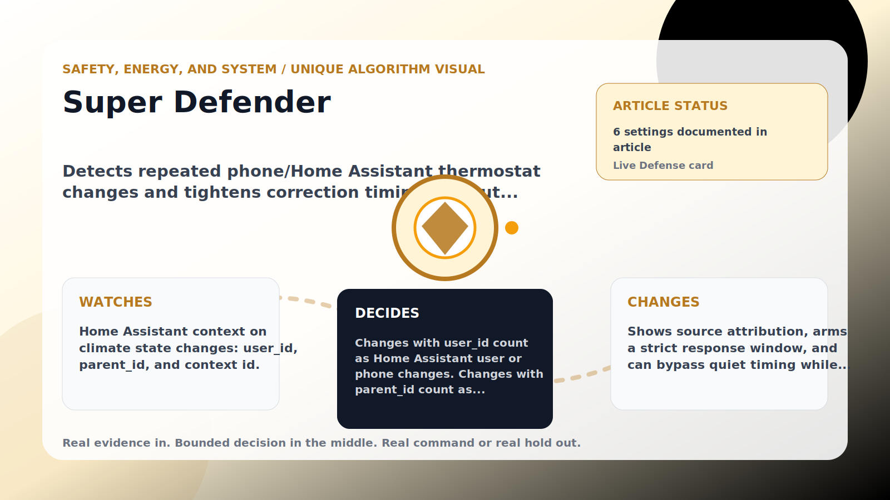

Safety, Energy, and System algorithm

# Super Defender

  

    
Detects repeated phone/Home Assistant thermostat changes and tightens correction timing without cutting thermostat Wi-Fi.

    
These algorithms keep the product honest: real Home Assistant commands, real errors, real weather or usage data, and safety-first fallbacks whenever comfort or equipment protection matters.

    
<a class="mini-link" href="Algorithms.html">Back to all algorithms</a> <a class="mini-link" href="Defender-Logic.html#super-defender">See it on the logic page</a>

  

  

  

  

  
1<strong>Watch</strong>

  
2<strong>Decide</strong>

  
3<strong>Act</strong>

  
<i></i>

## The short version

Detects repeated phone/Home Assistant thermostat changes and tightens correction timing without cutting thermostat Wi-Fi.

## What it watches

Home Assistant context on climate state changes: user_id, parent_id, and context id.

## How it decides

Changes with user_id count as Home Assistant user or phone changes. Changes with parent_id count as automation/script changes. Repeated remote-style changes inside the configured window arm Super Defender for the hold minutes. While active and the room still needs cooling, it can bypass subtle quiet waits. Wi-Fi blocking is intentionally manual only because cutting the thermostat off can also remove monitoring and recovery.

## What it changes

Shows source attribution, arms a strict response window, and can bypass quiet timing while cooling is needed.

## Safety boundaries

- Uses the real inputs listed above. It does not invent thermostat, weather, usage, or sensor state.
- Changes only the output listed above. Thermostat-affecting work goes through Home Assistant or returns a real error.
- The global AC Defender rules still apply: the website target remains the floor for cooling commands, the worker keeps refreshing real Home Assistant state 24/7, and comfort/safety rules are not bypassed by decorative timing.

## Settings

<ul class="settings-list"><li><code>SuperDefenderModeEnabled</code></li><li><code>SuperDefenderRemoteChangeThreshold</code></li><li><code>SuperDefenderWindowMinutes</code></li><li><code>SuperDefenderHoldMinutes</code></li><li><code>SuperDefenderSafetyBandCelsius</code></li><li><code>SuperDefenderBypassQuietTiming</code></li></ul>

## Where to see it

- **Defense page:** live card with state, verdict, evidence, and metrics.
- **Guide page:** generated from the same guard catalog entry.
- **Source:** `Guards/GuardCatalog.cs` describes this page; the implementation is coordinated by `Services/DefenderStateStore.cs` and `Services/AcDefenderService.cs`.
