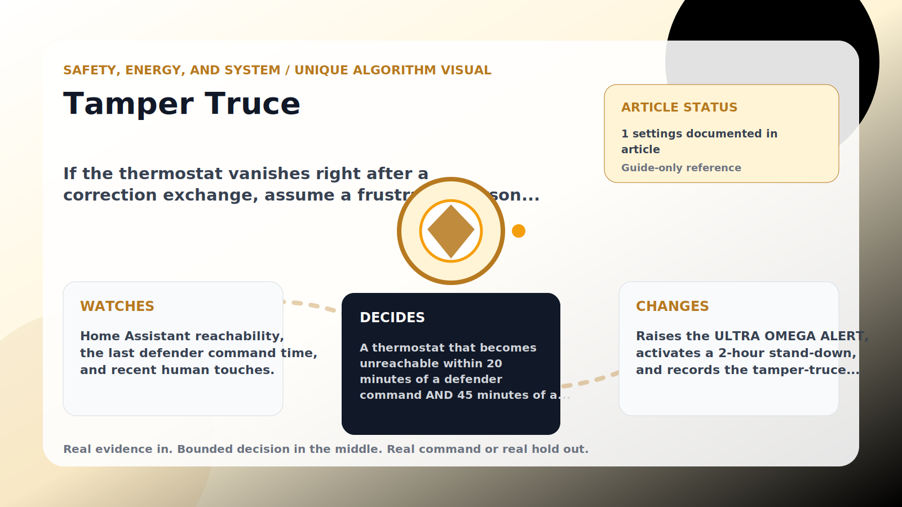

Safety, Energy, and System algorithm

# Tamper Truce

  

    
If the thermostat vanishes right after a correction exchange, assume a frustrated person detached it — stand down 2 hours instead of escalating.

    
These algorithms keep the product honest: real Home Assistant commands, real errors, real weather or usage data, and safety-first fallbacks whenever comfort or equipment protection matters.

    
<a class="mini-link" href="Algorithms.html">Back to all algorithms</a> <a class="mini-link" href="Defender-Logic.html#tamper-truce">See it on the logic page</a>

  

  

  

  

  
1<strong>Watch</strong>

  
2<strong>Decide</strong>

  
3<strong>Act</strong>

  
<i></i>

## The short version

If the thermostat vanishes right after a correction exchange, assume a frustrated person detached it — stand down 2 hours instead of escalating.

## What it watches

Home Assistant reachability, the last defender command time, and recent human touches.

## How it decides

A thermostat that becomes unreachable within 20 minutes of a defender command AND 45 minutes of a human touch looks exactly like someone pulling the unit off the wall (it really happened, twice). This is the ULTRA OMEGA ALERT — one tier above MEGA (not cooling) and OMEGA (breaker off). Instead of fighting harder, the defender enters a 2-hour emergency quiet named &#x27;Tamper truce&#x27; and says why. Normal outages without a preceding exchange are unaffected.

## What it changes

Raises the ULTRA OMEGA ALERT, activates a 2-hour stand-down, and records the tamper-truce event.

## Safety boundaries

- Uses the real inputs listed above. It does not invent thermostat, weather, usage, or sensor state.
- Changes only the output listed above. Thermostat-affecting work goes through Home Assistant or returns a real error.
- The global AC Defender rules still apply: the website target remains the floor for cooling commands, the worker keeps refreshing real Home Assistant state 24/7, and comfort/safety rules are not bypassed by decorative timing.

## Settings

<ul class="settings-list"><li><code>(always on — fixed: 20 min command window / 45 min touch window / 2 h truce)</code></li></ul>

## Where to see it

- **Defense page:** guide-only reference entry.
- **Guide page:** generated from the same guard catalog entry.
- **Source:** `Guards/GuardCatalog.cs` describes this page; the implementation is coordinated by `Services/DefenderStateStore.cs` and `Services/AcDefenderService.cs`.
