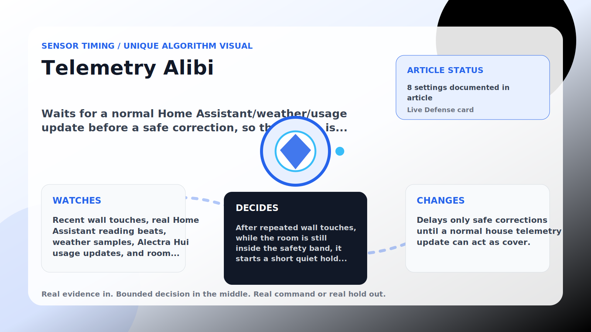

Sensor Timing algorithm

# Telemetry Alibi

  

    
Waits for a normal Home Assistant/weather/usage update before a safe correction, so the nudge is not an isolated event.

    
These algorithms make corrections land near real house signals instead of on a robotic beat, while still stepping aside when room comfort needs direct cooling.

    
<a class="mini-link" href="Algorithms.html">Back to all algorithms</a> <a class="mini-link" href="Defender-Logic.html#telemetry-alibi">See it on the logic page</a>

  

  

  

  

  
1<strong>Watch</strong>

  
2<strong>Decide</strong>

  
3<strong>Act</strong>

  
<i></i>

## The short version

Waits for a normal Home Assistant/weather/usage update before a safe correction, so the nudge is not an isolated event.

## What it watches

Recent wall touches, real Home Assistant reading beats, weather samples, Alectra Hui usage updates, and room temperature.

## How it decides

After repeated wall touches, while the room is still inside the safety band, it starts a short quiet hold and then waits for the next enabled real telemetry signal. A too-warm room, direct comfort need, matching setpoint, disabled signal source, or max wait clears the hold.

## What it changes

Delays only safe corrections until a normal house telemetry update can act as cover.

## Safety boundaries

- Uses the real inputs listed above. It does not invent thermostat, weather, usage, or sensor state.
- Changes only the output listed above. Thermostat-affecting work goes through Home Assistant or returns a real error.
- The global AC Defender rules still apply: the website target remains the floor for cooling commands, the worker keeps refreshing real Home Assistant state 24/7, and comfort/safety rules are not bypassed by decorative timing.

## Settings

<ul class="settings-list"><li><code>TelemetryAlibiEnabled</code></li><li><code>TelemetryAlibiTriggerTouches</code></li><li><code>TelemetryAlibiMinimumHoldSeconds</code></li><li><code>TelemetryAlibiMaxHoldMinutes</code></li><li><code>TelemetryAlibiSafetyBandCelsius</code></li><li><code>TelemetryAlibiUseWeather</code></li><li><code>TelemetryAlibiUseSensorBeat</code></li><li><code>TelemetryAlibiUsePeakPower</code></li></ul>

## Where to see it

- **Defense page:** live card with state, verdict, evidence, and metrics.
- **Guide page:** generated from the same guard catalog entry.
- **Source:** `Guards/GuardCatalog.cs` describes this page; the implementation is coordinated by `Services/DefenderStateStore.cs` and `Services/AcDefenderService.cs`.
