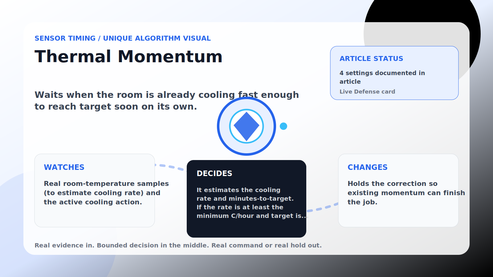

Sensor Timing algorithm

# Thermal Momentum

  

    
Waits when the room is already cooling fast enough to reach target soon on its own.

    
These algorithms make corrections land near real house signals instead of on a robotic beat, while still stepping aside when room comfort needs direct cooling.

    
<a class="mini-link" href="Algorithms.html">Back to all algorithms</a> <a class="mini-link" href="Defender-Logic.html#thermal-momentum">See it on the logic page</a>

  

  

  

  

  
1<strong>Watch</strong>

  
2<strong>Decide</strong>

  
3<strong>Act</strong>

  
<i></i>

## The short version

Waits when the room is already cooling fast enough to reach target soon on its own.

## What it watches

Real room-temperature samples (to estimate cooling rate) and the active cooling action.

## How it decides

It estimates the cooling rate and minutes-to-target. If the rate is at least the minimum C/hour and target is within the look-ahead minutes, it holds for the momentum hold minutes. A room near target or above the safety band proceeds.

## What it changes

Holds the correction so existing momentum can finish the job.

## Safety boundaries

- Uses the real inputs listed above. It does not invent thermostat, weather, usage, or sensor state.
- Changes only the output listed above. Thermostat-affecting work goes through Home Assistant or returns a real error.
- The global AC Defender rules still apply: the website target remains the floor for cooling commands, the worker keeps refreshing real Home Assistant state 24/7, and comfort/safety rules are not bypassed by decorative timing.

## Settings

<ul class="settings-list"><li><code>ThermalMomentumGuardEnabled</code></li><li><code>ThermalMomentumMinimumCoolingRateCelsiusPerHour</code></li><li><code>ThermalMomentumLookAheadMinutes</code></li><li><code>ThermalMomentumHoldMinutes</code></li></ul>

## Where to see it

- **Defense page:** live card with state, verdict, evidence, and metrics.
- **Guide page:** generated from the same guard catalog entry.
- **Source:** `Guards/GuardCatalog.cs` describes this page; the implementation is coordinated by `Services/DefenderStateStore.cs` and `Services/AcDefenderService.cs`.
