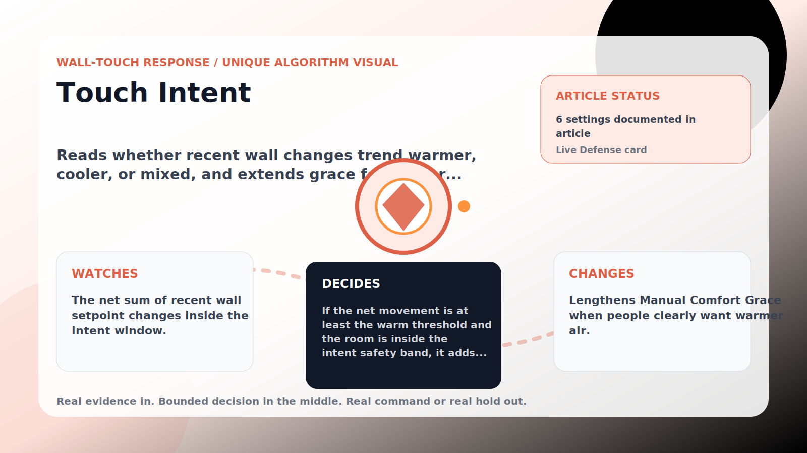

Wall-Touch Response algorithm

# Touch Intent

  

    
Reads whether recent wall changes trend warmer, cooler, or mixed, and extends grace for a clear warmer pattern.

    
These algorithms exist for the exact household fight AC Defender is built for: someone keeps raising the thermostat, but the room still needs to come back to your temperature without starting a visible duel.

    
<a class="mini-link" href="Algorithms.html">Back to all algorithms</a> <a class="mini-link" href="Defender-Logic.html#touch-intent">See it on the logic page</a>

  

  

  

  

  
1<strong>Watch</strong>

  
2<strong>Decide</strong>

  
3<strong>Act</strong>

  
<i></i>

## The short version

Reads whether recent wall changes trend warmer, cooler, or mixed, and extends grace for a clear warmer pattern.

## What it watches

The net sum of recent wall setpoint changes inside the intent window.

## How it decides

If the net movement is at least the warm threshold and the room is inside the intent safety band, it adds the extra grace minutes to Manual Comfort Grace. Cooler or mixed patterns get no extra grace; a too-warm room steps it aside.

## What it changes

Lengthens Manual Comfort Grace when people clearly want warmer air.

## Safety boundaries

- Uses the real inputs listed above. It does not invent thermostat, weather, usage, or sensor state.
- Changes only the output listed above. Thermostat-affecting work goes through Home Assistant or returns a real error.
- The global AC Defender rules still apply: the website target remains the floor for cooling commands, the worker keeps refreshing real Home Assistant state 24/7, and comfort/safety rules are not bypassed by decorative timing.

## Settings

<ul class="settings-list"><li><code>TouchIntentEnabled</code></li><li><code>TouchIntentMinimumTouches</code></li><li><code>TouchIntentWindowMinutes</code></li><li><code>TouchIntentNetWarmThresholdCelsius</code></li><li><code>TouchIntentExtraGraceMinutes</code></li><li><code>TouchIntentSafetyBandCelsius</code></li></ul>

## Where to see it

- **Defense page:** live card with state, verdict, evidence, and metrics.
- **Guide page:** generated from the same guard catalog entry.
- **Source:** `Guards/GuardCatalog.cs` describes this page; the implementation is coordinated by `Services/DefenderStateStore.cs` and `Services/AcDefenderService.cs`.
