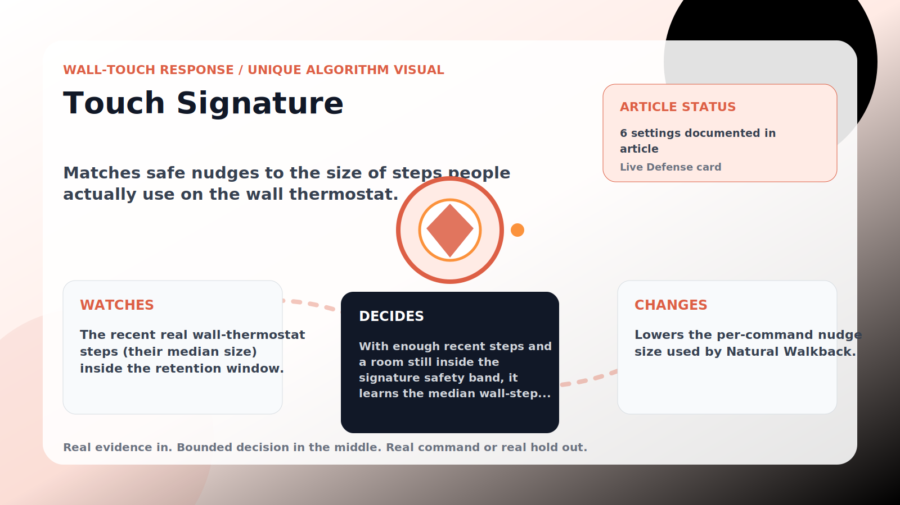

Wall-Touch Response algorithm

# Touch Signature

  

    
Matches safe nudges to the size of steps people actually use on the wall thermostat.

    
These algorithms exist for the exact household fight AC Defender is built for: someone keeps raising the thermostat, but the room still needs to come back to your temperature without starting a visible duel.

    
<a class="mini-link" href="Algorithms.html">Back to all algorithms</a> <a class="mini-link" href="Defender-Logic.html#touch-signature">See it on the logic page</a>

  

  

  

  

  
1<strong>Watch</strong>

  
2<strong>Decide</strong>

  
3<strong>Act</strong>

  
<i></i>

## The short version

Matches safe nudges to the size of steps people actually use on the wall thermostat.

## What it watches

The recent real wall-thermostat steps (their median size) inside the retention window.

## How it decides

With enough recent steps and a room still inside the signature safety band, it learns the median wall-step size, clamps it between the min and max signature step, and caps safe nudges to that size. Too-warm rooms clear the signature so direct cooling resumes.

## What it changes

Lowers the per-command nudge size used by Natural Walkback.

## Safety boundaries

- Uses the real inputs listed above. It does not invent thermostat, weather, usage, or sensor state.
- Changes only the output listed above. Thermostat-affecting work goes through Home Assistant or returns a real error.
- The global AC Defender rules still apply: the website target remains the floor for cooling commands, the worker keeps refreshing real Home Assistant state 24/7, and comfort/safety rules are not bypassed by decorative timing.

## Settings

<ul class="settings-list"><li><code>TouchSignatureEnabled</code></li><li><code>TouchSignatureTriggerTouches</code></li><li><code>TouchSignatureRetentionMinutes</code></li><li><code>TouchSignatureMinimumStepCelsius</code></li><li><code>TouchSignatureMaximumStepCelsius</code></li><li><code>TouchSignatureSafetyBandCelsius</code></li></ul>

## Where to see it

- **Defense page:** live card with state, verdict, evidence, and metrics.
- **Guide page:** generated from the same guard catalog entry.
- **Source:** `Guards/GuardCatalog.cs` describes this page; the implementation is coordinated by `Services/DefenderStateStore.cs` and `Services/AcDefenderService.cs`.
