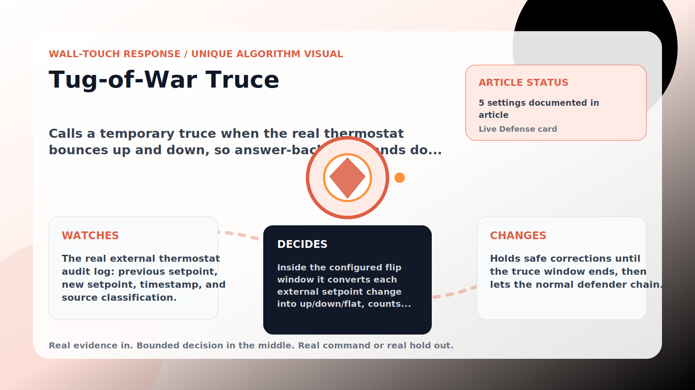

Wall-Touch Response algorithm

# Tug-of-War Truce

  

    
Calls a temporary truce when the real thermostat bounces up and down, so answer-back commands do not look like a duel.

    
These algorithms exist for the exact household fight AC Defender is built for: someone keeps raising the thermostat, but the room still needs to come back to your temperature without starting a visible duel.

    
<a class="mini-link" href="Algorithms.html">Back to all algorithms</a> <a class="mini-link" href="Defender-Logic.html#tug-of-war-truce">See it on the logic page</a>

  

  

  

  

  
1<strong>Watch</strong>

  
2<strong>Decide</strong>

  
3<strong>Act</strong>

  
<i></i>

## The short version

Calls a temporary truce when the real thermostat bounces up and down, so answer-back commands do not look like a duel.

## What it watches

The real external thermostat audit log: previous setpoint, new setpoint, timestamp, and source classification.

## How it decides

Inside the configured flip window it converts each external setpoint change into up/down/flat, counts direction flips, and compares that count to the flip trigger. If the flip trigger is met and the room is still inside the safety band, it holds only safe answer-back corrections for the truce minutes. A warm room, severe upstairs heat, matching setpoint, cooler-intent fast lane, or Super Defender strict bypass clears it.

## What it changes

Holds safe corrections until the truce window ends, then lets the normal defender chain continue.

## Safety boundaries

- Uses the real inputs listed above. It does not invent thermostat, weather, usage, or sensor state.
- Changes only the output listed above. Thermostat-affecting work goes through Home Assistant or returns a real error.
- The global AC Defender rules still apply: the website target remains the floor for cooling commands, the worker keeps refreshing real Home Assistant state 24/7, and comfort/safety rules are not bypassed by decorative timing.

## Settings

<ul class="settings-list"><li><code>TugOfWarTruceEnabled</code></li><li><code>TugOfWarTruceMinimumFlips</code></li><li><code>TugOfWarTruceWindowMinutes</code></li><li><code>TugOfWarTruceHoldMinutes</code></li><li><code>TugOfWarTruceSafetyBandCelsius</code></li></ul>

## Where to see it

- **Defense page:** live card with state, verdict, evidence, and metrics.
- **Guide page:** generated from the same guard catalog entry.
- **Source:** `Guards/GuardCatalog.cs` describes this page; the implementation is coordinated by `Services/DefenderStateStore.cs` and `Services/AcDefenderService.cs`.
