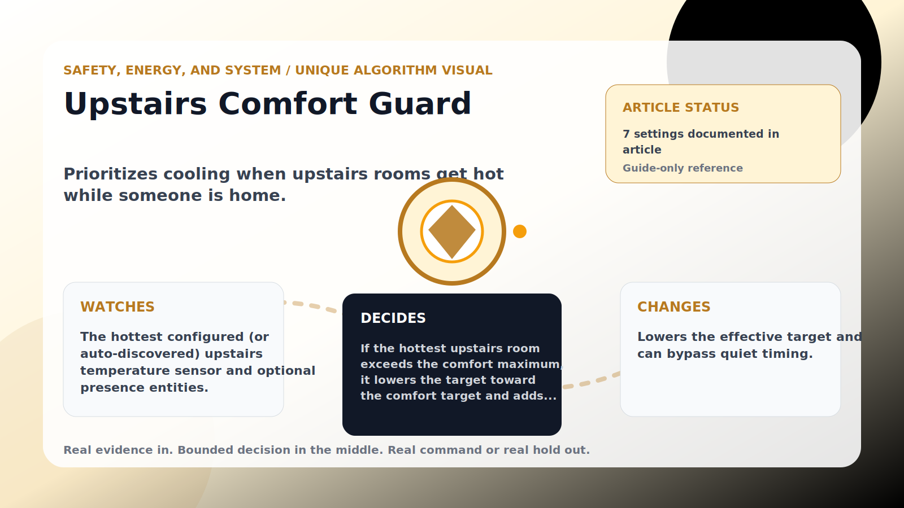

Safety, Energy, and System algorithm

# Upstairs Comfort Guard

  

    
Prioritizes cooling when upstairs rooms get hot while someone is home.

    
These algorithms keep the product honest: real Home Assistant commands, real errors, real weather or usage data, and safety-first fallbacks whenever comfort or equipment protection matters.

    
<a class="mini-link" href="Algorithms.html">Back to all algorithms</a> <a class="mini-link" href="Defender-Logic.html#upstairs-comfort-guard">See it on the logic page</a>

  

  

  

  

  
1<strong>Watch</strong>

  
2<strong>Decide</strong>

  
3<strong>Act</strong>

  
<i></i>

## The short version

Prioritizes cooling when upstairs rooms get hot while someone is home.

## What it watches

The hottest configured (or auto-discovered) upstairs temperature sensor and optional presence entities.

## How it decides

If the hottest upstairs room exceeds the comfort maximum, it lowers the target toward the comfort target and adds the cooling boost. Severe upstairs heat bypasses cooldown so comfort wins. When presence is required and nobody is detected, it assumes home rather than under-cooling.

## What it changes

Lowers the effective target and can bypass quiet timing.

## Safety boundaries

- Uses the real inputs listed above. It does not invent thermostat, weather, usage, or sensor state.
- Changes only the output listed above. Thermostat-affecting work goes through Home Assistant or returns a real error.
- The global AC Defender rules still apply: the website target remains the floor for cooling commands, the worker keeps refreshing real Home Assistant state 24/7, and comfort/safety rules are not bypassed by decorative timing.

## Settings

<ul class="settings-list"><li><code>UpstairsComfortEnabled</code></li><li><code>UpstairsTemperatureEntityIds</code></li><li><code>UpstairsMaxComfortCelsius</code></li><li><code>UpstairsComfortTargetCelsius</code></li><li><code>UpstairsComfortBoostCelsius</code></li><li><code>HomePresenceRequired</code></li><li><code>PresenceEntityIds</code></li></ul>

## Where to see it

- **Defense page:** guide-only reference entry.
- **Guide page:** generated from the same guard catalog entry.
- **Source:** `Guards/GuardCatalog.cs` describes this page; the implementation is coordinated by `Services/DefenderStateStore.cs` and `Services/AcDefenderService.cs`.
