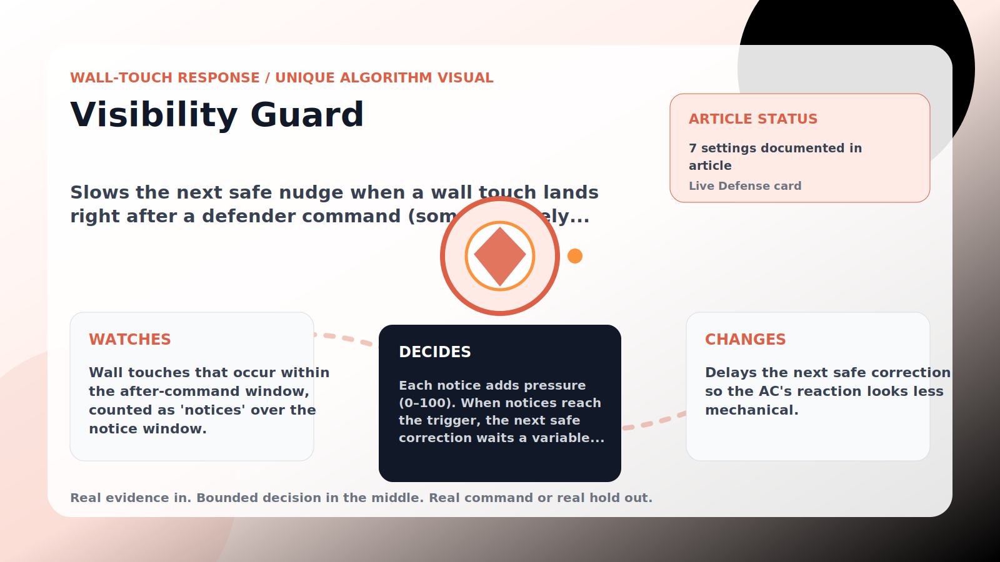

Wall-Touch Response algorithm

# Visibility Guard

  

    
Slows the next safe nudge when a wall touch lands right after a defender command (someone likely noticed).

    
These algorithms exist for the exact household fight AC Defender is built for: someone keeps raising the thermostat, but the room still needs to come back to your temperature without starting a visible duel.

    
<a class="mini-link" href="Algorithms.html">Back to all algorithms</a> <a class="mini-link" href="Defender-Logic.html#visibility-guard">See it on the logic page</a>

  

  

  

  

  
1<strong>Watch</strong>

  
2<strong>Decide</strong>

  
3<strong>Act</strong>

  
<i></i>

## The short version

Slows the next safe nudge when a wall touch lands right after a defender command (someone likely noticed).

## What it watches

Wall touches that occur within the after-command window, counted as &#x27;notices&#x27; over the notice window.

## How it decides

Each notice adds pressure (0–100). When notices reach the trigger, the next safe correction waits a variable hold between the min and max hold minutes, scaled by pressure. A room over the safety band clears the hold.

## What it changes

Delays the next safe correction so the AC&#x27;s reaction looks less mechanical.

## Safety boundaries

- Uses the real inputs listed above. It does not invent thermostat, weather, usage, or sensor state.
- Changes only the output listed above. Thermostat-affecting work goes through Home Assistant or returns a real error.
- The global AC Defender rules still apply: the website target remains the floor for cooling commands, the worker keeps refreshing real Home Assistant state 24/7, and comfort/safety rules are not bypassed by decorative timing.

## Settings

<ul class="settings-list"><li><code>VisibilityGuardEnabled</code></li><li><code>VisibilityGuardTriggerNotices</code></li><li><code>VisibilityGuardNoticeWindowMinutes</code></li><li><code>VisibilityGuardAfterCommandSeconds</code></li><li><code>VisibilityGuardMinimumHoldMinutes</code></li><li><code>VisibilityGuardMaximumHoldMinutes</code></li><li><code>VisibilityGuardSafetyBandCelsius</code></li></ul>

## Where to see it

- **Defense page:** live card with state, verdict, evidence, and metrics.
- **Guide page:** generated from the same guard catalog entry.
- **Source:** `Guards/GuardCatalog.cs` describes this page; the implementation is coordinated by `Services/DefenderStateStore.cs` and `Services/AcDefenderService.cs`.
