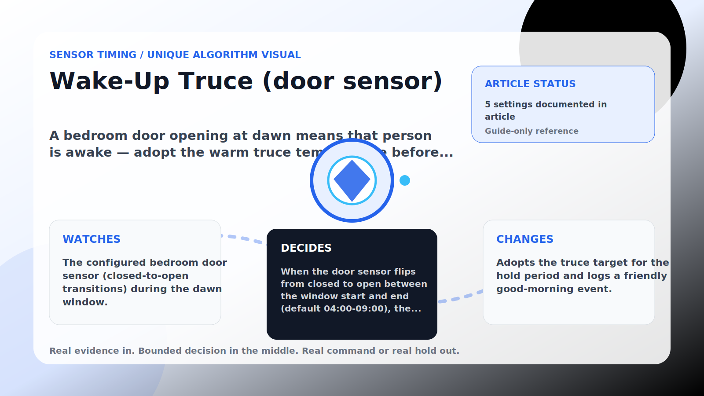

Sensor Timing algorithm

# Wake-Up Truce (door sensor)

  

    
A bedroom door opening at dawn means that person is awake — adopt the warm truce temperature before they ever touch the thermostat.

    
These algorithms make corrections land near real house signals instead of on a robotic beat, while still stepping aside when room comfort needs direct cooling.

    
<a class="mini-link" href="Algorithms.html">Back to all algorithms</a> <a class="mini-link" href="Defender-Logic.html#wake-up-truce-door-sensor">See it on the logic page</a>

  

  

  

  

  
1<strong>Watch</strong>

  
2<strong>Decide</strong>

  
3<strong>Act</strong>

  
<i></i>

## The short version

A bedroom door opening at dawn means that person is awake — adopt the warm truce temperature before they ever touch the thermostat.

## What it watches

The configured bedroom door sensor (closed-to-open transitions) during the dawn window.

## How it decides

When the door sensor flips from closed to open between the window start and end (default 04:00-09:00), the defender immediately adopts the truce temperature (default 25 C, never below my temp, capped at 27 C) for the hold period (default 2 h) using the same surrender machinery. The person wakes to a defender that already agrees with them.

## What it changes

Adopts the truce target for the hold period and logs a friendly good-morning event.

## Safety boundaries

- Uses the real inputs listed above. It does not invent thermostat, weather, usage, or sensor state.
- Changes only the output listed above. Thermostat-affecting work goes through Home Assistant or returns a real error.
- The global AC Defender rules still apply: the website target remains the floor for cooling commands, the worker keeps refreshing real Home Assistant state 24/7, and comfort/safety rules are not bypassed by decorative timing.

## Settings

<ul class="settings-list"><li><code>WakeTruceDoorSensorEntityId</code></li><li><code>WakeTruceWindowStart</code></li><li><code>WakeTruceWindowEnd</code></li><li><code>WakeTruceTargetCelsius</code></li><li><code>WakeTruceHoldMinutes</code></li></ul>

## Where to see it

- **Defense page:** guide-only reference entry.
- **Guide page:** generated from the same guard catalog entry.
- **Source:** `Guards/GuardCatalog.cs` describes this page; the implementation is coordinated by `Services/DefenderStateStore.cs` and `Services/AcDefenderService.cs`.
