# Algorithms

Every algorithm gets its own wiki article, generated from the same guard catalog that feeds the in-app Guide and Defense cards. Use this when you want the clearest answer to: “what happens when someone keeps making the thermostat too warm?”

  

    
50 real algorithms, no simulator

    <h2>The whole defense brain, searchable.</h2>
    
Each card has a unique generated thumbnail and opens a full article with a different unique explanatory graphic. No algorithm page shares the same image.

  

  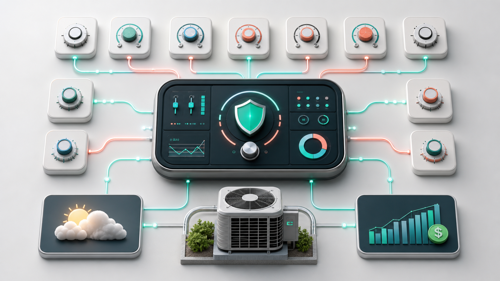

  <label for="algorithm-search">Search all algorithms</label>
  
<input id="algorithm-search" data-search-input type="search" placeholder="Try wall touch, schedule, Alectra, cooldown, cool mode, thermostat off..."><button type="button" data-search-clear aria-label="Clear algorithm search">Clear</button>

  
50 algorithms shown

No algorithms match that search.

  
<article class="algorithm-card category-core" data-search-item data-search-text="Comfort Sync (quiet recovery) Core Cooling Spaces out and softens corrections so a fixed thermostat does not look like an instant robot. Recent wall-touch count, time since the last defender command, and how far the room is above target. After a manual change it waits a random delay, may hold one or two extra short beats, enforces a minimum gap between commands, and shrinks the nudge size. Repeated touches raise the quiet level (Calm → Light → Quiet → Extra quiet → Softest), lengthening waits and shrinking steps. A warm room (over the safety override) skips all of it. Holds the correction until the chosen calm moment, then lets a softened nudge through. NaturalRecoveryEnabled AdaptiveQuietnessEnabled MinimumNaturalDelaySeconds MaximumNaturalDelaySeconds NaturalStepCelsius NaturalHoldChancePercent MinimumCommandGapSeconds NaturalSafetyOverrideCelsius">
  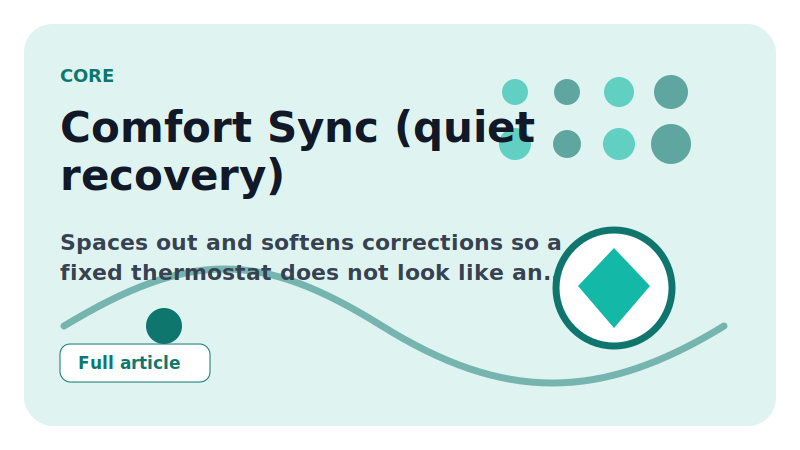
  

    Core
    Live card
  

  <h3><a href="Algorithm-comfort-sync-quiet-recovery.html">Comfort Sync (quiet recovery)</a></h3>
  
Spaces out and softens corrections so a fixed thermostat does not look like an instant robot.

  <dl><dt>Watches</dt><dd>Recent wall-touch count, time since the last defender command, and how far the room is above target.</dd><dt>Effect</dt><dd>Holds the correction until the chosen calm moment, then lets a softened nudge through.</dd></dl>
  
<strong>Key settings:</strong> NaturalRecoveryEnabled, AdaptiveQuietnessEnabled, MinimumNaturalDelaySeconds, MaximumNaturalDelaySeconds...

</article><article class="algorithm-card category-core" data-search-item data-search-text="Cool Mode Restore Core Cooling Puts the thermostat back into cool mode whenever someone switches it to heat/off/auto. The Home Assistant HVAC mode, plus how far the room is above target. If the mode is not &#x27;cool&#x27; it normally waits a short random delay (between the min and max seconds) so the change is not jarring — but only while the room stays within the comfort band. If the room is warmer than target + band, upstairs is severely hot, or the safety override is crossed, it restores cool immediately. Sends climate.set_hvac_mode = cool once the delay (if any) elapses. CoolModeRestoreDelayEnabled CoolModeRestoreMinimumDelaySeconds CoolModeRestoreMaximumDelaySeconds CoolModeRestoreComfortBandCelsius">
  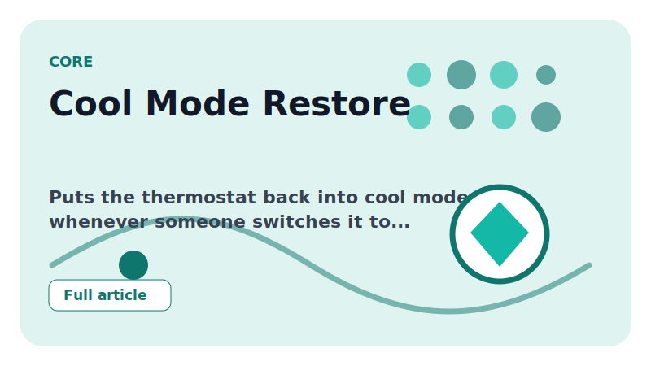
  

    Core
    Live card
  

  <h3><a href="Algorithm-cool-mode-restore.html">Cool Mode Restore</a></h3>
  
Puts the thermostat back into cool mode whenever someone switches it to heat/off/auto.

  <dl><dt>Watches</dt><dd>The Home Assistant HVAC mode, plus how far the room is above target.</dd><dt>Effect</dt><dd>Sends climate.set_hvac_mode = cool once the delay (if any) elapses.</dd></dl>
  
<strong>Key settings:</strong> CoolModeRestoreDelayEnabled, CoolModeRestoreMinimumDelaySeconds, CoolModeRestoreMaximumDelaySeconds, CoolModeRestoreComfortBandCelsius

</article><article class="algorithm-card category-wall" data-search-item data-search-text="Natural Walkback Wall-Touch Response Walks a safe-band correction toward target in small, slightly random steps instead of one obvious jump. Recent wall-touch pressure (a 0–100 suspicion score) and how far the setpoint is from the defender target. Once recent touches reach the trigger count and the room is inside the walkback safety band, each command moves only about the walkback step (plus a tiny jitter) toward target. A warm room that needs direct cooling skips walkback and still commands the configured warm-room approach below the current room temperature (0.5 C by default). Shapes the size of the setpoint command just before it is sent. NaturalWalkbackEnabled NaturalWalkbackTriggerTouches NaturalWalkbackStepCelsius NaturalWalkbackJitterCelsius NaturalWalkbackSafetyBandCelsius">
  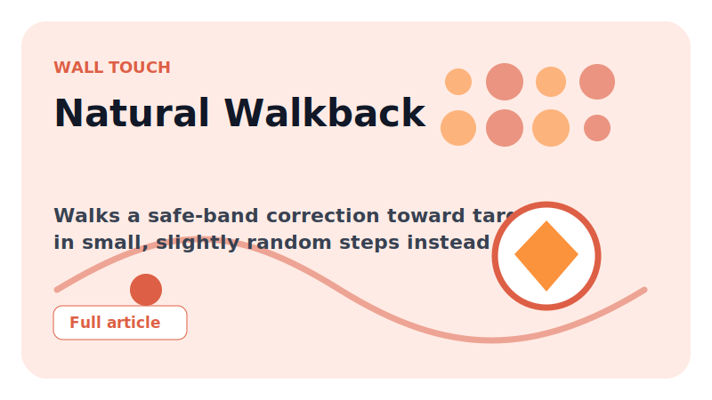
  

    Wall touch
    Live card
  

  <h3><a href="Algorithm-natural-walkback.html">Natural Walkback</a></h3>
  
Walks a safe-band correction toward target in small, slightly random steps instead of one obvious jump.

  <dl><dt>Watches</dt><dd>Recent wall-touch pressure (a 0–100 suspicion score) and how far the setpoint is from the defender target.</dd><dt>Effect</dt><dd>Shapes the size of the setpoint command just before it is sent.</dd></dl>
  
<strong>Key settings:</strong> NaturalWalkbackEnabled, NaturalWalkbackTriggerTouches, NaturalWalkbackStepCelsius, NaturalWalkbackJitterCelsius...

</article><article class="algorithm-card category-wall" data-search-item data-search-text="Touch Signature Wall-Touch Response Matches safe nudges to the size of steps people actually use on the wall thermostat. The recent real wall-thermostat steps (their median size) inside the retention window. With enough recent steps and a room still inside the signature safety band, it learns the median wall-step size, clamps it between the min and max signature step, and caps safe nudges to that size. Too-warm rooms clear the signature so direct cooling resumes. Lowers the per-command nudge size used by Natural Walkback. TouchSignatureEnabled TouchSignatureTriggerTouches TouchSignatureRetentionMinutes TouchSignatureMinimumStepCelsius TouchSignatureMaximumStepCelsius TouchSignatureSafetyBandCelsius">
  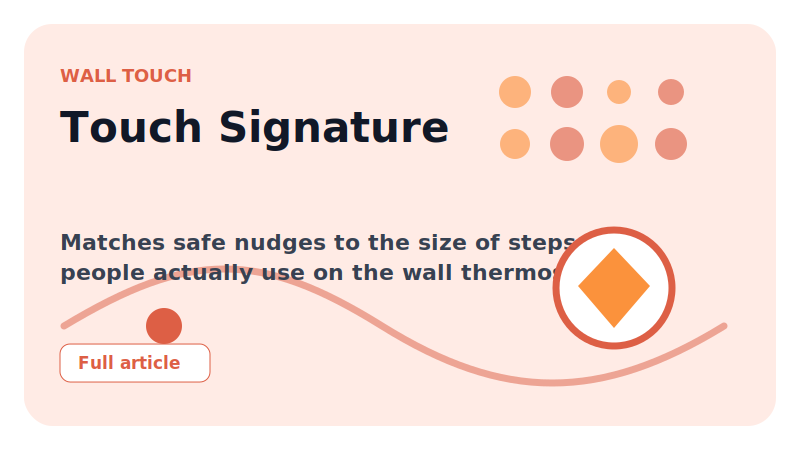
  

    Wall touch
    Live card
  

  <h3><a href="Algorithm-touch-signature.html">Touch Signature</a></h3>
  
Matches safe nudges to the size of steps people actually use on the wall thermostat.

  <dl><dt>Watches</dt><dd>The recent real wall-thermostat steps (their median size) inside the retention window.</dd><dt>Effect</dt><dd>Lowers the per-command nudge size used by Natural Walkback.</dd></dl>
  
<strong>Key settings:</strong> TouchSignatureEnabled, TouchSignatureTriggerTouches, TouchSignatureRetentionMinutes, TouchSignatureMinimumStepCelsius...

</article><article class="algorithm-card category-wall" data-search-item data-search-text="Human Nudge Wall-Touch Response Makes the final safe setpoint command look like a normal thermostat step instead of a precise bot number. Recent wall touches, the candidate defender command, the current thermostat setpoint, and room temperature. After repeated touches and while the room is inside the safe band, it snaps only safe follow-up commands to the configured human step size. Direct warm-room cooling, upstairs heat, or quiet-timing bypasses skip this shaper. Rewrites the outgoing safe setpoint to a normal one-step-looking value. HumanNudgeEnabled HumanNudgeTriggerTouches HumanNudgeStepCelsius HumanNudgeSafetyBandCelsius">
  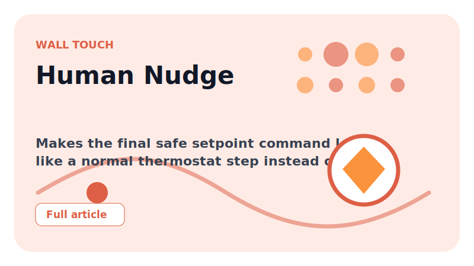
  

    Wall touch
    Live card
  

  <h3><a href="Algorithm-human-nudge.html">Human Nudge</a></h3>
  
Makes the final safe setpoint command look like a normal thermostat step instead of a precise bot number.

  <dl><dt>Watches</dt><dd>Recent wall touches, the candidate defender command, the current thermostat setpoint, and room temperature.</dd><dt>Effect</dt><dd>Rewrites the outgoing safe setpoint to a normal one-step-looking value.</dd></dl>
  
<strong>Key settings:</strong> HumanNudgeEnabled, HumanNudgeTriggerTouches, HumanNudgeStepCelsius, HumanNudgeSafetyBandCelsius

</article><article class="algorithm-card category-wall" data-search-item data-search-text="Visibility Guard Wall-Touch Response Slows the next safe nudge when a wall touch lands right after a defender command (someone likely noticed). Wall touches that occur within the after-command window, counted as &#x27;notices&#x27; over the notice window. Each notice adds pressure (0–100). When notices reach the trigger, the next safe correction waits a variable hold between the min and max hold minutes, scaled by pressure. A room over the safety band clears the hold. Delays the next safe correction so the AC&#x27;s reaction looks less mechanical. VisibilityGuardEnabled VisibilityGuardTriggerNotices VisibilityGuardNoticeWindowMinutes VisibilityGuardAfterCommandSeconds VisibilityGuardMinimumHoldMinutes VisibilityGuardMaximumHoldMinutes VisibilityGuardSafetyBandCelsius">
  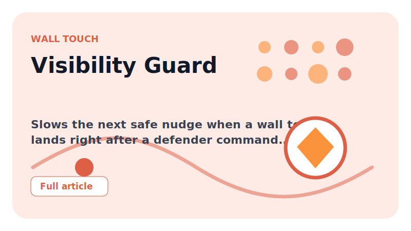
  

    Wall touch
    Live card
  

  <h3><a href="Algorithm-visibility-guard.html">Visibility Guard</a></h3>
  
Slows the next safe nudge when a wall touch lands right after a defender command (someone likely noticed).

  <dl><dt>Watches</dt><dd>Wall touches that occur within the after-command window, counted as &#x27;notices&#x27; over the notice window.</dd><dt>Effect</dt><dd>Delays the next safe correction so the AC&#x27;s reaction looks less mechanical.</dd></dl>
  
<strong>Key settings:</strong> VisibilityGuardEnabled, VisibilityGuardTriggerNotices, VisibilityGuardNoticeWindowMinutes, VisibilityGuardAfterCommandSeconds...

</article><article class="algorithm-card category-wall" data-search-item data-search-text="Routine Timing Wall-Touch Response Lines safe corrections up with a normal-looking comfort-check rhythm instead of firing instantly. Recent wall touches and the wall-clock minute. After repeated touches and while the room is safe, the next correction waits until the next interval boundary (the routine minutes) plus a little random wiggle, capped at the max routine delay. Too-warm rooms clear it. Delays the safe correction to the next tidy time slot. RoutineTimingEnabled RoutineTimingTriggerTouches RoutineTimingIntervalMinutes RoutineTimingJitterMinutes RoutineTimingMaxDelayMinutes RoutineTimingSafetyBandCelsius">
  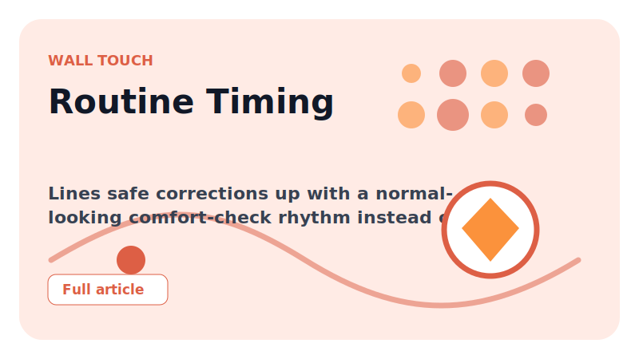
  

    Wall touch
    Live card
  

  <h3><a href="Algorithm-routine-timing.html">Routine Timing</a></h3>
  
Lines safe corrections up with a normal-looking comfort-check rhythm instead of firing instantly.

  <dl><dt>Watches</dt><dd>Recent wall touches and the wall-clock minute.</dd><dt>Effect</dt><dd>Delays the safe correction to the next tidy time slot.</dd></dl>
  
<strong>Key settings:</strong> RoutineTimingEnabled, RoutineTimingTriggerTouches, RoutineTimingIntervalMinutes, RoutineTimingJitterMinutes...

</article><article class="algorithm-card category-wall" data-search-item data-search-text="Comfort Budget Wall-Touch Response Caps how many safe corrections happen inside a rolling window so the AC is not constantly nudged. The count of recent automatic setpoint commands in the budget window. If the number of commands in the window reaches the max, it rests until the oldest command ages out of the window. A room over the safety band clears the budget. Holds new safe corrections until the budget frees up. ComfortBudgetEnabled ComfortBudgetWindowMinutes ComfortBudgetMaxCommands ComfortBudgetSafetyBandCelsius">
  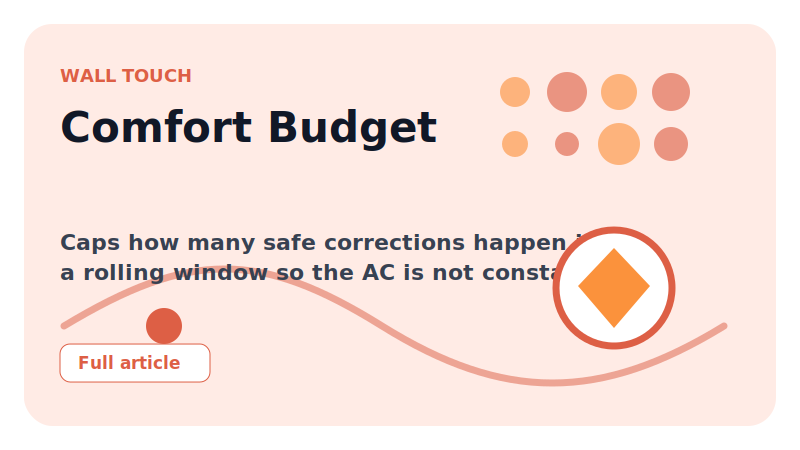
  

    Wall touch
    Live card
  

  <h3><a href="Algorithm-comfort-budget.html">Comfort Budget</a></h3>
  
Caps how many safe corrections happen inside a rolling window so the AC is not constantly nudged.

  <dl><dt>Watches</dt><dd>The count of recent automatic setpoint commands in the budget window.</dd><dt>Effect</dt><dd>Holds new safe corrections until the budget frees up.</dd></dl>
  
<strong>Key settings:</strong> ComfortBudgetEnabled, ComfortBudgetWindowMinutes, ComfortBudgetMaxCommands, ComfortBudgetSafetyBandCelsius

</article><article class="algorithm-card category-wall" data-search-item data-search-text="Command Camouflage Wall-Touch Response Gives a recent helper command time to look normal before another safe correction appears. The last real helper setpoint command, recent helper-command pressure, recent wall-touch pressure, and the room temperature. After a setpoint command, it waits at least the minimum gap plus pressure-scaled extra seconds before another safe correction. Higher recent touch or command pressure makes the gap longer. A room over the safety band or any comfort/safety bypass clears it immediately. Holds the next safe correction until the recent command has enough spacing. CommandCamouflageEnabled CommandCamouflageMinimumGapSeconds CommandCamouflagePressureExtraSeconds CommandCamouflageSafetyBandCelsius">
  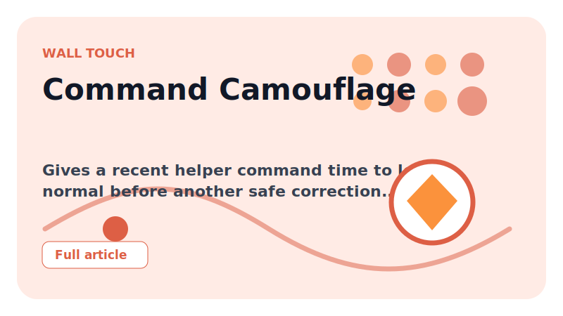
  

    Wall touch
    Live card
  

  <h3><a href="Algorithm-command-camouflage.html">Command Camouflage</a></h3>
  
Gives a recent helper command time to look normal before another safe correction appears.

  <dl><dt>Watches</dt><dd>The last real helper setpoint command, recent helper-command pressure, recent wall-touch pressure, and the room temperature.</dd><dt>Effect</dt><dd>Holds the next safe correction until the recent command has enough spacing.</dd></dl>
  
<strong>Key settings:</strong> CommandCamouflageEnabled, CommandCamouflageMinimumGapSeconds, CommandCamouflagePressureExtraSeconds, CommandCamouflageSafetyBandCelsius

</article><article class="algorithm-card category-wall" data-search-item data-search-text="Stealth Governor Wall-Touch Response Runs a whole-system low-profile hold when wall touches, noticed corrections, remote changes, and helper commands make the defender look too busy. Recent wall-touch pressure, noticed-correction pressure, Home Assistant remote-change pressure, helper command count, and room temperature. It computes a 0-100 pressure score. If the score reaches the trigger and the room is inside the safety band, it holds the next safe correction for a min-to-max low-profile window scaled by the score. Direct comfort needs, upstairs heat, or a quiet-timing bypass clear it. Holds only safe corrections until the low-profile window ends. StealthGovernorEnabled StealthGovernorTriggerScore StealthGovernorMinimumHoldMinutes StealthGovernorMaximumHoldMinutes StealthGovernorSafetyBandCelsius">
  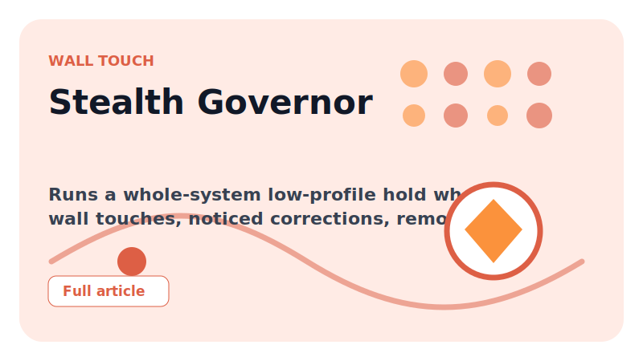
  

    Wall touch
    Live card
  

  <h3><a href="Algorithm-stealth-governor.html">Stealth Governor</a></h3>
  
Runs a whole-system low-profile hold when wall touches, noticed corrections, remote changes, and helper commands make the defender look too busy.

  <dl><dt>Watches</dt><dd>Recent wall-touch pressure, noticed-correction pressure, Home Assistant remote-change pressure, helper command count, and room temperature.</dd><dt>Effect</dt><dd>Holds only safe corrections until the low-profile window ends.</dd></dl>
  
<strong>Key settings:</strong> StealthGovernorEnabled, StealthGovernorTriggerScore, StealthGovernorMinimumHoldMinutes, StealthGovernorMaximumHoldMinutes...

</article><article class="algorithm-card category-wall" data-search-item data-search-text="Natural Cadence Wall-Touch Response Picks a variable future slot for safe nudges so they never land at identical, robotic times. Recent wall-touch pressure and recent command pressure. After repeated touches it chooses a wait between the min and max cadence minutes (later as pressure rises) plus a small jitter. Too-warm rooms clear it. Delays the safe correction to the chosen cadence slot. NaturalCadenceEnabled NaturalCadenceTriggerTouches NaturalCadenceMinimumMinutes NaturalCadenceMaximumMinutes NaturalCadenceJitterMinutes NaturalCadenceSafetyBandCelsius">
  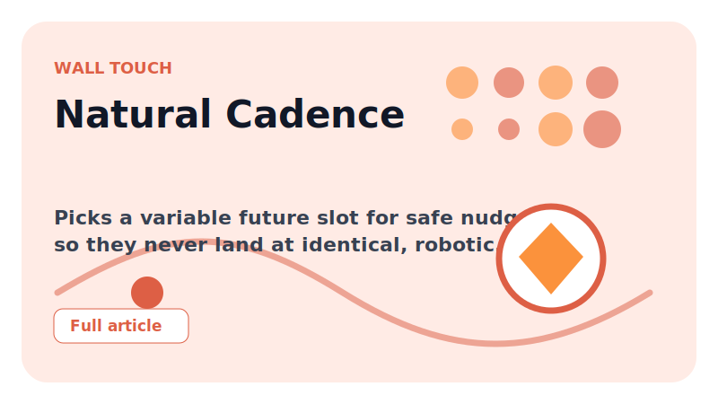
  

    Wall touch
    Live card
  

  <h3><a href="Algorithm-natural-cadence.html">Natural Cadence</a></h3>
  
Picks a variable future slot for safe nudges so they never land at identical, robotic times.

  <dl><dt>Watches</dt><dd>Recent wall-touch pressure and recent command pressure.</dd><dt>Effect</dt><dd>Delays the safe correction to the chosen cadence slot.</dd></dl>
  
<strong>Key settings:</strong> NaturalCadenceEnabled, NaturalCadenceTriggerTouches, NaturalCadenceMinimumMinutes, NaturalCadenceMaximumMinutes...

</article><article class="algorithm-card category-wall" data-search-item data-search-text="Comfort Pace Wall-Touch Response The high-frequency planner: under heavy wall fighting it waits for a calm weather, sensor, or clock-aligned slot. Touch pressure, command pressure, real outdoor-weather movement, the learned Home Assistant sensor beat, and 5/10-minute clock boundaries. When touches reach the trigger and the room is inside the safety band, it computes a base delay between the min and max pace minutes (scaling with pressure) and then snaps it to the nearest calm slot — a weather update, the sensor beat, or a clock boundary — recording why. Too-warm rooms clear it instantly. Delays the safe correction to the chosen calm climate slot. NaturalChangePlannerEnabled NaturalChangePlannerTriggerTouches NaturalChangePlannerMinimumMinutes NaturalChangePlannerMaximumMinutes NaturalChangePlannerJitterMinutes NaturalChangePlannerPreferWeatherSlots NaturalChangePlannerPreferSensorBeat">
  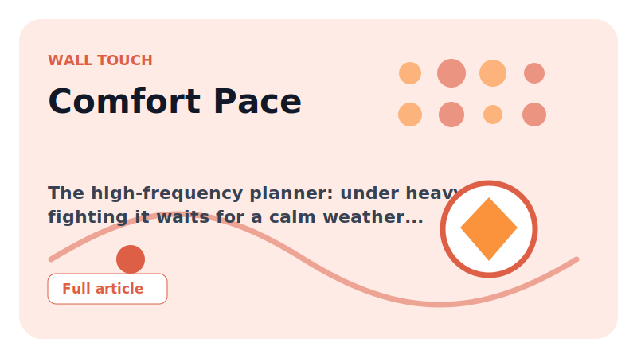
  

    Wall touch
    Live card
  

  <h3><a href="Algorithm-comfort-pace.html">Comfort Pace</a></h3>
  
The high-frequency planner: under heavy wall fighting it waits for a calm weather, sensor, or clock-aligned slot.

  <dl><dt>Watches</dt><dd>Touch pressure, command pressure, real outdoor-weather movement, the learned Home Assistant sensor beat, and 5/10-minute clock boundaries.</dd><dt>Effect</dt><dd>Delays the safe correction to the chosen calm climate slot.</dd></dl>
  
<strong>Key settings:</strong> NaturalChangePlannerEnabled, NaturalChangePlannerTriggerTouches, NaturalChangePlannerMinimumMinutes, NaturalChangePlannerMaximumMinutes...

</article><article class="algorithm-card category-wall" data-search-item data-search-text="Comfort Envelope Wall-Touch Response Lets a tiny safe wall preference rest for a while instead of being corrected the instant it appears. The wall setpoint relative to the defender target and how far the room is above target. After repeated touches, if the wall setpoint stays within the accepted range (target ± max offset) and the room is under the safety band, it simply observes for the hold minutes. A setpoint outside the range, a too-warm room, or a direct-cooling need clears it. Suppresses the small correction while the wall preference is inside the safe range. ComfortEnvelopeEnabled ComfortEnvelopeTriggerTouches ComfortEnvelopeHoldMinutes ComfortEnvelopeMaxOffsetCelsius ComfortEnvelopeSafetyBandCelsius">
  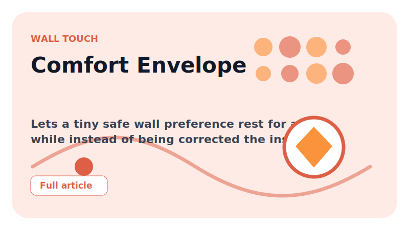
  

    Wall touch
    Live card
  

  <h3><a href="Algorithm-comfort-envelope.html">Comfort Envelope</a></h3>
  
Lets a tiny safe wall preference rest for a while instead of being corrected the instant it appears.

  <dl><dt>Watches</dt><dd>The wall setpoint relative to the defender target and how far the room is above target.</dd><dt>Effect</dt><dd>Suppresses the small correction while the wall preference is inside the safe range.</dd></dl>
  
<strong>Key settings:</strong> ComfortEnvelopeEnabled, ComfortEnvelopeTriggerTouches, ComfortEnvelopeHoldMinutes, ComfortEnvelopeMaxOffsetCelsius...

</article><article class="algorithm-card category-wall" data-search-item data-search-text="Comfort Compromise Wall-Touch Response Blends a repeated wall choice into a temporary target, then fades it back to the website target. The latest wall setpoint, the website target, and how far the room is above target. If touches repeat and the room is inside the compromise safety band, the wall setpoint pulls the effective target up to the max offset for the hold minutes, then eases back over the decay minutes. A too-warm room clears it immediately. Temporarily shifts the defender target the corrections aim for. ComfortCompromiseEnabled ComfortCompromiseTriggerTouches ComfortCompromiseHoldMinutes ComfortCompromiseDecayMinutes ComfortCompromiseMaxOffsetCelsius ComfortCompromiseSafetyBandCelsius">
  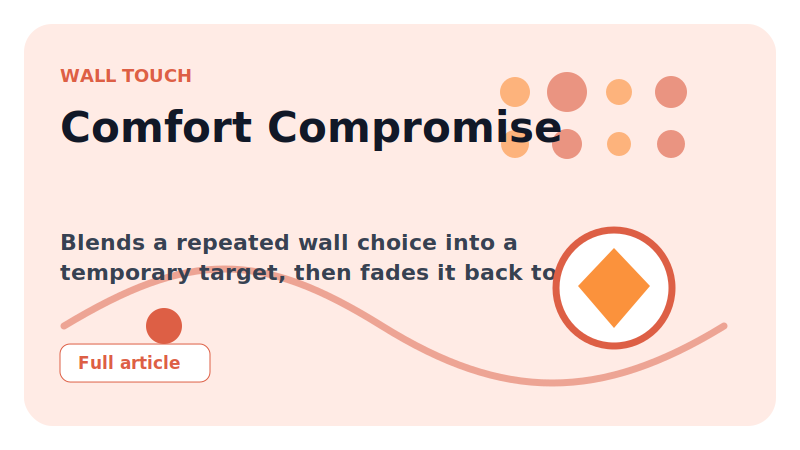
  

    Wall touch
    Live card
  

  <h3><a href="Algorithm-comfort-compromise.html">Comfort Compromise</a></h3>
  
Blends a repeated wall choice into a temporary target, then fades it back to the website target.

  <dl><dt>Watches</dt><dd>The latest wall setpoint, the website target, and how far the room is above target.</dd><dt>Effect</dt><dd>Temporarily shifts the defender target the corrections aim for.</dd></dl>
  
<strong>Key settings:</strong> ComfortCompromiseEnabled, ComfortCompromiseTriggerTouches, ComfortCompromiseHoldMinutes, ComfortCompromiseDecayMinutes...

</article><article class="algorithm-card category-wall" data-search-item data-search-text="Comfort Memory Wall-Touch Response Learns a small time-of-day target bias from repeated safe wall choices and re-applies it later that hour. The current hour and the offsets learned for it; the room temperature. Repeated safe touches teach a bounded offset (± max offset) for the current hour slot. On later checks in the same window it nudges the target by that learned offset. Learned memory expires after the retention hours and is skipped when the room is warm or upstairs needs cooling. Adjusts the defender target by the learned hourly bias. ComfortMemoryEnabled ComfortMemoryLearningTouches ComfortMemoryRetentionHours ComfortMemoryMaxOffsetCelsius ComfortMemorySafetyBandCelsius">
  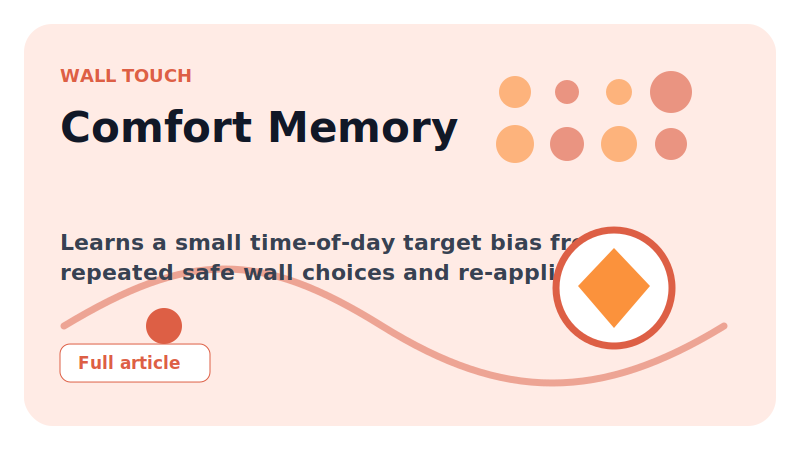
  

    Wall touch
    Live card
  

  <h3><a href="Algorithm-comfort-memory.html">Comfort Memory</a></h3>
  
Learns a small time-of-day target bias from repeated safe wall choices and re-applies it later that hour.

  <dl><dt>Watches</dt><dd>The current hour and the offsets learned for it; the room temperature.</dd><dt>Effect</dt><dd>Adjusts the defender target by the learned hourly bias.</dd></dl>
  
<strong>Key settings:</strong> ComfortMemoryEnabled, ComfortMemoryLearningTouches, ComfortMemoryRetentionHours, ComfortMemoryMaxOffsetCelsius...

</article><article class="algorithm-card category-wall" data-search-item data-search-text="Conflict Quiet Wall-Touch Response Stands the defender down during an obvious tug-of-war over the thermostat. Recent wall touches within the touch window and how far the room is above target. When touches reach the conflict threshold, it stops sending visible corrections for the stand-down minutes — but only while the room stays within target + comfort band. A warmer room, severe upstairs heat, or a crossed safety override ends it. Suppresses corrections for the stand-down period. ConflictQuietModeEnabled ConflictQuietTouchThreshold ConflictQuietMinutes ConflictQuietComfortBandCelsius">
  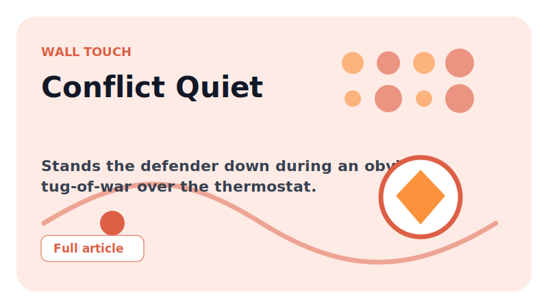
  

    Wall touch
    Live card
  

  <h3><a href="Algorithm-conflict-quiet.html">Conflict Quiet</a></h3>
  
Stands the defender down during an obvious tug-of-war over the thermostat.

  <dl><dt>Watches</dt><dd>Recent wall touches within the touch window and how far the room is above target.</dd><dt>Effect</dt><dd>Suppresses corrections for the stand-down period.</dd></dl>
  
<strong>Key settings:</strong> ConflictQuietModeEnabled, ConflictQuietTouchThreshold, ConflictQuietMinutes, ConflictQuietComfortBandCelsius

</article><article class="algorithm-card category-wall" data-search-item data-search-text="Tug-of-War Truce Wall-Touch Response Calls a temporary truce when the real thermostat bounces up and down, so answer-back commands do not look like a duel. The real external thermostat audit log: previous setpoint, new setpoint, timestamp, and source classification. Inside the configured flip window it converts each external setpoint change into up/down/flat, counts direction flips, and compares that count to the flip trigger. If the flip trigger is met and the room is still inside the safety band, it holds only safe answer-back corrections for the truce minutes. A warm room, severe upstairs heat, matching setpoint, cooler-intent fast lane, or Super Defender strict bypass clears it. Holds safe corrections until the truce window ends, then lets the normal defender chain continue. TugOfWarTruceEnabled TugOfWarTruceMinimumFlips TugOfWarTruceWindowMinutes TugOfWarTruceHoldMinutes TugOfWarTruceSafetyBandCelsius">
  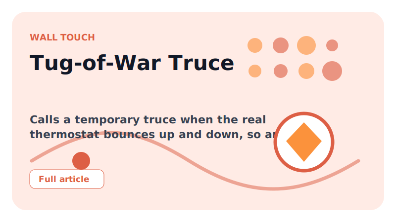
  

    Wall touch
    Live card
  

  <h3><a href="Algorithm-tug-of-war-truce.html">Tug-of-War Truce</a></h3>
  
Calls a temporary truce when the real thermostat bounces up and down, so answer-back commands do not look like a duel.

  <dl><dt>Watches</dt><dd>The real external thermostat audit log: previous setpoint, new setpoint, timestamp, and source classification.</dd><dt>Effect</dt><dd>Holds safe corrections until the truce window ends, then lets the normal defender chain continue.</dd></dl>
  
<strong>Key settings:</strong> TugOfWarTruceEnabled, TugOfWarTruceMinimumFlips, TugOfWarTruceWindowMinutes, TugOfWarTruceHoldMinutes...

</article><article class="algorithm-card category-wall" data-search-item data-search-text="Wall Settling Wall-Touch Response Waits for someone who is still tapping the wall thermostat to stop before correcting. Recent touches inside the settling window and the room temperature. With enough recent touches it holds for the base settle seconds plus extra pressure seconds (more touches = longer), measured from the latest touch. A room over the safety band clears it. Holds the correction until the wall stops changing. WallSettlingGuardEnabled WallSettlingMinimumTouches WallSettlingWindowMinutes WallSettlingBaseSeconds WallSettlingPressureExtraSeconds WallSettlingSafetyBandCelsius">
  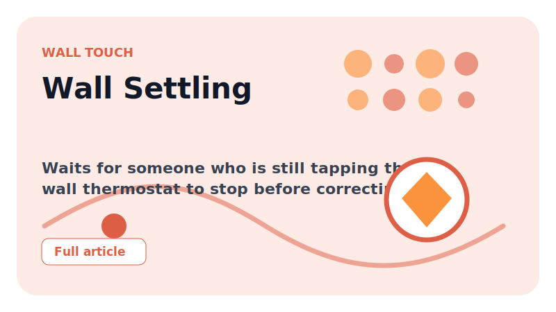
  

    Wall touch
    Live card
  

  <h3><a href="Algorithm-wall-settling.html">Wall Settling</a></h3>
  
Waits for someone who is still tapping the wall thermostat to stop before correcting.

  <dl><dt>Watches</dt><dd>Recent touches inside the settling window and the room temperature.</dd><dt>Effect</dt><dd>Holds the correction until the wall stops changing.</dd></dl>
  
<strong>Key settings:</strong> WallSettlingGuardEnabled, WallSettlingMinimumTouches, WallSettlingWindowMinutes, WallSettlingBaseSeconds...

</article><article class="algorithm-card category-wall" data-search-item data-search-text="Manual Comfort Grace Wall-Touch Response Leaves a manual wall change alone while the room still feels comfortable. Time since the wall change and how far the room is above target. After cooldown it can keep waiting up to the grace minutes while the room stays within target + grace band. If the room rises above the band, the mode leaves cool, or upstairs becomes severely hot, grace ends. Touch Intent can extend the grace when recent changes are clearly warmer. Suppresses the correction while the wall change stays comfortable. ManualComfortGraceEnabled ManualComfortGraceMinutes ManualComfortGraceBandCelsius">
  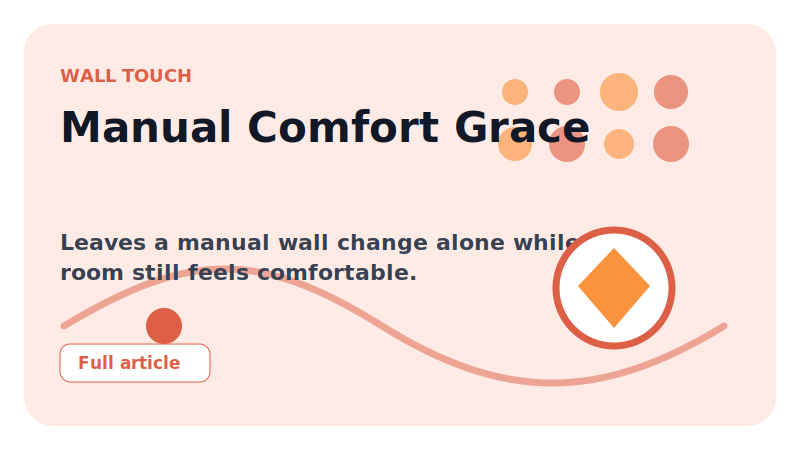
  

    Wall touch
    Live card
  

  <h3><a href="Algorithm-manual-comfort-grace.html">Manual Comfort Grace</a></h3>
  
Leaves a manual wall change alone while the room still feels comfortable.

  <dl><dt>Watches</dt><dd>Time since the wall change and how far the room is above target.</dd><dt>Effect</dt><dd>Suppresses the correction while the wall change stays comfortable.</dd></dl>
  
<strong>Key settings:</strong> ManualComfortGraceEnabled, ManualComfortGraceMinutes, ManualComfortGraceBandCelsius

</article><article class="algorithm-card category-wall" data-search-item data-search-text="Touch Intent Wall-Touch Response Reads whether recent wall changes trend warmer, cooler, or mixed, and extends grace for a clear warmer pattern. The net sum of recent wall setpoint changes inside the intent window. If the net movement is at least the warm threshold and the room is inside the intent safety band, it adds the extra grace minutes to Manual Comfort Grace. Cooler or mixed patterns get no extra grace; a too-warm room steps it aside. Lengthens Manual Comfort Grace when people clearly want warmer air. TouchIntentEnabled TouchIntentMinimumTouches TouchIntentWindowMinutes TouchIntentNetWarmThresholdCelsius TouchIntentExtraGraceMinutes TouchIntentSafetyBandCelsius">
  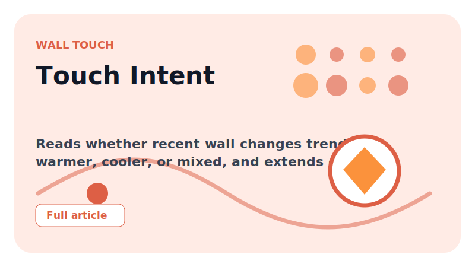
  

    Wall touch
    Live card
  

  <h3><a href="Algorithm-touch-intent.html">Touch Intent</a></h3>
  
Reads whether recent wall changes trend warmer, cooler, or mixed, and extends grace for a clear warmer pattern.

  <dl><dt>Watches</dt><dd>The net sum of recent wall setpoint changes inside the intent window.</dd><dt>Effect</dt><dd>Lengthens Manual Comfort Grace when people clearly want warmer air.</dd></dl>
  
<strong>Key settings:</strong> TouchIntentEnabled, TouchIntentMinimumTouches, TouchIntentWindowMinutes, TouchIntentNetWarmThresholdCelsius...

</article><article class="algorithm-card category-wall" data-search-item data-search-text="Cooler Intent Fast Lane Wall-Touch Response When people keep dialing the wall cooler, it skips quiet waits so the room cools sooner. The net cooler movement of recent wall changes and whether the room is above target. If repeated touches move the wall cooler by at least the cool threshold and the room is above target, it clears quiet waits (cooldown, grace, conflict quiet, cadence, repeat quiet, sensor rhythm, runway, and more) for the hold minutes. It never lowers the website target — cooling still starts at room minus 1 °C and stops at target. A room over the safety band hands control back to normal safety rules. Bypasses the quiet timing guards for a short window. CoolerIntentFastLaneEnabled CoolerIntentMinimumTouches CoolerIntentWindowMinutes CoolerIntentHoldMinutes CoolerIntentNetCoolThresholdCelsius CoolerIntentSafetyBandCelsius">
  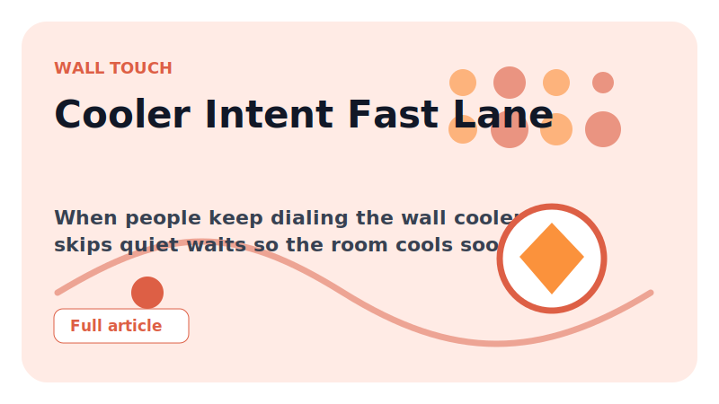
  

    Wall touch
    Live card
  

  <h3><a href="Algorithm-cooler-intent-fast-lane.html">Cooler Intent Fast Lane</a></h3>
  
When people keep dialing the wall cooler, it skips quiet waits so the room cools sooner.

  <dl><dt>Watches</dt><dd>The net cooler movement of recent wall changes and whether the room is above target.</dd><dt>Effect</dt><dd>Bypasses the quiet timing guards for a short window.</dd></dl>
  
<strong>Key settings:</strong> CoolerIntentFastLaneEnabled, CoolerIntentMinimumTouches, CoolerIntentWindowMinutes, CoolerIntentHoldMinutes...

</article><article class="algorithm-card category-sensor" data-search-item data-search-text="Setpoint Echo Sensor Timing Waits for Home Assistant to report back the last setpoint before sending another safe command. The pending command setpoint and whether Home Assistant has echoed it yet. After a command it waits up to the echo grace seconds for Home Assistant to report that setpoint within 0.15 °C. Once echoed, or after the grace expires, the next command is allowed. A too-warm room steps it aside. Briefly holds the next safe command to avoid piling commands on a slow integration. SetpointEchoGuardEnabled SetpointEchoGraceSeconds SetpointEchoSafetyBandCelsius">
  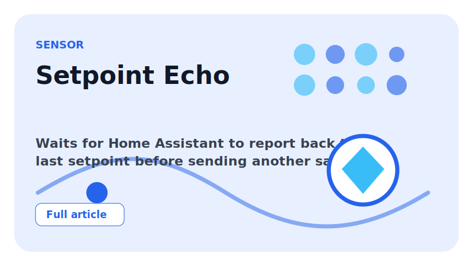
  

    Sensor
    Live card
  

  <h3><a href="Algorithm-setpoint-echo.html">Setpoint Echo</a></h3>
  
Waits for Home Assistant to report back the last setpoint before sending another safe command.

  <dl><dt>Watches</dt><dd>The pending command setpoint and whether Home Assistant has echoed it yet.</dd><dt>Effect</dt><dd>Briefly holds the next safe command to avoid piling commands on a slow integration.</dd></dl>
  
<strong>Key settings:</strong> SetpointEchoGuardEnabled, SetpointEchoGraceSeconds, SetpointEchoSafetyBandCelsius

</article><article class="algorithm-card category-sensor" data-search-item data-search-text="Repeat Quiet Sensor Timing Waits before sending the very same thermostat number again. The setpoint about to be sent versus the last defender command, plus touch and command pressure. If the next safe command would repeat the last number, it waits at least the minimum wait seconds plus extra pressure seconds (scaling with recent touches and commands). Different one-degree step-downs pass straight through; a too-warm room steps it aside. Holds an identical follow-up command until the wait elapses. RepeatCommandGuardEnabled RepeatCommandMinimumWaitSeconds RepeatCommandPressureExtraSeconds RepeatCommandSafetyBandCelsius">
  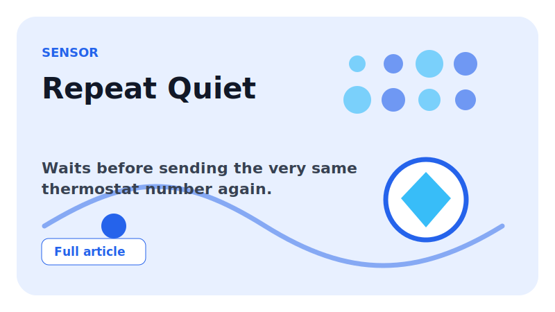
  

    Sensor
    Live card
  

  <h3><a href="Algorithm-repeat-quiet.html">Repeat Quiet</a></h3>
  
Waits before sending the very same thermostat number again.

  <dl><dt>Watches</dt><dd>The setpoint about to be sent versus the last defender command, plus touch and command pressure.</dd><dt>Effect</dt><dd>Holds an identical follow-up command until the wait elapses.</dd></dl>
  
<strong>Key settings:</strong> RepeatCommandGuardEnabled, RepeatCommandMinimumWaitSeconds, RepeatCommandPressureExtraSeconds, RepeatCommandSafetyBandCelsius

</article><article class="algorithm-card category-sensor" data-search-item data-search-text="Setpoint Stillness Sensor Timing Waits until the wall setpoint stops moving before a safe correction answers back. Real Home Assistant climate readings, the current reported setpoint, recent wall touches, and room temperature. After repeated external touches, while the room is still inside the safe band, it requires a few consecutive real Home Assistant readings at the same wall setpoint before allowing a safe correction. If the room gets too warm, a cooler-intent fast lane is active, the expected setpoint is already reached, or the max hold expires, it steps aside. Delays only safe corrections until the wall setpoint looks settled. SetpointStillnessGuardEnabled SetpointStillnessTriggerTouches SetpointStillnessRequiredSamples SetpointStillnessMaxHoldSeconds SetpointStillnessToleranceCelsius SetpointStillnessSafetyBandCelsius">
  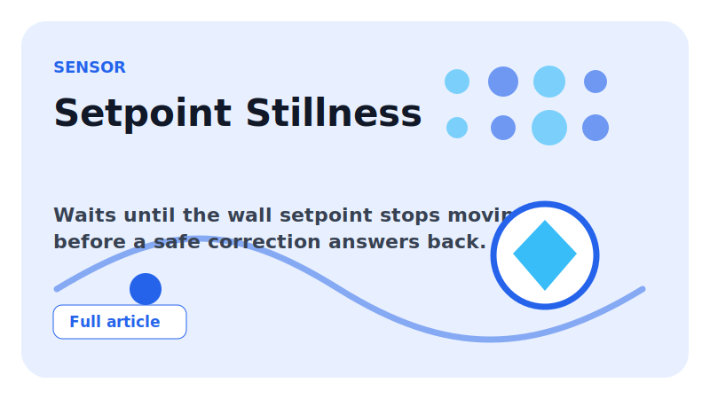
  

    Sensor
    Live card
  

  <h3><a href="Algorithm-setpoint-stillness.html">Setpoint Stillness</a></h3>
  
Waits until the wall setpoint stops moving before a safe correction answers back.

  <dl><dt>Watches</dt><dd>Real Home Assistant climate readings, the current reported setpoint, recent wall touches, and room temperature.</dd><dt>Effect</dt><dd>Delays only safe corrections until the wall setpoint looks settled.</dd></dl>
  
<strong>Key settings:</strong> SetpointStillnessGuardEnabled, SetpointStillnessTriggerTouches, SetpointStillnessRequiredSamples, SetpointStillnessMaxHoldSeconds...

</article><article class="algorithm-card category-sensor" data-search-item data-search-text="Sensor Rhythm Sensor Timing Times nudges to just after the normal Home Assistant reading beat so they look less mechanical. Timestamps of real Home Assistant readings, used to learn the median update interval. With at least the minimum samples in the rhythm window, it learns the median interval between updates and waits until just after the next beat plus a small jitter. A too-warm room or upstairs heat clears it. Delays the safe correction to align with the sensor&#x27;s update cadence. SensorRhythmGuardEnabled SensorRhythmMinimumSamples SensorRhythmWindowMinutes SensorRhythmJitterSeconds SensorRhythmSafetyBandCelsius">
  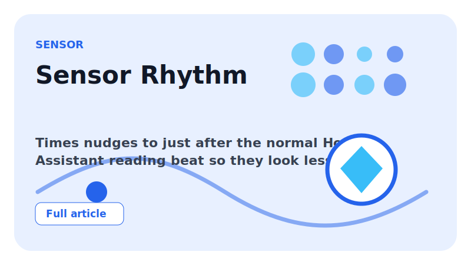
  

    Sensor
    Live card
  

  <h3><a href="Algorithm-sensor-rhythm.html">Sensor Rhythm</a></h3>
  
Times nudges to just after the normal Home Assistant reading beat so they look less mechanical.

  <dl><dt>Watches</dt><dd>Timestamps of real Home Assistant readings, used to learn the median update interval.</dd><dt>Effect</dt><dd>Delays the safe correction to align with the sensor&#x27;s update cadence.</dd></dl>
  
<strong>Key settings:</strong> SensorRhythmGuardEnabled, SensorRhythmMinimumSamples, SensorRhythmWindowMinutes, SensorRhythmJitterSeconds...

</article><article class="algorithm-card category-sensor" data-search-item data-search-text="HVAC Alibi Sensor Timing Waits for a real HVAC action transition so a safe correction lands near a normal thermostat event. The current Home Assistant hvac_action, the last action transition, recent wall touches, and room temperature. After repeated wall touches, while the room is still inside the safety band, it can hold a safe correction until hvac_action changes (for example idle to cooling or cooling to idle). A recent transition can also clear the hold. Direct comfort needs, upstairs heat, or a too-warm room bypass the wait immediately. Delays only safe corrections until a real HVAC action transition or the max hold expires. HvacActionAlibiEnabled HvacActionAlibiTriggerTouches HvacActionAlibiTransitionWindowSeconds HvacActionAlibiMaxHoldMinutes HvacActionAlibiSafetyBandCelsius">
  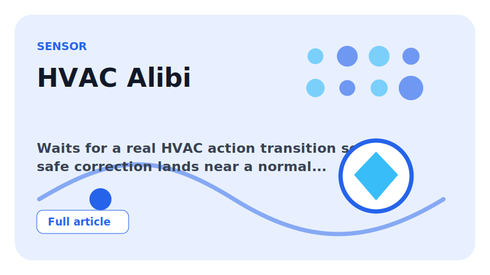
  

    Sensor
    Live card
  

  <h3><a href="Algorithm-hvac-alibi.html">HVAC Alibi</a></h3>
  
Waits for a real HVAC action transition so a safe correction lands near a normal thermostat event.

  <dl><dt>Watches</dt><dd>The current Home Assistant hvac_action, the last action transition, recent wall touches, and room temperature.</dd><dt>Effect</dt><dd>Delays only safe corrections until a real HVAC action transition or the max hold expires.</dd></dl>
  
<strong>Key settings:</strong> HvacActionAlibiEnabled, HvacActionAlibiTriggerTouches, HvacActionAlibiTransitionWindowSeconds, HvacActionAlibiMaxHoldMinutes...

</article><article class="algorithm-card category-sensor" data-search-item data-search-text="Telemetry Alibi Sensor Timing Waits for a normal Home Assistant/weather/usage update before a safe correction, so the nudge is not an isolated event. Recent wall touches, real Home Assistant reading beats, weather samples, Alectra Hui usage updates, and room temperature. After repeated wall touches, while the room is still inside the safety band, it starts a short quiet hold and then waits for the next enabled real telemetry signal. A too-warm room, direct comfort need, matching setpoint, disabled signal source, or max wait clears the hold. Delays only safe corrections until a normal house telemetry update can act as cover. TelemetryAlibiEnabled TelemetryAlibiTriggerTouches TelemetryAlibiMinimumHoldSeconds TelemetryAlibiMaxHoldMinutes TelemetryAlibiSafetyBandCelsius TelemetryAlibiUseWeather TelemetryAlibiUseSensorBeat TelemetryAlibiUsePeakPower">
  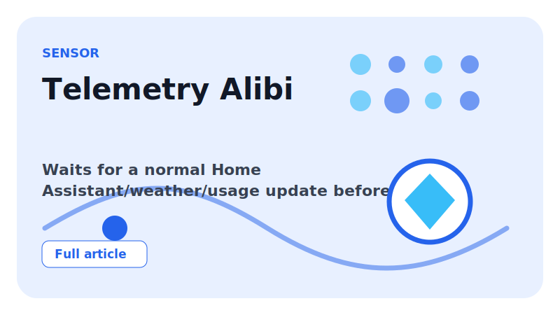
  

    Sensor
    Live card
  

  <h3><a href="Algorithm-telemetry-alibi.html">Telemetry Alibi</a></h3>
  
Waits for a normal Home Assistant/weather/usage update before a safe correction, so the nudge is not an isolated event.

  <dl><dt>Watches</dt><dd>Recent wall touches, real Home Assistant reading beats, weather samples, Alectra Hui usage updates, and room temperature.</dd><dt>Effect</dt><dd>Delays only safe corrections until a normal house telemetry update can act as cover.</dd></dl>
  
<strong>Key settings:</strong> TelemetryAlibiEnabled, TelemetryAlibiTriggerTouches, TelemetryAlibiMinimumHoldSeconds, TelemetryAlibiMaxHoldMinutes...

</article><article class="algorithm-card category-sensor" data-search-item data-search-text="Cooling Runway Sensor Timing Gives the AC time to work after cooling starts before nudging the setpoint again. The Home Assistant hvac_action and how long ago cooling started, plus command pressure. When the action turns to cooling it records the start and holds for the minimum runway seconds plus extra pressure seconds. If cooling stops or the room gets too warm, it clears immediately. Holds the next safe nudge so a fresh cooling cycle is not interrupted. CoolingRunwayGuardEnabled CoolingRunwayMinimumSeconds CoolingRunwayPressureExtraSeconds CoolingRunwaySafetyBandCelsius">
  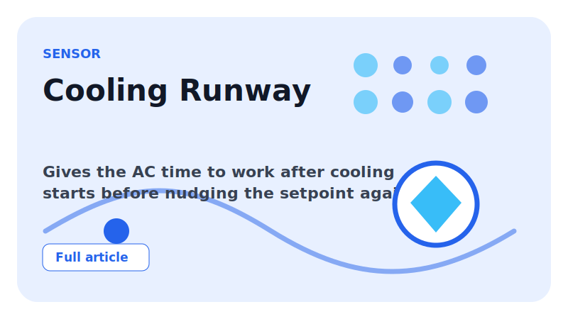
  

    Sensor
    Live card
  

  <h3><a href="Algorithm-cooling-runway.html">Cooling Runway</a></h3>
  
Gives the AC time to work after cooling starts before nudging the setpoint again.

  <dl><dt>Watches</dt><dd>The Home Assistant hvac_action and how long ago cooling started, plus command pressure.</dd><dt>Effect</dt><dd>Holds the next safe nudge so a fresh cooling cycle is not interrupted.</dd></dl>
  
<strong>Key settings:</strong> CoolingRunwayGuardEnabled, CoolingRunwayMinimumSeconds, CoolingRunwayPressureExtraSeconds, CoolingRunwaySafetyBandCelsius

</article><article class="algorithm-card category-sensor" data-search-item data-search-text="Room Trend Guard Sensor Timing Keeps observing when the room is already stable or cooling after a wall change. Real room-temperature samples: the oldest versus newest inside the trend window. If the room is cooling (delta below the negative stable tolerance) it holds for the trend hold minutes so cooling can continue. Stable or warming rooms let the correction proceed; rooms above the grace band or safety override always proceed. Holds the correction while the room is trending cooler on its own. RoomTrendGuardEnabled RoomTrendWindowMinutes RoomTrendStableToleranceCelsius RoomTrendHoldMinutes">
  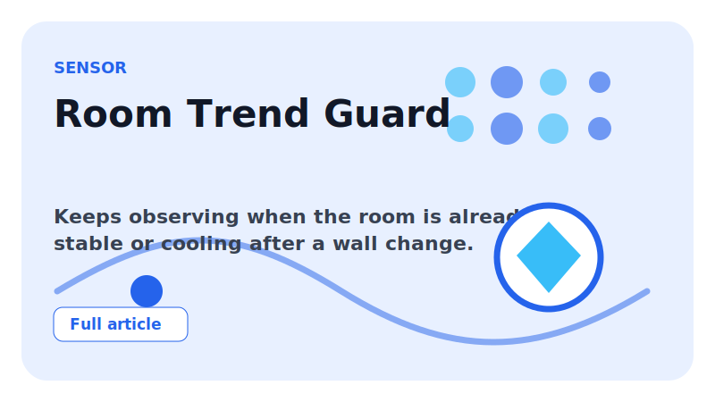
  

    Sensor
    Live card
  

  <h3><a href="Algorithm-room-trend-guard.html">Room Trend Guard</a></h3>
  
Keeps observing when the room is already stable or cooling after a wall change.

  <dl><dt>Watches</dt><dd>Real room-temperature samples: the oldest versus newest inside the trend window.</dd><dt>Effect</dt><dd>Holds the correction while the room is trending cooler on its own.</dd></dl>
  
<strong>Key settings:</strong> RoomTrendGuardEnabled, RoomTrendWindowMinutes, RoomTrendStableToleranceCelsius, RoomTrendHoldMinutes

</article><article class="algorithm-card category-sensor" data-search-item data-search-text="Thermal Momentum Sensor Timing Waits when the room is already cooling fast enough to reach target soon on its own. Real room-temperature samples (to estimate cooling rate) and the active cooling action. It estimates the cooling rate and minutes-to-target. If the rate is at least the minimum C/hour and target is within the look-ahead minutes, it holds for the momentum hold minutes. A room near target or above the safety band proceeds. Holds the correction so existing momentum can finish the job. ThermalMomentumGuardEnabled ThermalMomentumMinimumCoolingRateCelsiusPerHour ThermalMomentumLookAheadMinutes ThermalMomentumHoldMinutes">
  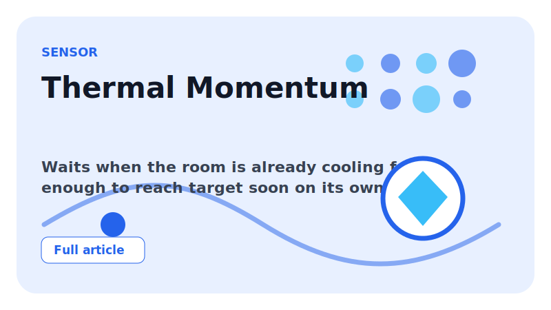
  

    Sensor
    Live card
  

  <h3><a href="Algorithm-thermal-momentum.html">Thermal Momentum</a></h3>
  
Waits when the room is already cooling fast enough to reach target soon on its own.

  <dl><dt>Watches</dt><dd>Real room-temperature samples (to estimate cooling rate) and the active cooling action.</dd><dt>Effect</dt><dd>Holds the correction so existing momentum can finish the job.</dd></dl>
  
<strong>Key settings:</strong> ThermalMomentumGuardEnabled, ThermalMomentumMinimumCoolingRateCelsiusPerHour, ThermalMomentumLookAheadMinutes, ThermalMomentumHoldMinutes

</article><article class="algorithm-card category-sensor" data-search-item data-search-text="Weather Drift Timing Sensor Timing Times safe corrections to real outdoor-weather movement instead of firing immediately. Real outdoor-temperature samples (oldest versus newest) inside the weather window. After a wall touch, while the room is inside the weather safety band, stable or cooling outdoor temperatures let it hold for the weather hold minutes. Once the outdoor temperature genuinely warms by the minimum change, the hold clears so the correction lines up with real weather. A too-warm room clears it. Holds the safe correction until outdoor weather moves. WeatherDriftGuardEnabled WeatherDriftWindowMinutes WeatherDriftMinimumChangeCelsius WeatherDriftHoldMinutes WeatherDriftSafetyBandCelsius">
  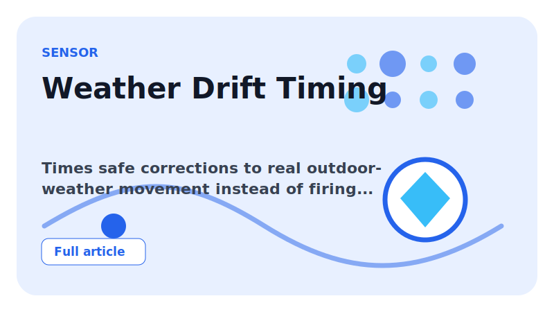
  

    Sensor
    Live card
  

  <h3><a href="Algorithm-weather-drift-timing.html">Weather Drift Timing</a></h3>
  
Times safe corrections to real outdoor-weather movement instead of firing immediately.

  <dl><dt>Watches</dt><dd>Real outdoor-temperature samples (oldest versus newest) inside the weather window.</dd><dt>Effect</dt><dd>Holds the safe correction until outdoor weather moves.</dd></dl>
  
<strong>Key settings:</strong> WeatherDriftGuardEnabled, WeatherDriftWindowMinutes, WeatherDriftMinimumChangeCelsius, WeatherDriftHoldMinutes...

</article><article class="algorithm-card category-system" data-search-item data-search-text="Website Debounce Safety, Energy, and System Blocks repeated website button taps for two minutes so the UI does not spam Home Assistant. The last website command name and time. The first click runs; later clicks within the debounce seconds show the remaining wait instead of resending. Emergency actions bypass the debounce and then start a fresh window. Rejects duplicate website actions until the window clears. (fixed at 120 seconds)">
  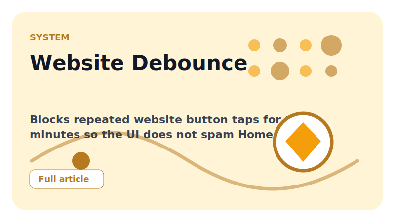
  

    System
    Live card
  

  <h3><a href="Algorithm-website-debounce.html">Website Debounce</a></h3>
  
Blocks repeated website button taps for two minutes so the UI does not spam Home Assistant.

  <dl><dt>Watches</dt><dd>The last website command name and time.</dd><dt>Effect</dt><dd>Rejects duplicate website actions until the window clears.</dd></dl>
  
<strong>Key settings:</strong> (fixed at 120 seconds)

</article><article class="algorithm-card category-system" data-search-item data-search-text="Super Defender Safety, Energy, and System Detects repeated phone/Home Assistant thermostat changes and tightens correction timing without cutting thermostat Wi-Fi. Home Assistant context on climate state changes: user_id, parent_id, and context id. Changes with user_id count as Home Assistant user or phone changes. Changes with parent_id count as automation/script changes. Repeated remote-style changes inside the configured window arm Super Defender for the hold minutes. While active and the room still needs cooling, it can bypass subtle quiet waits. Wi-Fi blocking is intentionally manual only because cutting the thermostat off can also remove monitoring and recovery. Shows source attribution, arms a strict response window, and can bypass quiet timing while cooling is needed. SuperDefenderModeEnabled SuperDefenderRemoteChangeThreshold SuperDefenderWindowMinutes SuperDefenderHoldMinutes SuperDefenderSafetyBandCelsius SuperDefenderBypassQuietTiming">
  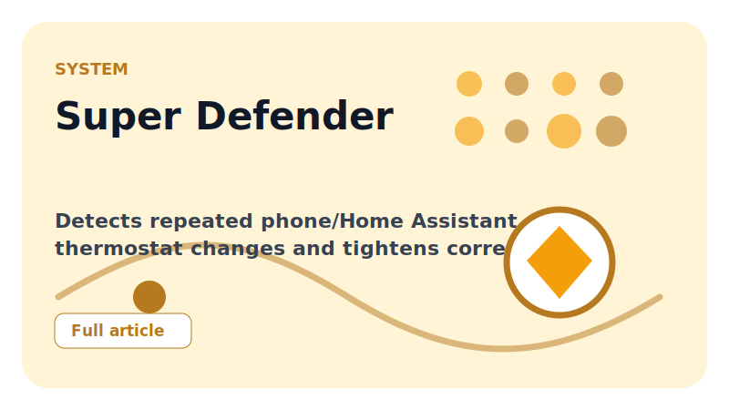
  

    System
    Live card
  

  <h3><a href="Algorithm-super-defender.html">Super Defender</a></h3>
  
Detects repeated phone/Home Assistant thermostat changes and tightens correction timing without cutting thermostat Wi-Fi.

  <dl><dt>Watches</dt><dd>Home Assistant context on climate state changes: user_id, parent_id, and context id.</dd><dt>Effect</dt><dd>Shows source attribution, arms a strict response window, and can bypass quiet timing while cooling is needed.</dd></dl>
  
<strong>Key settings:</strong> SuperDefenderModeEnabled, SuperDefenderRemoteChangeThreshold, SuperDefenderWindowMinutes, SuperDefenderHoldMinutes...

</article><article class="algorithm-card category-system" data-search-item data-search-text="Rival Schedule Watch Safety, Energy, and System Knows the AC vendor app&#x27;s own temperature schedule (SLEEP / DEEP SLEEP / GOOD MORNING) and defends my temp when a scheduled block pushes the wall warmer while everyone sleeps. The configured rival AC-app schedule blocks (start time + low/high setpoints per weekday), the live wall setpoint, Home Assistant change context, and the local clock. The blocks are configuration (appsettings/environment), never code. A setpoint change that is not from a Home Assistant user and lands on the active block&#x27;s low/high number is attributed to the AC app schedule instead of a human wall touch — so it starts no cooldown, no comfort grace, no touch counters, no peace offering, and teaches nothing to comfort memory/compromise (otherwise the schedule would train the defender to like the rival&#x27;s warm blocks). While the wall sits at a scheduled setpoint above my temp and the room is warm, quiet waits are bypassed: a schedule is a machine running while the household sleeps, so nobody is watching the correction. My temp is never changed by the rival schedule, and extreme heat still defers to normal comfort safety. The vendor app&#x27;s Fan schedule tab is reserved in configuration but not enforced yet. Attributes schedule pushes in the audit log, announces block boundaries as events, and answers a scheduled warm push back toward my temp without human-style delays. RivalScheduleWatchEnabled RivalScheduleSetpointToleranceCelsius RivalScheduleBypassQuietTiming RivalScheduleSafetyBandCelsius RivalScheduleBlocks RivalFanScheduleBlocks">
  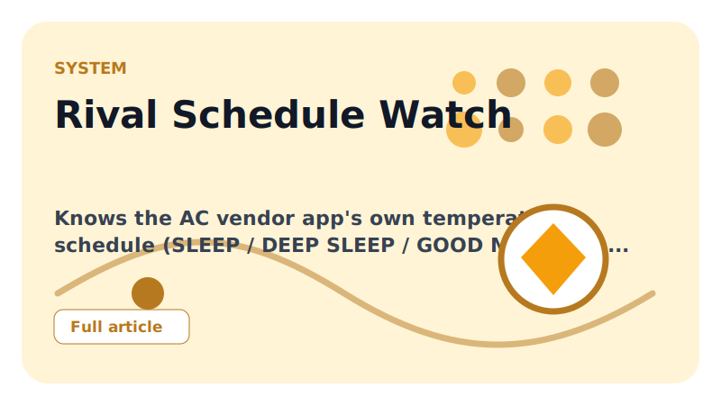
  

    System
    Live card
  

  <h3><a href="Algorithm-rival-schedule-watch.html">Rival Schedule Watch</a></h3>
  
Knows the AC vendor app&#x27;s own temperature schedule (SLEEP / DEEP SLEEP / GOOD MORNING) and defends my temp when a scheduled block pushes the wall warmer while everyone sleeps.

  <dl><dt>Watches</dt><dd>The configured rival AC-app schedule blocks (start time + low/high setpoints per weekday), the live wall setpoint, Home Assistant change context, and the local clock.</dd><dt>Effect</dt><dd>Attributes schedule pushes in the audit log, announces block boundaries as events, and answers a scheduled warm push back toward my temp without human-style delays.</dd></dl>
  
<strong>Key settings:</strong> RivalScheduleWatchEnabled, RivalScheduleSetpointToleranceCelsius, RivalScheduleBypassQuietTiming, RivalScheduleSafetyBandCelsius...

</article><article class="algorithm-card category-system" data-search-item data-search-text="Cool-Outdoor Shutdown (Open-Window Armistice) Safety, Energy, and System When it is genuinely cool outside and the forecast says it stays cool, the defender turns the AC fully off — and turns it back on by itself when the weather or the room demands it. The real outdoor temperature, the hourly Home Assistant forecast over the gate hours, the room temperature, the thermostat mode, and the minimum-off dwell clock. Below the shutdown threshold, and only when the forecast peak over the gate hours stays under threshold+margin (no off/on flapping before a hot afternoon), it sends ONE off command per cool episode and stands guard. It restores cool mode on its own once outdoor warms past threshold+margin (after the minimum off dwell) — or immediately, dwell ignored, if the room crosses the safety band. Someone turning the AC back on mid-episode wins for the rest of that episode; an AC already off by hand is adopted without a command. Unknown outdoor or a missing forecast means it does nothing new; safety bands always win. While it holds the AC off, the quiet minutes bank food rations. Sends climate.set_hvac_mode = off once per cool episode, then a tagged automatic restore. CoolOutdoorShutdownEnabled CoolOutdoorShutdownBelowCelsius CoolOutdoorRestoreMarginCelsius CoolOutdoorMinimumOffMinutes CoolOutdoorForecastGateEnabled CoolOutdoorForecastGateHours ForecastRefreshMinutes">
  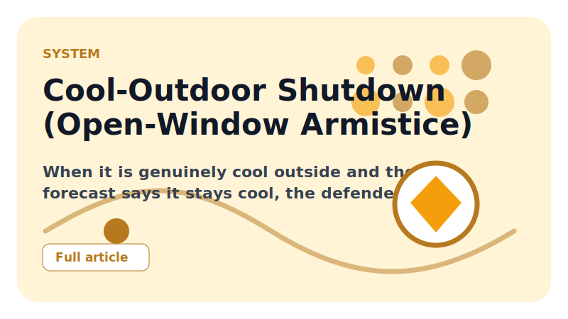
  

    System
    Live card
  

  <h3><a href="Algorithm-cool-outdoor-shutdown-open-window-armistice.html">Cool-Outdoor Shutdown (Open-Window Armistice)</a></h3>
  
When it is genuinely cool outside and the forecast says it stays cool, the defender turns the AC fully off — and turns it back on by itself when the weather or the room demands it.

  <dl><dt>Watches</dt><dd>The real outdoor temperature, the hourly Home Assistant forecast over the gate hours, the room temperature, the thermostat mode, and the minimum-off dwell clock.</dd><dt>Effect</dt><dd>Sends climate.set_hvac_mode = off once per cool episode, then a tagged automatic restore.</dd></dl>
  
<strong>Key settings:</strong> CoolOutdoorShutdownEnabled, CoolOutdoorShutdownBelowCelsius, CoolOutdoorRestoreMarginCelsius, CoolOutdoorMinimumOffMinutes...

</article><article class="algorithm-card category-system" data-search-item data-search-text="Siesta Watch (mess hall) Safety, Energy, and System Lets the whole guard force nap on command; while they sleep the AC eases off and the money it would have spent is banked as food rations. The siesta timer, the room temperature against the wake band, the budget safety maximum, and the thermostat mode. A siesta starts from the dashboard (1h/2h/4h) and parks the thermostat — or turns it off — exactly once; a human changing it back mid-nap is respected, the accrual just pauses while the unit cools. The guards wake on the timer, immediately when the room passes target + wake band or the budget safety maximum, on cancel, or when an emergency fires or the master switch pauses the defender. Rations already earned are always kept. Holds the whole correction pipeline while the nap timer runs; sends one park/off command at the start. SiestaEnabled SiestaThermostatAction SiestaWakeBandCelsius SiestaMaxMinutes">
  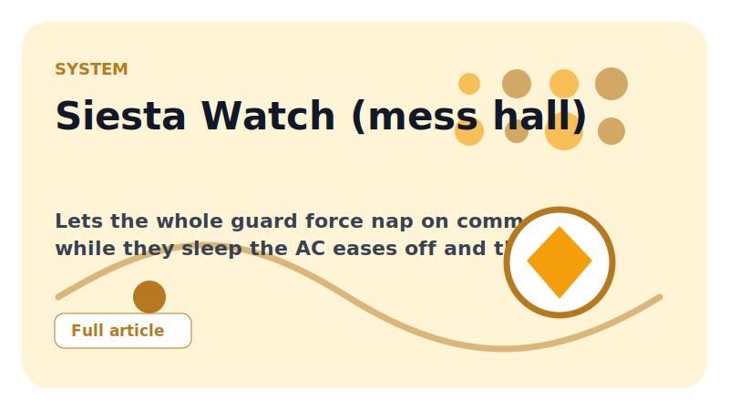
  

    System
    Live card
  

  <h3><a href="Algorithm-siesta-watch-mess-hall.html">Siesta Watch (mess hall)</a></h3>
  
Lets the whole guard force nap on command; while they sleep the AC eases off and the money it would have spent is banked as food rations.

  <dl><dt>Watches</dt><dd>The siesta timer, the room temperature against the wake band, the budget safety maximum, and the thermostat mode.</dd><dt>Effect</dt><dd>Holds the whole correction pipeline while the nap timer runs; sends one park/off command at the start.</dd></dl>
  
<strong>Key settings:</strong> SiestaEnabled, SiestaThermostatAction, SiestaWakeBandCelsius, SiestaMaxMinutes

</article><article class="algorithm-card category-system" data-search-item data-search-text="Field Kitchen (food rations) Safety, Energy, and System Banks unspent AC dollars during siestas and cool-outdoor shutdowns, and spends them on forecast-hot days so the monthly budget eases exactly when cooling matters most. The pantry balance and cap, the trailing-week compressor duty cycle, the Alectra TOU rate in force, the hourly forecast over the release lookahead, and the AC&#x27;s real per-slice estimated cost. While the guards nap, every quiet minute banks the money the AC would probably have spent — its usual share of run-time from the last week × its assumed power draw × the Alectra rate right now. On a forecast-hot day the pantry pays the AC&#x27;s bill: every dollar the AC actually spends during the hot window comes out of the food balance instead of counting against the monthly budget (up to the per-day cap, only while over pace). A slice where the compressor actually cools earns nothing, and no usage history means no accrual — the pantry never invents savings. Rations can also summon the WinForge reactor&#x27;s AI operator — one ration per hour. Adjusts the monthly budget&#x27;s over/under bookkeeping; moves no real money and sends no thermostat commands. FoodRationsEnabled FoodBalanceMaxCad FoodReleaseHotThresholdCelsius FoodReleaseLookaheadHours FoodReleaseMaxPerDayCad ReactorPowerEnabled FoodRationSizeCad">
  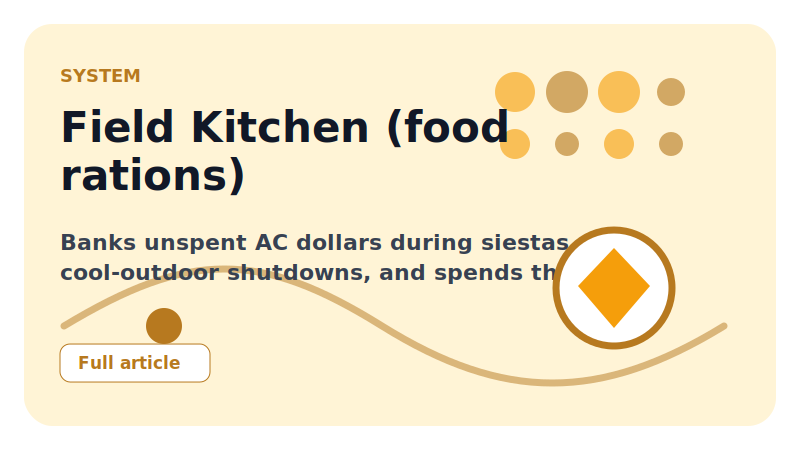
  

    System
    Live card
  

  <h3><a href="Algorithm-field-kitchen-food-rations.html">Field Kitchen (food rations)</a></h3>
  
Banks unspent AC dollars during siestas and cool-outdoor shutdowns, and spends them on forecast-hot days so the monthly budget eases exactly when cooling matters most.

  <dl><dt>Watches</dt><dd>The pantry balance and cap, the trailing-week compressor duty cycle, the Alectra TOU rate in force, the hourly forecast over the release lookahead, and the AC&#x27;s real per-slice estimated cost.</dd><dt>Effect</dt><dd>Adjusts the monthly budget&#x27;s over/under bookkeeping; moves no real money and sends no thermostat commands.</dd></dl>
  
<strong>Key settings:</strong> FoodRationsEnabled, FoodBalanceMaxCad, FoodReleaseHotThresholdCelsius, FoodReleaseLookaheadHours...

</article><article class="algorithm-card category-system" data-search-item data-search-text="Desired-State Enforcer Safety, Energy, and System Makes the owner&#x27;s chosen AC state win automatically: if someone else turns the unit off or moves the setpoint, it restores the exact desired state and keeps it there. Home Assistant HVAC mode, the live setpoint vs the owner&#x27;s target, context.user_id attribution, recent override/assert counts, and the learned interference probability. When a change is attributed to someone other than the owner (or has no owner user_id) it debounces, then either lets the human-like stealth pipeline ease the setpoint back (smart-stealth mode) or snaps to the exact target (hard mode). Cooldown, device-reject backoff, and a rate limit stop it thrashing; repeated overrides escalate it to firm mode and an optional notification. Owner changes are respected. It clamps to the device min/max and never acts while Home Assistant is unreachable. Restores the desired mode/setpoint, escalates on repeated interference, and notifies — using the trained interference/cadence models to pace itself. EnforcerModeEnabled EnforcerTargetTemperatureCelsius EnforcerEnforceMode EnforcerEnforceSetpoint EnforcerStealthShaping EnforcerRespectOwner EnforcerOwnerUserIds EnforcerDebounceSeconds EnforcerCooldownSeconds EnforcerRateWindowMinutes EnforcerMaxAssertsPerWindow EnforcerEscalateAfterOverrides EnforcerBackoffBaseSeconds EnforcerBackoffMaxSeconds EnforcerScheduleEnabled EnforcerStartTime EnforcerEndTime EnforcerRequirePresence EnforcerNotifyEnabled EnforcerUseLearning">
  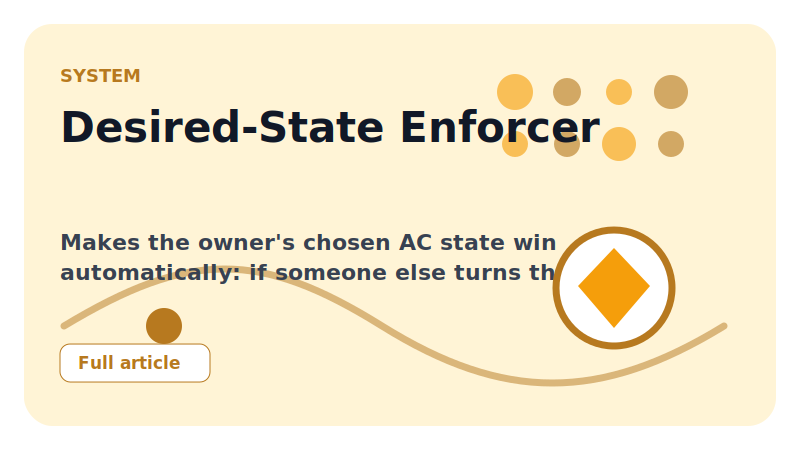
  

    System
    Live card
  

  <h3><a href="Algorithm-desired-state-enforcer.html">Desired-State Enforcer</a></h3>
  
Makes the owner&#x27;s chosen AC state win automatically: if someone else turns the unit off or moves the setpoint, it restores the exact desired state and keeps it there.

  <dl><dt>Watches</dt><dd>Home Assistant HVAC mode, the live setpoint vs the owner&#x27;s target, context.user_id attribution, recent override/assert counts, and the learned interference probability.</dd><dt>Effect</dt><dd>Restores the desired mode/setpoint, escalates on repeated interference, and notifies — using the trained interference/cadence models to pace itself.</dd></dl>
  
<strong>Key settings:</strong> EnforcerModeEnabled, EnforcerTargetTemperatureCelsius, EnforcerEnforceMode, EnforcerEnforceSetpoint...

</article><article class="algorithm-card category-system" data-search-item data-search-text="Remote Settling Guard Safety, Energy, and System Gives repeated phone/Home Assistant or automation thermostat changes a quiet settling window before a safe answer-back. Home Assistant change source attribution, recent remote-style change count, room temperature, and the expected setpoint. When Home Assistant context shows repeated user/phone or automation changes inside the configured window, and the room is still inside the safety band, it holds only safe corrections for the quiet hold minutes. A too-warm room, cooler intent, matching setpoint, disabled setting, or expired hold releases it immediately. Delays only safe corrections after remote-style thermostat changes so the response does not look instant. RemoteSettlingGuardEnabled RemoteSettlingTriggerChanges RemoteSettlingWindowMinutes RemoteSettlingHoldMinutes RemoteSettlingSafetyBandCelsius">
  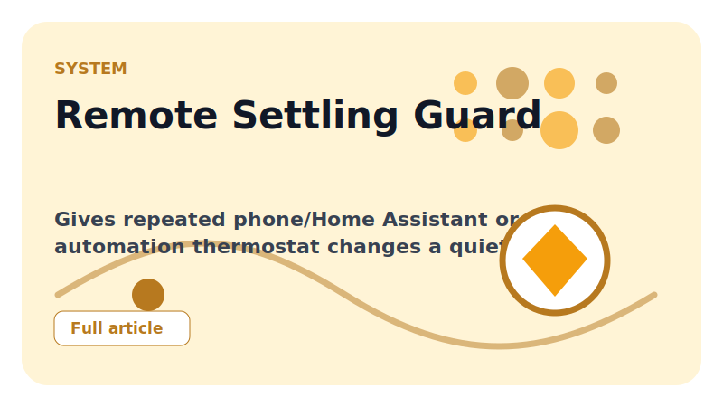
  

    System
    Live card
  

  <h3><a href="Algorithm-remote-settling-guard.html">Remote Settling Guard</a></h3>
  
Gives repeated phone/Home Assistant or automation thermostat changes a quiet settling window before a safe answer-back.

  <dl><dt>Watches</dt><dd>Home Assistant change source attribution, recent remote-style change count, room temperature, and the expected setpoint.</dd><dt>Effect</dt><dd>Delays only safe corrections after remote-style thermostat changes so the response does not look instant.</dd></dl>
  
<strong>Key settings:</strong> RemoteSettlingGuardEnabled, RemoteSettlingTriggerChanges, RemoteSettlingWindowMinutes, RemoteSettlingHoldMinutes...

</article><article class="algorithm-card category-system" data-search-item data-search-text="Alectra Peak Power Saver Safety, Energy, and System Makes the defender more chill and resource-saving when Alectra Hui reports on-peak, high price, or high power use. Alectra Hui current TOU period, current price, current power, and current plan sensors from Home Assistant. When enabled, On-peak TOU, price above the c/kWh threshold, or current power above the kW threshold arms a short saver window. During that window it holds only safe cooling commands that would demand more cooling, and it can set the configured fan saver mode if the room is still inside the safety band. If the room or upstairs gets too hot, or the command would save energy by warming the setpoint, it steps aside. Holds safe cooling during expensive/high-load periods and prefers the saver fan mode. PeakPowerSaverEnabled PeakPowerSaverOnPeakEnabled PeakPowerSaverHighPowerEnabled PeakPowerSaverPowerThresholdKilowatts PeakPowerSaverPriceThresholdCentsPerKwh PeakPowerSaverHoldMinutes PeakPowerSaverSafetyBandCelsius PeakPowerSaverFanSaverEnabled PeakPowerSaverFanMode">
  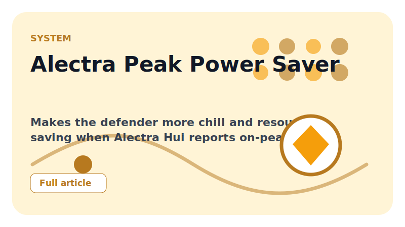
  

    System
    Live card
  

  <h3><a href="Algorithm-alectra-peak-power-saver.html">Alectra Peak Power Saver</a></h3>
  
Makes the defender more chill and resource-saving when Alectra Hui reports on-peak, high price, or high power use.

  <dl><dt>Watches</dt><dd>Alectra Hui current TOU period, current price, current power, and current plan sensors from Home Assistant.</dd><dt>Effect</dt><dd>Holds safe cooling during expensive/high-load periods and prefers the saver fan mode.</dd></dl>
  
<strong>Key settings:</strong> PeakPowerSaverEnabled, PeakPowerSaverOnPeakEnabled, PeakPowerSaverHighPowerEnabled, PeakPowerSaverPowerThresholdKilowatts...

</article><article class="algorithm-card category-system" data-search-item data-search-text="Front-door Guard Post Safety, Energy, and System Pauses the defender and can turn the thermostat off when a real front-door person detector trips. Configured or auto-discovered Home Assistant front-door person sensors. The worker reads the configured entities, or auto-discovers likely front-door/porch/entry person sensors. If any detector reports a person, the defender pauses immediately, holds the guard window, and sends thermostat OFF if that setting is enabled. The source is recorded as the front-door guard post so it does not look like a wall touch. Runs the kill switch, hides the live boards while paused, and records the source. FrontDoorKillSwitchEnabled FrontDoorPersonEntityIds FrontDoorKillSwitchHoldMinutes FrontDoorKillSwitchRefreshSeconds FrontDoorKillSwitchTurnsThermostatOff">
  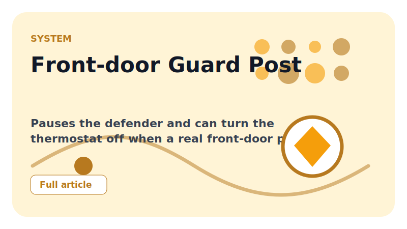
  

    System
    Live card
  

  <h3><a href="Algorithm-front-door-guard-post.html">Front-door Guard Post</a></h3>
  
Pauses the defender and can turn the thermostat off when a real front-door person detector trips.

  <dl><dt>Watches</dt><dd>Configured or auto-discovered Home Assistant front-door person sensors.</dd><dt>Effect</dt><dd>Runs the kill switch, hides the live boards while paused, and records the source.</dd></dl>
  
<strong>Key settings:</strong> FrontDoorKillSwitchEnabled, FrontDoorPersonEntityIds, FrontDoorKillSwitchHoldMinutes, FrontDoorKillSwitchRefreshSeconds...

</article><article class="algorithm-card category-system" data-search-item data-search-text="Emergency Protocols Safety, Energy, and System One-tap stand-down modes for too-cold, someone-upset, and suspicion situations. The chosen protocol and its remaining window. Too cold (30 min) pauses the defender and turns the thermostat off. Someone upset (45 min) and Suspicion quiet (90 min) keep reading the thermostat 24/7 but send no corrective commands until the window ends. Emergency actions bypass the website debounce. Suppresses corrective commands for the protocol window. (run from the Controls page)">
  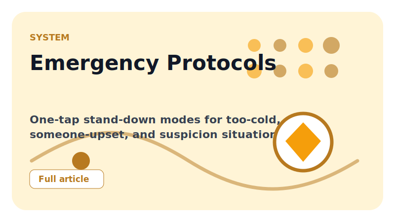
  

    System
    Live card
  

  <h3><a href="Algorithm-emergency-protocols.html">Emergency Protocols</a></h3>
  
One-tap stand-down modes for too-cold, someone-upset, and suspicion situations.

  <dl><dt>Watches</dt><dd>The chosen protocol and its remaining window.</dd><dt>Effect</dt><dd>Suppresses corrective commands for the protocol window.</dd></dl>
  
<strong>Key settings:</strong> (run from the Controls page)

</article><article class="algorithm-card category-system" data-search-item data-search-text="Cooling Failure Watch Safety, Energy, and System Raises a repeating mega-alert when cool mode is demanded but the AC is not really cooling, escalates to a full-site OMEGA alert when a rising room confirms it, then turns the AC off until the room warms 0.5 C. Real Home Assistant data only: hvac_mode, hvac_action, the setpoint, and room-temperature history. MEGA: it alerts if the entity is in cool, the room is clearly above the setpoint, and the action stays idle for about 30 minutes (possible breaker/equipment), or if the action says cooling but the room does not drop over the retained window (possible compressor/airflow). OMEGA: while the idle/breaker mega alert is up, if the room has also risen at least 0.4 C over the last 5 minutes — what a dead breaker looks like — it escalates to a full-site OMEGA alert. Requiring a real, sustained rise (and only on the idle branch) keeps false positives down. Alerts repeat about once a minute. Surfaces a red alert, an event log entry, and (on OMEGA) a site-wide overlay. It also turns the AC fully off (a failing unit is only wasting power) and holds it off until the real room temperature rises 0.5 C above the reading captured at shutdown, then restores cool. A human turning the AC back on is always respected. CoolingFailureWatchEnabled">
  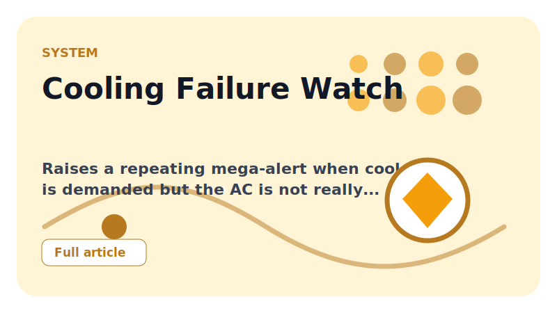
  

    System
    Live card
  

  <h3><a href="Algorithm-cooling-failure-watch.html">Cooling Failure Watch</a></h3>
  
Raises a repeating mega-alert when cool mode is demanded but the AC is not really cooling, escalates to a full-site OMEGA alert when a rising room confirms it, then turns the AC off until the room warms 0.5 C.

  <dl><dt>Watches</dt><dd>Real Home Assistant data only: hvac_mode, hvac_action, the setpoint, and room-temperature history.</dd><dt>Effect</dt><dd>Surfaces a red alert, an event log entry, and (on OMEGA) a site-wide overlay. It also turns the AC fully off (a failing unit is only wasting power) and holds it off until the real room temperature rises 0.5 C above the reading captured at shutdown, then restores cool. A human turning the AC back on is always respected.</dd></dl>
  
<strong>Key settings:</strong> CoolingFailureWatchEnabled

</article><article class="algorithm-card category-system" data-search-item data-search-text="Dynamic Cooldown Safety, Energy, and System A frequency-based quiet period after a manual thermostat change. How many wall touches happened recently inside the touch-frequency window. cooldown = min(MaxCooldownSeconds, BaseCooldownSeconds × recentTouchCount) + a small random quiet delay. More repeated changes mean longer cooldowns. Holds the next correction until the cooldown elapses. BaseCooldownSeconds MaxCooldownSeconds TouchFrequencyWindowMinutes">
  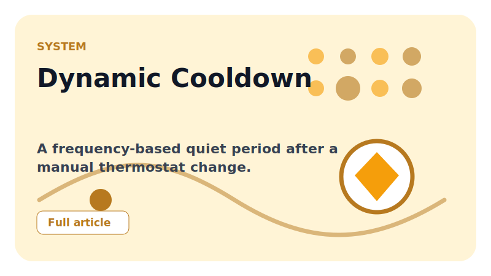
  

    System
    Guide only
  

  <h3><a href="Algorithm-dynamic-cooldown.html">Dynamic Cooldown</a></h3>
  
A frequency-based quiet period after a manual thermostat change.

  <dl><dt>Watches</dt><dd>How many wall touches happened recently inside the touch-frequency window.</dd><dt>Effect</dt><dd>Holds the next correction until the cooldown elapses.</dd></dl>
  
<strong>Key settings:</strong> BaseCooldownSeconds, MaxCooldownSeconds, TouchFrequencyWindowMinutes

</article><article class="algorithm-card category-system" data-search-item data-search-text="Fan Energy Saver Safety, Energy, and System Optionally moves the fan to an energy-saving mode when the room is near target. Room temperature versus target and the thermostat&#x27;s available fan modes. When enabled and the room is within the threshold of target, if the configured fan mode exists on the device it calls climate.set_fan_mode. Sets the fan to the saver mode; otherwise leaves the fan alone. FanEnergySaverEnabled FanEnergySaverThresholdCelsius FanEnergySaverMode">
  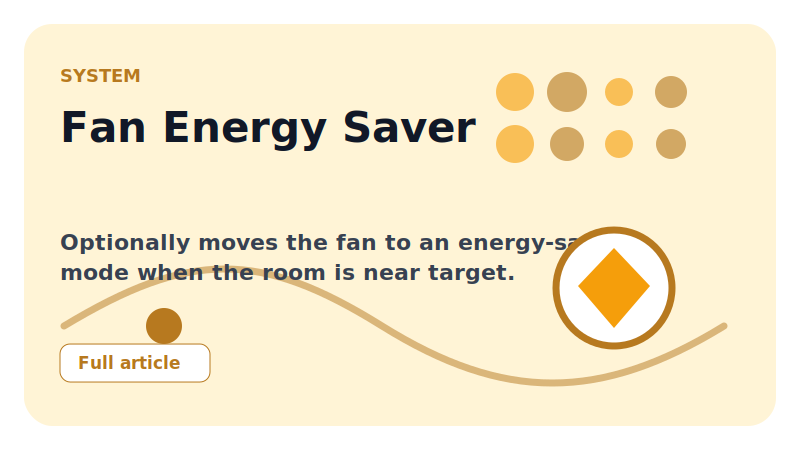
  

    System
    Guide only
  

  <h3><a href="Algorithm-fan-energy-saver.html">Fan Energy Saver</a></h3>
  
Optionally moves the fan to an energy-saving mode when the room is near target.

  <dl><dt>Watches</dt><dd>Room temperature versus target and the thermostat&#x27;s available fan modes.</dd><dt>Effect</dt><dd>Sets the fan to the saver mode; otherwise leaves the fan alone.</dd></dl>
  
<strong>Key settings:</strong> FanEnergySaverEnabled, FanEnergySaverThresholdCelsius, FanEnergySaverMode

</article><article class="algorithm-card category-system" data-search-item data-search-text="Upstairs Comfort Guard Safety, Energy, and System Prioritizes cooling when upstairs rooms get hot while someone is home. The hottest configured (or auto-discovered) upstairs temperature sensor and optional presence entities. If the hottest upstairs room exceeds the comfort maximum, it lowers the target toward the comfort target and adds the cooling boost. Severe upstairs heat bypasses cooldown so comfort wins. When presence is required and nobody is detected, it assumes home rather than under-cooling. Lowers the effective target and can bypass quiet timing. UpstairsComfortEnabled UpstairsTemperatureEntityIds UpstairsMaxComfortCelsius UpstairsComfortTargetCelsius UpstairsComfortBoostCelsius HomePresenceRequired PresenceEntityIds">
  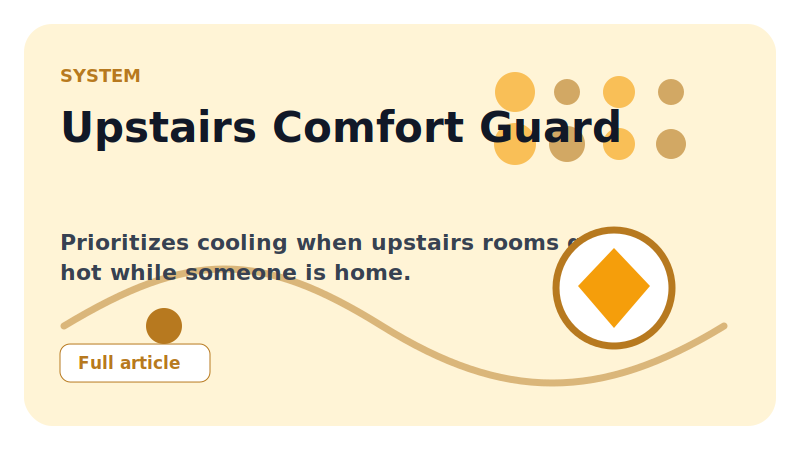
  

    System
    Guide only
  

  <h3><a href="Algorithm-upstairs-comfort-guard.html">Upstairs Comfort Guard</a></h3>
  
Prioritizes cooling when upstairs rooms get hot while someone is home.

  <dl><dt>Watches</dt><dd>The hottest configured (or auto-discovered) upstairs temperature sensor and optional presence entities.</dd><dt>Effect</dt><dd>Lowers the effective target and can bypass quiet timing.</dd></dl>
  
<strong>Key settings:</strong> UpstairsComfortEnabled, UpstairsTemperatureEntityIds, UpstairsMaxComfortCelsius, UpstairsComfortTargetCelsius...

</article><article class="algorithm-card category-system" data-search-item data-search-text="Schedule &amp; Weather Rules Safety, Energy, and System Time-of-day target rules, each gated by a weather activation condition. The active schedule entry for the current day/time and the weather rule. When the custom schedule is on, the matching rule supplies the target. Weather rules (always, room-above-outdoor, room-below-outdoor, outdoor-above-target, outdoor-below-target) decide whether corrective action is allowed. The defender still reads Home Assistant 24/7 even when a rule blocks correction. Sets the target and whether corrective action runs. ScheduleEnabled WeatherActivationMode (per-rule Days / Start / End / Target / Weather)">
  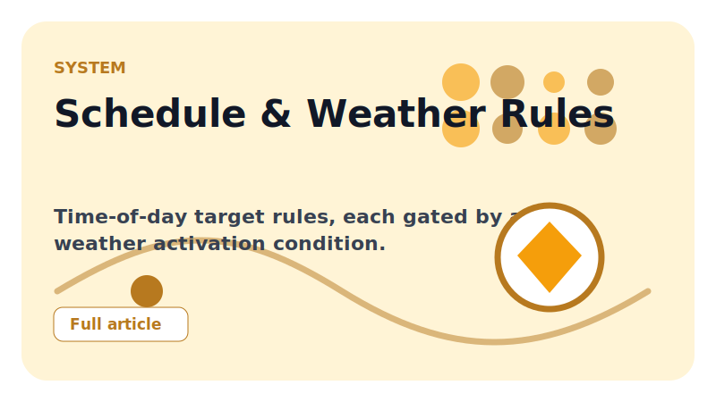
  

    System
    Guide only
  

  <h3><a href="Algorithm-schedule-and-weather-rules.html">Schedule &amp; Weather Rules</a></h3>
  
Time-of-day target rules, each gated by a weather activation condition.

  <dl><dt>Watches</dt><dd>The active schedule entry for the current day/time and the weather rule.</dd><dt>Effect</dt><dd>Sets the target and whether corrective action runs.</dd></dl>
  
<strong>Key settings:</strong> ScheduleEnabled, WeatherActivationMode, (per-rule Days / Start / End / Target / Weather)

</article><article class="algorithm-card category-wall" data-search-item data-search-text="Repeated-Raise Surrender Wall-Touch Response If a person re-raises the setpoint to about the same value 3+ times in 30 minutes, the defender adopts their number for 4 hours — the human wins the argument. Recent external RAISES (times and values, pruned to a 30-minute window). Three or more raises landing within 0.7 C of each other mean the person really wants that temperature. The defender adopts it (capped at 27 C) as the effective target for 4 hours — deliberately with NO &#x27;unless the room is too warm&#x27; escape, because that escape hatch is what turned dawn disagreements into a detached thermostat. My temp stays the hard floor, emergencies still win, and a deliberate website target clears the surrender. Raises the effective target to the human&#x27;s number for 4 hours and logs the surrender. (always on — fixed: 3 raises / 30 min window / 4 h hold / 27 C cap)">
  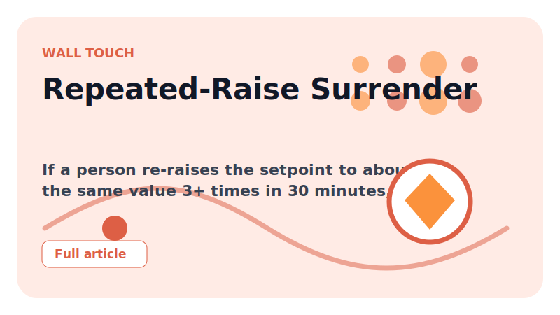
  

    Wall touch
    Guide only
  

  <h3><a href="Algorithm-repeated-raise-surrender.html">Repeated-Raise Surrender</a></h3>
  
If a person re-raises the setpoint to about the same value 3+ times in 30 minutes, the defender adopts their number for 4 hours — the human wins the argument.

  <dl><dt>Watches</dt><dd>Recent external RAISES (times and values, pruned to a 30-minute window).</dd><dt>Effect</dt><dd>Raises the effective target to the human&#x27;s number for 4 hours and logs the surrender.</dd></dl>
  
<strong>Key settings:</strong> (always on — fixed: 3 raises / 30 min window / 4 h hold / 27 C cap)

</article><article class="algorithm-card category-system" data-search-item data-search-text="Tamper Truce Safety, Energy, and System If the thermostat vanishes right after a correction exchange, assume a frustrated person detached it — stand down 2 hours instead of escalating. Home Assistant reachability, the last defender command time, and recent human touches. A thermostat that becomes unreachable within 20 minutes of a defender command AND 45 minutes of a human touch looks exactly like someone pulling the unit off the wall (it really happened, twice). This is the ULTRA OMEGA ALERT — one tier above MEGA (not cooling) and OMEGA (breaker off). Instead of fighting harder, the defender enters a 2-hour emergency quiet named &#x27;Tamper truce&#x27; and says why. Normal outages without a preceding exchange are unaffected. Raises the ULTRA OMEGA ALERT, activates a 2-hour stand-down, and records the tamper-truce event. (always on — fixed: 20 min command window / 45 min touch window / 2 h truce)">
  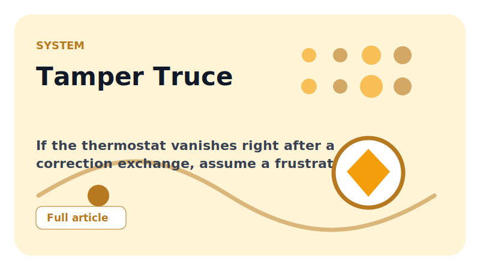
  

    System
    Guide only
  

  <h3><a href="Algorithm-tamper-truce.html">Tamper Truce</a></h3>
  
If the thermostat vanishes right after a correction exchange, assume a frustrated person detached it — stand down 2 hours instead of escalating.

  <dl><dt>Watches</dt><dd>Home Assistant reachability, the last defender command time, and recent human touches.</dd><dt>Effect</dt><dd>Raises the ULTRA OMEGA ALERT, activates a 2-hour stand-down, and records the tamper-truce event.</dd></dl>
  
<strong>Key settings:</strong> (always on — fixed: 20 min command window / 45 min touch window / 2 h truce)

</article><article class="algorithm-card category-sensor" data-search-item data-search-text="Wake-Up Truce (door sensor) Sensor Timing A bedroom door opening at dawn means that person is awake — adopt the warm truce temperature before they ever touch the thermostat. The configured bedroom door sensor (closed-to-open transitions) during the dawn window. When the door sensor flips from closed to open between the window start and end (default 04:00-09:00), the defender immediately adopts the truce temperature (default 25 C, never below my temp, capped at 27 C) for the hold period (default 2 h) using the same surrender machinery. The person wakes to a defender that already agrees with them. Adopts the truce target for the hold period and logs a friendly good-morning event. WakeTruceDoorSensorEntityId WakeTruceWindowStart WakeTruceWindowEnd WakeTruceTargetCelsius WakeTruceHoldMinutes">
  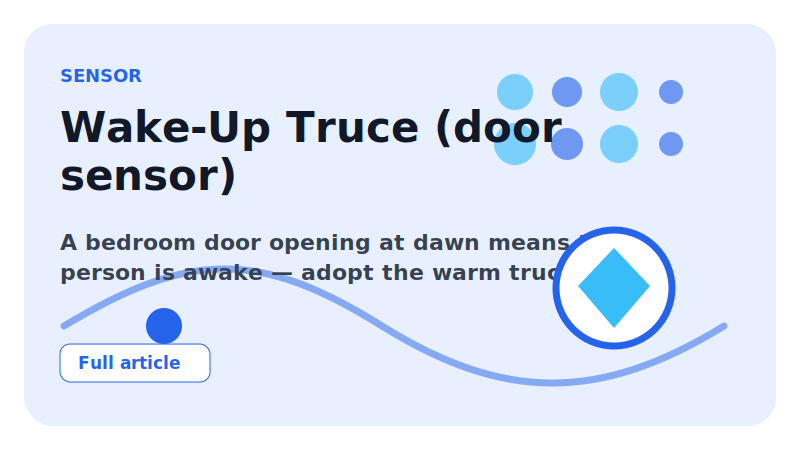
  

    Sensor
    Guide only
  

  <h3><a href="Algorithm-wake-up-truce-door-sensor.html">Wake-Up Truce (door sensor)</a></h3>
  
A bedroom door opening at dawn means that person is awake — adopt the warm truce temperature before they ever touch the thermostat.

  <dl><dt>Watches</dt><dd>The configured bedroom door sensor (closed-to-open transitions) during the dawn window.</dd><dt>Effect</dt><dd>Adopts the truce target for the hold period and logs a friendly good-morning event.</dd></dl>
  
<strong>Key settings:</strong> WakeTruceDoorSensorEntityId, WakeTruceWindowStart, WakeTruceWindowEnd, WakeTruceTargetCelsius...

</article>

