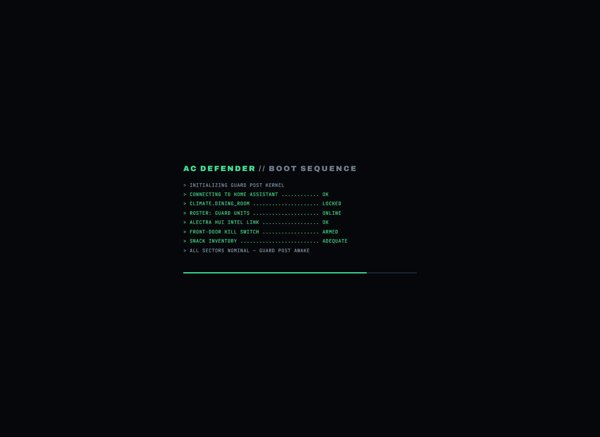

# Home Assistant AC Defender Wiki

Home Assistant AC Defender is a Docker-hosted ASP.NET Core Blazor website and background
worker that watches a **real** Home Assistant climate entity and defends the dining room AC
target — *my temp* — against the AC app's own schedule, phone changes, and wall touches,
while staying polite, safe, and cheap to run.

No simulator or dummy thermostat is used. Every control acts on the configured Home
Assistant climate entity or returns a real error.

## Start here

| Page | What it answers |
| --- | --- |
| **[Website Tour](Website-Tour.md)** | "What am I looking at?" — every page, with screenshots, in plain words |
| **[Every Guard, Explained Simply](Every-Guard-Explained.md)** | Every single algorithm, described so a five-year-old could follow |
| **[Energy & Costs](Energy-and-Costs.md)** | How hours become dollars: TOU rates, the AC-only estimate, the usage calendar, the monthly budget |
| **[Defender Logic](Defender-Logic.md)** | The full decision cycle and every guard's exact rules |
| **[Settings](Settings.md)** | Every knob on the Settings page |
| **[API](API.md)** | The JSON endpoints and SSE stream |
| **[Architecture](Architecture.md)** | How the code is put together |
| **[Deployment](Deployment.md)** | Docker hosting |

## The big ideas

- **My temp is law.** The user's target is a hard floor — no guard, schedule, budget, or
  learned offset may ever cool below it, and warm-room defense always walks back toward it.
- **A team of guards, not one rule.** Dozens of small, focused guards (cooldown, comfort
  grace, stealth timing, peak-power saving, rival-schedule watch…) each get a live card on
  the Defense page and a section in the in-app Guide, generated from one source of truth.
- **People get courtesy; machines don't.** Human wall touches earn quiet waits, peace
  offerings, and natural-looking corrections. The AC app's own schedule (Rival Schedule
  Watch) is answered promptly — nobody is watching at 2 a.m.
- **Money awareness built in.** Real compressor hours are priced at Alectra time-of-use
  rates (sensor-free), shown under the runtime counters, on an airline-style usage
  calendar, and steered by an optional monthly budget with a safety-first fallback.
- **Safety always wins.** Hot rooms bypass every stealth wait; the budget yields to a
  maximum room temperature; emergencies stop everything.
- **Fully automated getting-yelled-at detection.** An angry setpoint jump or a burst of
  thermostat touches means someone is about to yell — the rage detector apologizes
  automatically, eases the AC up as a peace gesture, and stands down for two hours.
  It stops *before* it happens, to prevent tears.
