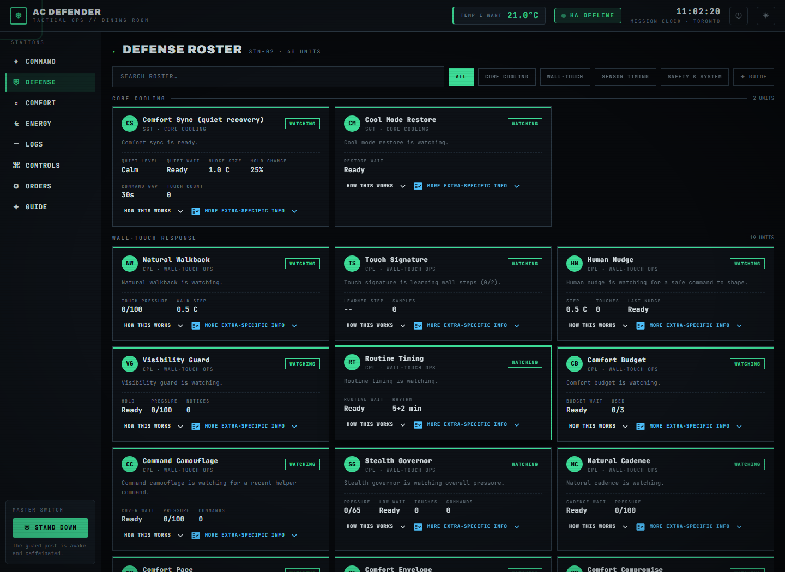
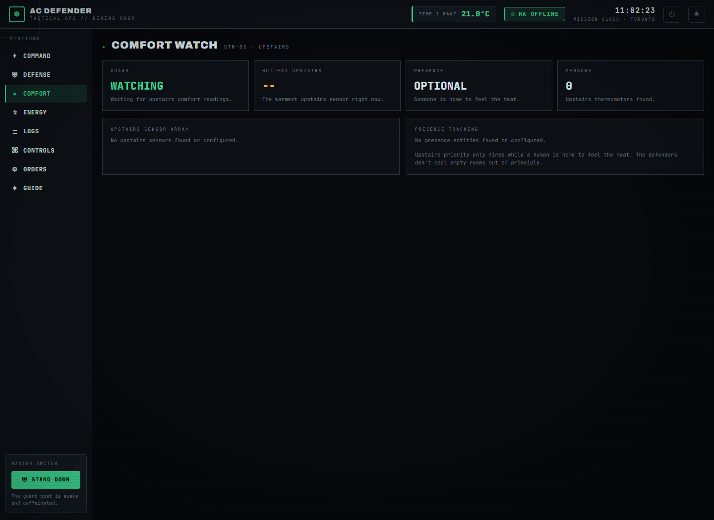
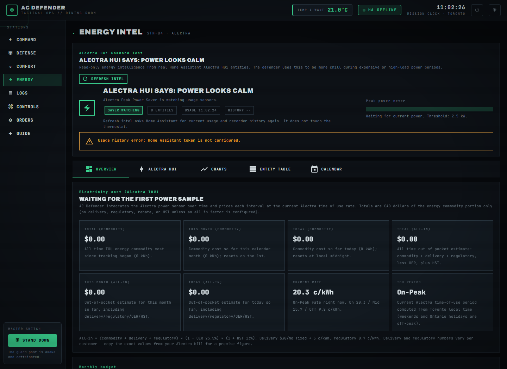
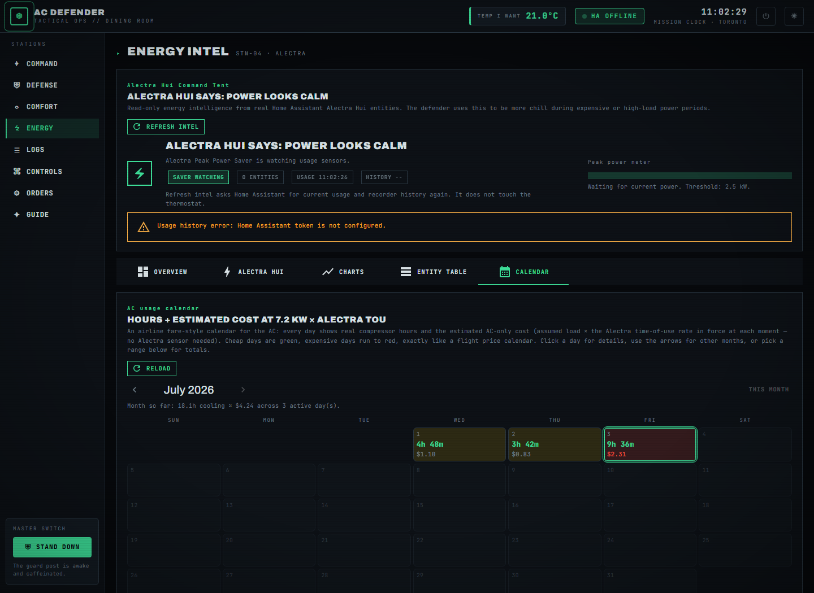
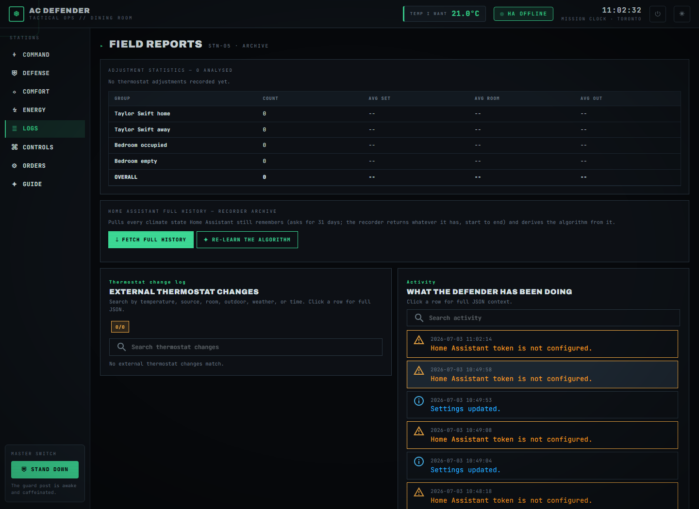
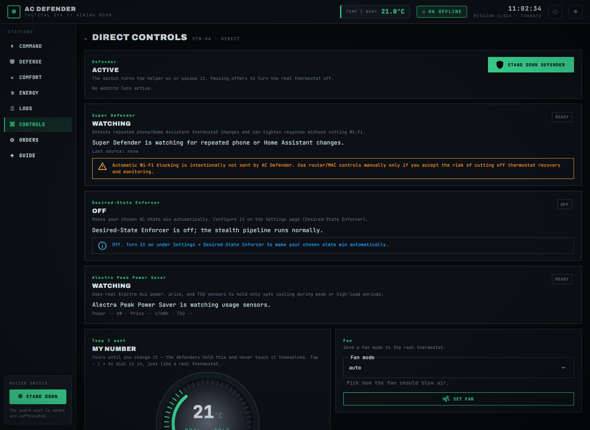
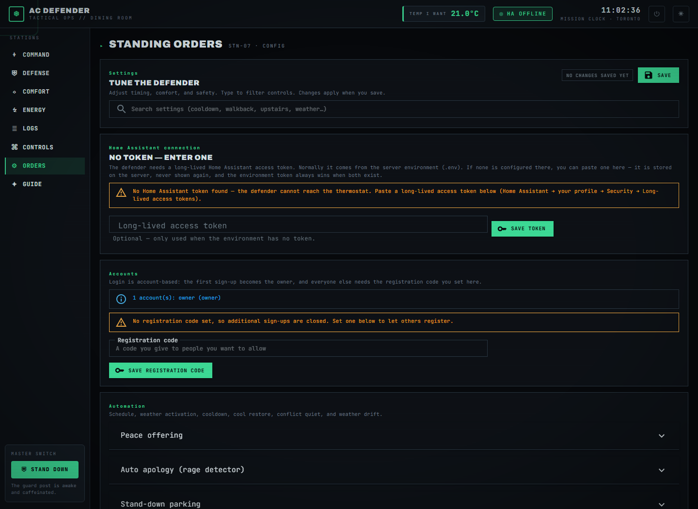
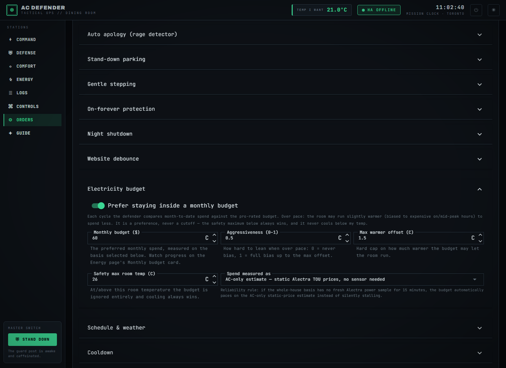
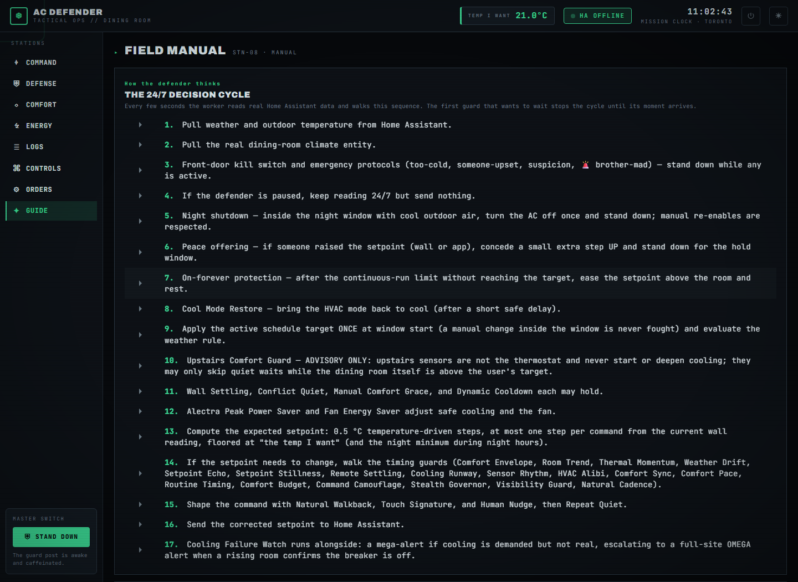

# Website Tour

A picture-book walk through every page — written so simply that anyone can follow along.
(The screenshots show "HA OFFLINE" because they were taken on a computer without a real
Home Assistant; on your real install the numbers are live.)

The one idea behind everything: **you pick a temperature you like ("my temp"), and the
defender keeps the room there — even when the AC's own app, a schedule, or another person
tries to change it.**

---

## 🏠 Command Center (the front page, `/`)

Think of this page as the guard's desk.

- **The big number** is *my temp* — the temperature you want. Nothing on this site ever
  cools the room below it.
- **The ring** is the real wall thermostat, live. What it says is what the AC is really doing.
- **APPLY MY TEMP** — "make the wall match my number, please."
- **STAND DOWN** (bottom-left) — the big off switch. The guards stop correcting things but
  keep watching 24/7.
- **AC RUNTIME — HOURS COOLING** — three little scoreboards: how long the AC really ran
  **today**, **this month**, and **ever** — and right under each one, **about how many
  dollars that cooling cost** (`≈ $1.53`). No power meter needed: it multiplies the hours
  by the AC's size and by the electricity price at that hour of the day.
- **DIRECT ORDERS** — buttons for right now: read the thermostat again, step toward my temp,
  force cooling.
- **BROTHER MAD** — the apology button. Everything stops for 2 hours and the AC is eased up,
  so an upset person sees the system agreeing with them.

---

## 🛡️ Defense (`/defense`)

The defender is not one big rule — it is a **team of little guards**, and this page shows
every guard as a card. Each card says what that guard watches and what it is doing *right
now* ("Watching", "Holding", "Answering"…). Open a card's "How this works" drawer for a
plain explanation, or "More extra-specific info" for the full detective notes.

Examples of guards you'll meet:

- **Cool Mode Restore** — if someone switches the AC off `cool`, put it back (politely, after
  a small wait, unless the room is getting hot).
- **Rival Schedule Watch** — knows the AC app's own bedtime schedule (SLEEP → DEEP SLEEP →
  GOOD MORNING) and answers its warm pushes back to my temp. A machine gets no courtesy waits.
- **Super Defender** — notices when someone keeps changing things from a phone and gets stricter.
- **Peace Offering / Auto apology** — notices when a *person* is unhappy and backs off.

---

## 🛋️ Comfort (`/comfort`)

The upstairs check. If bedroom sensors say upstairs is hot **and** someone is home, the
defender is allowed to skip its polite waiting so cooling starts sooner. Upstairs sensors
can never force extra cooling on their own — they only make the defender less patient when
the dining room already needs it.

---

## ⚡ Energy (`/energy`)

The money page. Tabs across the middle:

- **Overview** — electricity cost so far (today / this month / total), the current
  time-of-use price ("is power cheap or expensive right now?"), and the **Monthly budget**
  card if you set a budget.
- **Alectra Hui / Charts / Entity Table** — every live reading from the Alectra power
  integration, searchable, with 24-hour charts.
- **Calendar** — the fun one, below.

### The AC usage calendar

Exactly like the calendar airlines use to show cheap and expensive flight days — but for
your AC:

- **Every day is a little box.** Inside it: how long the AC cooled that day (`4h 48m`) and
  about what it cost (`$1.10`).
- **Green box** = cheap day. **Yellow** = medium. **Red** = the expensive day of the month.
- **Click a day** and a sentence appears under the calendar: *"Fri Jul 3 — AC ran 9h 36m
  for an estimated $2.31."*
- **Arrows** flip to other months; **Range totals** at the bottom adds up any start-to-end
  stretch you pick — one day, one week, or whole months.

---

## 📜 Logs (`/logs`)

The diary. Every time someone (or something) touched the thermostat, a row appears: when,
what it changed, how warm the room was, and **who the defender thinks did it** — a person
at the wall, a phone app, an automation, or the AC's own schedule (`RIVAL-SCHEDULE`).
Click any row for the full JSON detective notes.

---

## 🎮 Controls (`/controls`)

Hands-on buttons, all acting on the **real** thermostat: set/generate a target, change the
fan, refresh, force cooling, turn the unit off, and the emergency buttons (Too cold /
Someone upset / Suspicion quiet). If a button would fight a command sent seconds ago, the
site makes you wait instead of spamming the AC.

---

## ⚙️ Settings / Orders (`/settings`)

Every dial for every guard, grouped into fold-out panels with a search box. Each control has
a one-line explanation under it. Highlights:

### The Electricity budget panel

- **The switch** — "Prefer staying inside a monthly budget."
- **Monthly budget ($)** — how much you'd like to spend this month.
- **Spend measured as** — either the whole-house bill (needs the live Alectra sensor) or the
  **AC-only estimate at fixed price-per-hour rates**, which needs no sensor at all. If the
  sensor goes quiet, the budget automatically uses the estimate — it never just stops working.
- When you're spending faster than the month allows, the defender lets the room run a tiny
  bit warmer (never past the **safety max** temperature, and never below my temp).

The schedule editor for your own time-of-day targets lives at the bottom of this page.

---

## 📹 Front door (`/camera`)

A live view of the front-door doorbell, streamed straight from Google into the site
(WebRTC). It starts automatically, renews itself under Google's five-minute session
limit, and sits behind the same sign-in as everything else — the camera is never public.

---

## 🔑 Signing in with Google

Besides username + password, the guard post can show a **Sign in with Google** button.
Click it and a short code appears (like `BWW-LVW-GBRS`); open `google.com/device` on any
device, enter the code with an allow-listed Google account, and the page signs you in by
itself. Only accounts on the allow-list may enter.

---

## 📖 Guide (`/guide`)

The built-in instruction manual: the full decision cycle and one section per guard,
generated from the same source of truth as the Defense cards — so it can never drift out
of date from the code.

---

## Where next?

- [Every Guard, Explained Simply](Every-Guard-Explained.html) — every algorithm in plain words.
- [Defender Logic](Defender-Logic.html) — every guard's exact rules.
- [Energy & Costs](Energy-and-Costs.html) — how the dollars are computed.
- [Settings](Settings.html) — every knob, listed.
- [API](API.html) — the JSON endpoints behind all of this.
